

![ref1]

Analyse I et II Licence Informatique

Guillaume Metzler

Institut de Communication (ICOM)
Université de Lyon, Université Lumière Lyon 2 Laboratoire ERIC UR 3083, Lyon, France

<guillaume.metzler@univ-lyon2.fr>

Résumé

L’objectif de ce cours est de présenter les outils nécessaires à l’étude d’une fonc- tion : cela peut être l’étude de ses variations, la recherche d’extrema ou encore d’éventuelles propriétés comme la convexité de ces fonctions. On étudiera également des objets comme les suites numériques réelles.

La première partie de ce document est destinée aux étudiants de première année

de Licence Informatique et concerne l’étude des suites numériques réelles ou encore des fonctions réelles à une variable réelle. Nous reviendrons sur des généralités sur les suites numériques réelles : étude de la monotonie, sa nature (récurrente, arith- métique, géométrique), la convergence ou divergence des suites et donc de limite. Enfin, nous introduisons des nouveaux concepts comme la notion de comparaison des suites. Une partie conséquente est ensuite consacrée à l’étude de fonctions réelles. On commencera par présenter quelques fonctions usuelles comme les fonctions linéaires, quadratiques, logarithme et exponentielles, circulaires et hyperboliques. L’objectif étant d’offrir un spectre large des fonctions que l’on pourra rencontrer par la suite. Nous étudierons ensuite les propriétés de continuité et surtout de dérivabilité qui sera essentiel dans l’étude des problèmes en Science des Données. Enfin, des bases sur l’intégration seront également fournies pour des besoins ultérieures en probabi- lités et statistiques.

Dans la deuxième partie, destinée principalement aux étudiants de deuxième année Licence Informatique ,nous effectuerons une étude analogue mais pour les fonctions à plusieurs variables. Nous allons profiter des connaissances acquises dans la première partie de ce document mais aussi dans le cours d’Algèbre Linéaire [^1] [afin ](#_page0_x124.81_y668.43)d’étendre les définitions vues en première année à ce contexte. Nous souhaitons nous diriger vers un point essentiel qui est l’étude des problèmes d’optimisation et les al- gorithmes de descente de gradient que l’on retrouvera ultérieurement dans des cours de statistiques ou encore d’apprentissage machine.

Remerciements Un grand merci à Julien Ah-Pine dont les ressources ont été d’une aide précieuse pour la préparation de la deuxième partie de ce cours.

Table des matières

[I Introduction](#_page5_x89.29_y101.03) 6 [II Analyse des fonctions à une variable réelle ](#_page11_x89.29_y101.03)12

1 Suites réelles 14

1. Généralités sur les suites . . . . . . . . . . . . . . . . . . . . . . . . . . . . 14
1. Convergence des suites . . . . . . . . . . . . . . . . . . . . . . . . . . . . . 18
1. Divergence des suites . . . . . . . . . . . . . . . . . . . . . . . . . . . . . . 23
1. Limite d’une suite monotone . . . . . . . . . . . . . . . . . . . . . . . . . . 24
1. Relations de comparaison . . . . . . . . . . . . . . . . . . . . . . . . . . . 25
1. Suite négligeable . . . . . . . . . . . . . . . . . . . . . . . . . . . . 25
1. Suite dominée . . . . . . . . . . . . . . . . . . . . . . . . . . . . . . 27
1. Suites équivalentes . . . . . . . . . . . . . . . . . . . . . . . . . . . 27

2 Fonctions usuelles 31

1. Logarithme . . . . . . . . . . . . . . . . . . . . . . . . . . . . . . . . . . . 31
1. Fonction exponentielle . . . . . . . . . . . . . . . . . . . . . . . . . . . . . 34
1. Fonctions puissances . . . . . . . . . . . . . . . . . . . . . . . . . . . . . . 38
1. Fonctions circulaires . . . . . . . . . . . . . . . . . . . . . . . . . . . . . . 40
1. Fonctions hyperboliques . . . . . . . . . . . . . . . . . . . . . . . . . . . . 44

3 Continuité des fonctions réelles 48

1. Quelques caractéristiques des fonctions . . . . . . . . . . . . . . . . . . . . 48
1. Continuité . . . . . . . . . . . . . . . . . . . . . . . . . . . . . . . . . . . . 51
1. Extrema d’une fonction et fonction lipschitzienne . . . . . . . . . . . . . . 58

4 Dérivabilité 63

1. Définition de la dérivabilité . . . . . . . . . . . . . . . . . . . . . . . . . . 63
1. Dérivation et extrema . . . . . . . . . . . . . . . . . . . . . . . . . . . . . 66
1. Etude des accroissements d’une fonction . . . . . . . . . . . . . . . . . . . 67
1. Régularité des fonctions réelles . . . . . . . . . . . . . . . . . . . . . . . . 70

5 Etude des fonctions convexes 73

1. Caractérisations de la convexité . . . . . . . . . . . . . . . . . . . . . . . . 73
1. Lien avec la recherche d’extremum . . . . . . . . . . . . . . . . . . . . . . 79

6 Intégration 81

1. Généralités sur l’intégrale . . . . . . . . . . . . . . . . . . . . . . . . . . . 81
1. Calculs de primitives et intégrales . . . . . . . . . . . . . . . . . . . . . . . 81
1. Quelques propriétés de l’intégrale . . . . . . . . . . . . . . . . . . . . . . . 88

7 Développements Limités 91

1. Formule de Taylor . . . . . . . . . . . . . . . . . . . . . . . . . . . . . . . 91
1. Développements limités . . . . . . . . . . . . . . . . . . . . . . . . . . . . 91

8 Formulaire 94

1. Dérivées des fonctions usuelles . . . . . . . . . . . . . . . . . . . . . . . . . 94
1. Formules de dérivations générales . . . . . . . . . . . . . . . . . . . . . . . 95
1. Développements limités . . . . . . . . . . . . . . . . . . . . . . . . . . . . 96
1. Primitives des fonctions usuelles . . . . . . . . . . . . . . . . . . . . . . . . 97

[III Analyse des fonctions à plusieurs variables ](#_page97_x89.29_y101.03)98 9 Généralités sur les fonctions à plusieurs variables 100

10 Continuité et Dérivabilité 103

1. Continuité . . . . . . . . . . . . . . . . . . . . . . . . . . . . . . . . . . . . 103
1. Fonctions différentiables et dérivables . . . . . . . . . . . . . . . . . . . . . 104
1. Fonction différentiables : ordre 2 . . . . . . . . . . . . . . . . . . . . . . . 115

11 Recherche d’extrema et applications aux fonctions convexes 120

1. Retour sur la convexité . . . . . . . . . . . . . . . . . . . . . . . . . . . . . 120
1. Conditions d’optimalité . . . . . . . . . . . . . . . . . . . . . . . . . . . . 121
1. Problème d’optimisation . . . . . . . . . . . . . . . . . . . . . . . . . . . . 129

12 Optimisation : descente de gradient 132

1. Introduction à la descente de gradient . . . . . . . . . . . . . . . . . . . . 132
1. Descente de gradient à pas optimal . . . . . . . . . . . . . . . . . . . . . . 135
1. Descente de Gradient à pas conjugué . . . . . . . . . . . . . . . . . . . . . 140
1. Descente de Newton . . . . . . . . . . . . . . . . . . . . . . . . . . . . . . 142
1. Approximation de la méthode de Newton . . . . . . . . . . . . . . . . . . 143

13 Intégration 148

1. Fonctions réelles intégrables . . . . . . . . . . . . . . . . . . . . . . . . . . 148
1. Fonctions à plusieurs variables . . . . . . . . . . . . . . . . . . . . . . . . . 151
1. Changement de variable . . . . . . . . . . . . . . . . . . . . . . . . . . . . 156

Première partie

Introduction

L’analyse des fonctions à variables réelles constituera la base de la plupart des études que l’on pourra mener dans le domaine de la Science des Données . Connaître les fonctions, leurs comportements et leurs propriétés sont des éléments essentiels qui permettront de résoudre des tâches complexes comme l’extraction de données ou l’esti- mation des valeurs optimales des paramètres d’un modèle d’apprentissage automatique.

Les modèles d’apprentissage se traduisent très souvent par des fonctions mathématiques dont les propriétés sont connues et simples à étudier et qui vont permettre de relater

un phénomène observé dans les données ou ce que l’on cherche à faire. On peut, par exemple, chercher à prédire la valeur du cours d’une action en fonction du temps, trou-

ver une solution la moins coûteuse possible, déterminer le meilleur arrangement possible lorsque l’on dispose de différentes contraintes, etc.

Il faudra donc connaître des propriétés sur la fonction comme la continuité, la dérivabilité voire déterminer des intégrales. En réalité, il y a plusieurs facettes de la Sciences des Données qui sont à prendre en compte :

- pour faire de l’analyse de données de façon générale, ce qui nous amènera à étudier des problèmes d’optimisation.
- la construction de modèles prédictifs qui reposent sur des outils mathématiques

  et statistiques. Cela permettra d’effectuer des tâches de régression ou de clas- sification

- Etudier les propriétés des modèles sur le plan mathématique permettra égale- ment de prouver leur bon fonctionnement, i.e. avoir des garanties théoriques sur leurs performances mais aussi que les algorithmes développés convergent bien la solution optimale.

Etude de la complexité des algorithmes Ces études de suites ou de fonctions sont également intéressantes pour tout bon informaticien qui souhaite développer des algorithmes efficaces pour la gestion ou le traitement sur des bases de données. Il n’aura

pas échapper à l’apprenant dans ce domaine qu’il est possible d’implémenter une solution

à un problème de plusieurs façon différentes. Prenons un exemple simple où l’on souhaite calculer n! (lire factorielle n. On peut alors développer une approche dite itérative ou récursive pour calculer cette valeur

Apprentissage Faire en sorte qu’une intelligence artificielle soit capable de réaliser certaines tâches est loin d’être aisé, car cela nécessite non seulement des données mais aussi des outils analytique, algébriques mais aussi des connaissances en statistiques pour quiconque souhaite développer ou encore étudier des algorithmes sophistiqués.

Si l’on retourne même à un usage plus primaire des données, la connaissance des outils

|Algorithm 1: Approche récursive|
| - |
|
Entrée: n ∈N

Sortie : n!

Factorielle( n)

1: if n == 1 then

2: return( n)

3: else

4: return( n× Factorielle( n − 1)) 5: end if
|
||
|Algorithm 2: Approche itérative|
|
Entrée: n ∈N

Sortie : n!

1: a = n

2: for i = 1 ,...,n − 1 do 3: a = a ∗n − i

4: end for
|

algébriques, comme la manipulation de matrices est capitale pour développer des codes plus efficaces qui permettent de limiter le nombre d’opérations et donc de réduire le temps d’exécution des différents calculs. En ce sens, la mathématique ne peut être dissociée, dans le cadre de la manipulation des données, de l’outil informatique et tous les deux se révèlent être complémentaires dans ce domaine.

L’apprentissage nécessite deux grands outils fondamentaux : l’algèbre linéaire mais aussi les outils d’analyses de fonctions à plusieurs variables ce qui pourra permettre de mettre en place une intelligence capable de discriminer les spams dans une série de mails.

Pour simplifier la représentation, nous allons considérer que les mails sont décrits par deux variables, i.e. représentés par deux valeurs et on peut alors les représenter dans un plan, comme cela est montré en Figure 1. Pour simplifier la tâche, on va supposer que l’on souhaite apprendre une droite qui sépare de façon optimale les points rouges des points bleus, dans le sens où l’on effectue le minimum d’erreur.

Nous avons donc besoin de deux éléments ici

- Savoir définir une droite dans un plan (ou un hyperplan dans un espace de dimension quelconque)
- Définir le critère à minimiser, i.e. la fonction à minimiser, dont les valeurs dépendent de la droite considérer.

Le premier point est plutôt simple, vous vous souvenez que l’équation d’une droite dans un plan est de la forme

x2

x1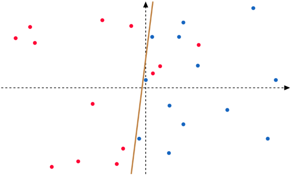

Figure 1 – Représentation des différents mails dans un espace à deux dimensions. Les spams sont représentés en rouge alors que les mails classiques sont représentés en bleu. La droite représentée en gris représente une potentielle droite optimale permettant de séparer les spams des mails standards.

y = ax + b

Si on reprend la représentation effectuée dans la Figure 1, notre droite se présentera sous la forme

ax1 + bx2 + c = 0,

ce qui est exactement la même forme que la précédente. On va noter ha,b,c (x) = ax 1 + bx2 + c le membre de gauche de l’équation précédente. Et il faudrait donc déter- miner les bonnes valeurs des paramètres a,b et c de la droite.

Ces paramètres seront déterminés de façon à réduire le nombre d’erreurs de clas- sification effectués par notre algorithme qui apprend une droite séparant les données en deux groupes. Pour fixer les idées, on va dire que si on se trouve à gauche de la droite ax 1 + bx2 + c = 0 ⇐⇒ ha,b,c (x) = 0 , i.e. si ha,b,c (x) < 0 alors le mail est catégorisé comme étant un spam. Dans le cas contraire, le mail est catégorisé comme étant "dési- rable", i.e. lorsque ha,b,c (x) > 0.

A partir de cela, on peut alors proprement définir le critère que l’on souhaite minimiser,

à savoir notre nombre d’erreurs. Pour cela, on se rappelle que les exemples considérés possèdent une étiquette (colorée), s’ils sont bleus, on va dire que les mail sont "positifs",

i.e. ils sont standards, on va leur attribuer une valeur y = 1 Dans le cas contraire, s’ils sont rouges, ils sont dits "négatifs" donc considérés comme des spams et on va leur une valeur y = − 1.

Ainsi on va chercher à minimiser le nombre d’erreurs qui s’écrit comme suit :

m1  1{yi ha,b,c (xi )< 0}.

m

i=1

Une erreur correspond donc à l’attribution du mauvais signe à une donnée x, i.e. au fait que la donnée se trouve du mauvais côté de la droite.

Fonctions à plusieurs variables Ce simple exemple montre que chercher à minimiser un nombre d’erreurs revient à étudier une fonction à plusieurs variables, ici a,b et c et à chercher le minimum de cette fonction.

Vous avez pu voir, ou verrez que chercher les valeurs de a,b et c pour lesquelles la fonction atteint son minimum nécessite de trouver des points critiques et d’étudier

la nature de ses points critiques via la résolution de l’équation d’Euler et l’étude de

(a,b,c)(0)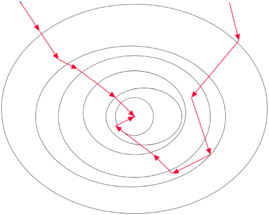

(a,b,c)(1)

(a,b,c)(1)

(a,b,c)(2)

(a,b,c)(3)

(a,b,c)(4) (a,b,c)(2)

(a,b,c)(⋆)

(a,b,c)(6)

(a,b,c)(5) (a,b,c)(3

(a,b,c)(4)

Figure 2 – Illustration de la descente de gradient vers la solution optimale (a,b,c)(⋆) de la fonction g que l’on souhaite minimiser en fonction des paramètres a,b et c Les différentes ellipses représentent des lignes de niveau de la fonction g.

la dérivée seconde de la fonction, qui se présentera sous la forme d’une matrice. Plus formellement, on dit que l’on va résoudre un problème d’optimisation :

1 m

min g(a,b,c) = min

a,b,c a,b,c m 1{yi ha,b,c (xi )< 0}.

i=1

Bien évidemment quand les points critiques sont très complexes à trouver mais que la fonction possède de bonnes propriétés, on peut passer par des algorithmes de descente de gradient, qui vont, de façon itérative, approcher la solution optimale comme cela est illustré en Figure 2.

Vous verrez que cette approche itérative s’écrit de la façon suivante

(a,b,c)(n+1) = (a,b,c)(n) − η∇g (a,b,c)(n) ,

i.e. les valeurs des paramètres a,b et c à l’itération n + 1 est une transformation des valeurs de ces mêmes paramètres à l’itération n qui met en jeu les données mais aussi le gradient de la fonction que l’on cherche à optimiser (et donc de l’équation de la droite). Cette procédure simple, appelée descente de gradient nécessite de manipuler des vecteurs voir des matrices ou des inverses de matrices pour des versions plus sophistiquées.

Ce n’est bien sûr pas la seule application mais c’est une première application di- recte qui pourra se faire plus tard avec ces outils d’Analyse et d’Algèbre Linéaire.

Vous étudierez également, vraisemblablement l’année prochaine, comment exploi- ter l’algèbre linéaire pour faire de l’ Analyse de Données .

Commençons sans plus tarder!

Deuxième partie

Analyse des fonctions à une variable réelle

Dans cette première partie, nous nous intéresserons à l’étude des fonctions réelles d’une variable réelle ainsi que des suites numériques réelles.

On souhaite tout d’abord faire quelques rappels sur les suites numériques qui seront très souvent utilisées dans la prochaine partie de ce cours.

Les suites sont omniprésentes dans la conception des algorithmes et on les retrouve à chaque fois que l’on effectue des boucles dans son programme. En outre, combinée à l’étude des fonctions, elles permettent d’étudier les propriétés des algorithmes et notam- ment leur convergence ou encore leur complexité. Enfin, pour cette dernière il est égale- ment important de connaître des ordres de grandeurs, ou plus précisément des équivalents de suites ou de fonctions afin de mieux appréhender la complexité d’un algorithme : son temps de calcul ainsi que son coût en mémoire.

Ce sont autant d’éléments qui vont permettre de développer des solutions efficaces dans de multiples applications avec la prise en compte des contrainte matériels.

Une grosse partie est ensuite consacrée à l’étude des fonctions, avec une présen- tation non exhaustive de fonctions usuelles en mathématiques et que le lecture sera susceptible de rencontrer dans son futur en tant que qu’ingénieur/chercheur en Science des Données.

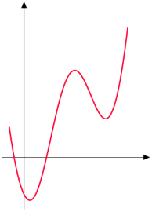

Nous présenterons les concepts de continuités et de de dérivabilités de ces fonctions ainsi que quelques grands résultats concernant la recherche d’extrema pour des fonctions

continues voire même pour des fonctions convexes.

Nous verrons aussi comment approcher une fonction dérivable, ou plusieurs déri- vables, à l’aide d’une approximation linéaire, quadratique, voire plus pour en simplifier l’étude localement autour d’un point. L’ensemble de ces outils constituent des éléments fondamentaux dans la recherche d’extrema d’une fonction sur le plan algorithmique. Ce sont ces méthodes d’approximation qui vont permettre de développer des algorithmes de recherche d’extrema de fonctions complexes et cela de façon automatique. Les propriétés des fonctions vont ensuite nous permettre de garantir la convergence de l’algorithme ou encore la nature de la solution.

Une dernière partie est consacrée à l’intégration des fonctions continues et quelques théorèmes généraux et des méthodes de calculs permettant de calculer une grande variété d’intégrale. Cela permettra de donner quelques outils qui pourront s’avérer utiles lors de

la présentation des concepts comme l’ espérance ou la variance d’une variable aléatoire ayant une fonction de densité continue.

1  Suites réelles

Cette section est dédiée à l’étude des suites réelles. Elle rappelle les définitions élémentaires sur les suites : variations et bornes. On abordera ensuite les notions de convergence et limite des suites On finira enfin par quelques rappels et études des suites arithmétiques, géométriques et arithmético-géométriques.

Cette première section est primordiale car elle permet d’introduire des outils né- cessaires à l’étude des fonctions. En effet, on pourra voir les suites comme des fonctions évaluées sur l’ensemble des nombres entiers N.

1. Généralités sur les suites

Définition 1.1: Suites réelles

On appelle suite réelle tout famille de nombres réels indexés par N. On notera u = ( un)n∈N une telle suite, où pour tout n ∈ N, un ∈ R est le terme de rang n de la suite u.

Exemple 1.1. Les suites u,v w définies pour tout entier n ∈N par

n

un = n + 3 , vn = 4 n, et wn = 2

sont des suites réelles au sens défini précédemment.

Dans l’exemple ci-dessus, les suites u et v sont des suites arithmétiques et la suite v est une suite géométrique . Nous reviendrons sur ces points là un peu plus tard dans cette section.

La définition de suite suppose que cette dernière est définie pour tout entier naturel n, mais il n’est pas rare que l’on souhaite définir une suite à partir d’un certain rang n0 ∈N afin que les objets soient bien définies.

Exemple 1.2. Considérons la suite u définie par

√ 

un = 2n − 6.

Pour la suite u soit bien définie, il faut que l’argument dans la racine carrée soit positif ou nul, i.e. il faut que 2n − 6 ≥ 0 soit n ≥ 3. Ainsi la suite u est définie à partir du rang n0 = 3 .

On pourra également introduire des suites plus exotiques dont la définition pourrait varier selon la parité de n, comme cela serait le cas avec la suite u définie pour tout entier n par :

2n − 3 si n est pair ,

u =

n n + 3 si n est impair .

On pourra également effectuer des opérations sur les suites, tout comme on peut effectuer des opérations sur les nombres réels.

Définition 1.2: Opérations sur les suites

Soient deux suites de nombres réels u = ( un)n∈N et v = ( vn)n∈N et soit λ un nombre réel quelconque. On peut alors définir :

1. la suite λu = ( λu n)n∈N,
1. la suite u + v = ( un + vn)n∈N,
1. la suite u × v = ( un × vn)n∈N,
1. la suite u = un )

   v vn n∈N, à condition que la suite (vn n∈N soit non nulle pour tout entier n

Exemple 1.3. Considérons les suites u et v définies pour tout entier n ∈N par

un = n + 3 et vn = 2 n

et λ un nombre réel quelconque. Alors les suite u + v et u × v sont définies pour tout entier naturel n par

un + vn = 2 n + n + 3 et un × vn = 2 n(n + 3) .

Après avoir défini les suites, nous pouvons maintenant nous intéresser à l’évolution de leurs valeurs et plus précisément à leurs variations.

Définition 1.3: Variations

Une suite de nombres réels (un )n∈N est dite :

1. croissante si pour tout n ∈N : un+1 ≥ un,
1. décroissante si pour tout n ∈N : un+1 ≤ un,
1. constante si pour tout n ∈N : un+1 = un.

On pourra également reprendre cette définition pour introduire les notions de mo- notonie stricte en remplaçant les inégalités larges par des inégalités strictes.

A nouveau, il n’est pas rare d’étudier la monotonie d’une fonction à partir d’un certain rang n0, i.e. en ne se préoccupant pas du comportement de la suite sur ses pre- miers termes.

Exemple 1.4. On considère les suites u,v w définies pour tout entier n ∈N par

n

un = 2 n, vn = 12 , et wn = ( − 1)n.

sont des suites réelles au sens défini précédemment.

Alors la suite u est strictement croissante pour tout n. En effet un+1 = 2( n +

\1) = 2 n + 2 > 2n = un\. De la même façon on remarque que la suite v est strictement décroissante et que la suite w n’est ni croissante, ni décroissante\.

Etudier les valeurs successives des suites revêt d’un enjeu important dans l’étude de certains algorithmes afin d’étudier d’éventuelles propriétés de convergence de ces derniers. Pour étudier cette convergence, nous avons donc besoin de connaître le comportement de la suite mais aussi de savoir si cette dernière prend des valeurs bornées. En effet, la monotonie d’une suite et son caractère bornée vont nous permettre d’affirmer que cette dernière est convergente.

Nous illustrerons plus tard dans ce cours, après avoir étudié les fonctions, l’utilité des suites et de l’étude de leur convergence.

Définition 1.4: Suites minorées, majorées et bornées Soit u = ( un)n∈N, alors cette suite est dite :

1. minorée s’il existe un réel m tel que : ∀n ∈N, m ≤ un,
1. majorée s’il existe un réel m tel que : ∀n ∈N, M ≥ un,
1. bornée si elle est à la fois minorée et majorée.

De cette définition découle la proposition immédiate suivante : Proposition 1.1: Suite bornée

Soit une suite réelle u = ( un)n∈N, alors la suite u est bornée si et seulement si la suite |u| = ( |u|)n∈N est majorée.

Démonstration. La proposition se démontre en montrant les deux implications.

- Supposons que |u| soit majorée, il existe donc un réel M tel que pour tout n, |un| ≤ M. En utilisant la définition de la valeur absolue, on a pour tout entier

  n

−M ≤ un ≤ M.

Ainsi la suite u est donc bien minorée et majorée, elle est donc bornée.

- Supposons que la suite u soit bornée, il existe donc des réels m,M tels que pour tout n

m ≤ un ≤ M.

En posant K = max (|m|,|M|), nous avons, pour tout entier n

−K ≤ m ≤ un ≤ M ≤ K.

Ainsi, en utilisant la définition de la valeur absolue, nous avons |un| ≤ K pour tout n, ce qui montre bien que la suite |u| est majorée.

Nous allons maintenant définir la convergence d’une suite, les propriétés de conver- gence ainsi que les liens entre la monotonie, le caractère borné et la convergence d’une suite.

2. Convergence des suites

La notion de convergence est très importante lorsqu’il s’agira, plus tard, d’étudier des algorithmes d’optimisation.

En effet, nous serons souvent amenés à construire des algorithmes pour trouver une solu- tion à un problème que l’on souhaite résoudre. Le problème sera résolu de façon itérative et on espère que notre algorithme convergera vers une (bonne) solution.

On va donc étudier à quelle(s) condition(s) une suite converge, ce qui permettra de donner quelques outils pour étudier, plus tard, la convergence de méthodes plus com- plexes.

Définition 1.5: Convergence

Soit une suite réelle (un )n∈N et L un nombre réel. On dit que la suite (un )n∈N tend vers L si :

∀ε > 0, ∃n0 ∈N tel que ∀n ∈N, n ≥ n0 =⇒ | un − L| ≤ ε.

On note alors lim (un) = L.

n→+∞

Dit autrement, une suite admet pour limite L ∈ R, si tous les termes de la suite, peuvent être aussi proche de L qu’on le souhaite, à partir d’un certain rang.

On peut montrer que, lorsqu’elle existe, la limite d’une suite est unique .

Définition 1.6: Suite convergente

Soit une suite réelle (un )n∈N, on dit que cette suite est convergente s’il existe un réel L tel que :

lim (un) = L.

n→+∞

Dans le cas contraire, elle est dite divergente.

Regardons quelques exemples pour illustrer des cas de suite convergentes et diver- gentes.

Exemple 1.5. On considère la suite (un )n∈N définie pour tout entier naturel n par

un = 1 + n +1 1 .

Notons que cette suite (un )n∈N converge vers 1 en appliquant nos connaissances

1

sur les calculs de limites. En effet lim = 0 .

n→+∞ n + 1

Si nous devions employer la définition, cela nous donnerait

1

=⇒ |1 + − 1| ≤ ε. ∀ε > 0, ∃n0 ∈N tel que ∀n ∈N, n ≥ n0 n + 1

Il faudrait donc montrer l’existence d’un tel n0 qui dépendrait donc de ε. 1 1

- ε ⇐⇒ n ≥ − 1.

n + 1 ε

Ainsi, la définition est vérifiée en prenant n0 = 1ε − 1.

Bien évidemment, nous n’utilisons pas la définition, en pratique, pour montrer qu’une suite converge. On se contente d’appliquer ce que l’on connaît pour le calcul de limites ou, quand cela est moins visible, d’utiliser des propriétés que nous verrons plus tard.

Exemple 1.6. Considérons les suites (vn )n∈N et (wn )n∈N suivantes

vn = ( − 1)n et wn = 2 n

Ces deux suites divergent. En effet, la suite (vn )n∈N alterne entre deux valeurs − 1 et 1 selon la parité de n et ne peut donc pas être convergente (cela contredirait l’unicité

de la limite).

La suite (wn )n∈N est également divergente car elle peut prendre des valeurs aussi grandes qu’on le souhaite.

Nous verrons un peu plus tard, comment définir une suite qui diverge. Mais regar- dons d’abord quelques propriétés des suites convergentes.

Proposition 1.2: Convergence et bornée Toute suite convergente est bornée.

Démonstration. 

Cette proposition, bien que très simple ne s’utilise que très rarement. Elle sert surtout à montrer qu’une suite est divergente en utilisant la contraposée : une suite non bornée est divergente , ce que l’on a pu voir directement avec la suite (wn )n∈N de l’Exemple 1.6.

Regardons maintenant quelques résultats sur la convergence des suites et les opé- rations élémentaires (somme et produit)

Proposition 1.3: Suites convergentes vers 0

oient deux suites réelles (un )n∈N et (vn )n∈N convergeant toutes deux vers 0 et soit λ un nombre réel. Alors

1. la suite (λu n )n∈N converge vers 0
1. la suite (un + vn)n∈N converge vers 0

Démonstration. La preuve consiste à appliquer la définition de limite dans le cas où L = 0 sur les deux suites étudiées

1\. 2.

Ce n’est pas surprenant intuitivement mais regardons quelques exemples pour vi- sualiser ces propriétés.

Exemple 1.7. On considère deux suites réelles (un )n∈N et (vn )n∈N définies pour tout n par :

1 2

u = et v =

n n + 1 n n + 1

Ces deux suites convergent bien vers 0. Soit également un nombre réel λ. Alors,

lim λun = λ lim un = λ × 0 = 0.

n→+∞ n→+∞

De la même façon

1 2 3

lim (un + vn) = lim + = lim = 0. n→+∞ n→+∞ n + 1 n + 1 n→+∞ n + 1

Ce premier résultat permet d’avoir des les propriétés plus générales suivantes sur les suites convergentes.

Proposition 1.4: Opérations sur les suites convergentes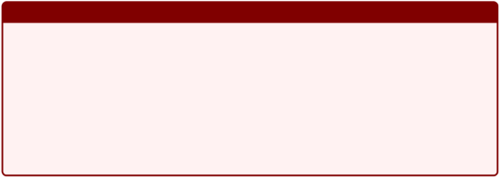

oit deux suites réelles convergentes (un )n∈N et (vn )n∈N de limites respectives L1 et L2 et λ un nombre réel. Alors :

1. la suite (λu n )n∈N converge vers λL 1,
1. la suite (un + vn)n∈N converge vers L1 + L2,
1. la suite (un × vn)n∈N converge vers L1L2
1. si L = 0 , la suite un converge vers L1 . 2 vn n∈N L2

A nouveau cette proposition est plutôt intuitive, elle ne devrait pas choquer le lecteur et généralise ce que l’on a vu précédemment aux suites convergentes (mais pas nécessairement vers 0).

Elle est en revanche très pratique lorsqu’il s’agit de calculer la limite de somme, produit ou encore quotient de deux suites.

Il se peut parfois que la limite d’une suite soit très difficile à calculer car son ex- pression est trop complexe, il peut donc se révéler utile de trouver une suite majorante dont la limite est plus simple à déterminer. C’est d’ailleurs ce que l’on fait, dans un cadre plus général en employant le Théorème des Gendarmes .

On dit que la suite (vn )n∈N est une suite majorante de (un )n∈N, si pour tout entier n, nous avons

un ≤ vn.

On peut également parler de suite majorante à partir d’un certain rang. On peut également, de façon analogue, définir la notion de suite minorante.

Proposition 1.5: Convergence et suite majorante

Soit (un )n∈N une réelle et supposons qu’il existe une suite (vn )n∈N telle que pour tout entier naturel n, |un| ≤ vn et lim vn = 0 , alors lim un = 0 .

n→+∞ n→+∞

La démonstration n’est qu’une simple écriture de la définition de limite. En re- vanche, noter que l’on étudie la suite des valeurs absolues de la suite (un )n∈N, i.e. on étudie une suite dont les valeurs sont positives. Cette hypothèse, si elle n’est pas respectée, peut mettre en défaut le résultat précédent.

En effet, considérons les suites (un )n∈N et (vn )n∈N définies par

un = − 2 + n +1 1 et vn = n + 1 .

1

On a bien un ≤ vn pour tout entier n et (vn)n∈N converge vers 0, mais cela n’est pas le cas de la suite (un )n∈N qui converge vers − 2.

Proposition 1.6: Théorème des Gendarmes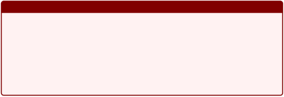

Soient trois suites réelles (un)n∈N, (vn)n∈N et (wn)n∈N telles que pour tout entier n, nous avons

un ≤ vn ≤ wn.

Alors si lim un = lim wn = L ∈R, on a

n→+∞ n→+∞

lim vn = L

n→+∞

Le résultat de cette proposition reste inchangée si l’on a un ≤ vnlewn à partir d’un certain rang n.

Exemple 1.8. Considérons la suite (un)n∈N définie pour tout entier n ∈N par

sin(n)

un = n + 1

et appliquons le théorème des gendarmes pour étudier la limite de cette suite. Notons que pour tout entier n, nous avons

−1 sin(n) 1

−1 ≤ sin(n) ≤ 1 ⇐⇒ ≤ ≤~~ .

n + 1 n + 1 n + 1

1 −1

Or lim = lim = 0 .

n→+∞ n + 1 n→+∞ n + 1

On en déduit donc, à l’aide du théorème des gendarmes, que la suite (un )n∈N converge vers 0.

C’est donc un résultat très intéressant à employer en pratique. On retrouvera un résultat analogue lorsque l’on reviendra sur les études de fonctions.

3. Divergence des suites

Toutes les suites étudiées ne sont pas forcément convergentes et nous avons pu en voir quelques exemples dans la section précédente. Dans la présente section, on cherchera simplement à définir proprement une suite divergente ainsi qu’une proposition utile en pratique

Définition 1.7: Suite divergente

Soit (un )n∈N une suite de nombres réels.

- On dit que (un)n∈N tend vers + ∞ et on note lim un = + ∞ , si : n→+∞

∀A ∈R,∃n0 ∈N tel que ∀n ≥ n0 =⇒ un ≥ A.

- On dit que (un)n∈N tend vers −∞ et on note lim un = −∞ , si : n→+∞

∀A ∈R,∃n0 ∈N tel que ∀n ≥ n0 =⇒ un ≤ A.

Dans les deux cas, la suite (un )n∈N est dite divergente.

Nous avons déjà rencontré un exemple d’une telle suite lorsque dans l’Exemple [ ?],

n

notamment à travers la suite (wn)n∈N définie pour tout entier n par wn = 2 .

Si on reprend la définition, nous avons bien pour tout A ∈ R, 2n ≥ A pour tout

ln(2A). Ainsi la définition est bien vérifiée pour tout n ≥ n0 = 2

ln(A)

n ≥ .

Remarque Une suite divergente ne doit pas forcément tendre vers + ∞ , il faut simple- ment qu’elle ne tende pas vers une valeur fixe. Donc les suites

un = ( − 1)n et v = sin( n)

n

ne tendent pas vers ±∞ mais elles divergent pour autant.

Proposition 1.7: Divergence et Relation d’ordre

Soient (un)n∈N et (vn)n∈N deux suites réelles telles que pour tout entier n, u n ≤ vn alors

1. si lim un = + ∞ , on a lim vn = + ∞ ,

n→+∞ n→+∞

2. si lim vn = −∞ , on a lim un = −∞ .

n→+∞ n→+∞

Cette proposition reste valide si l’hypothèse un ≤ vn n’est vérifiée qu’à partir d’un

certain rang.

Ces premières définitions et résultats ne permettant pas forcément de trouver la limite d’une suite ou encore de prouver que cette dernière converge.

Le seul théorème qui nous permis de faire cela est celui des gendarmes, mais on

ne dispose pas toujours de tels moyens pour déterminer la convergence d’une suite. En revanche, lorsque la suite possède de bonne propriété comme le fait d’être monotone , i.e. croissante ou décroissante, on peut alors montrer sa convergence.

4. Limite d’une suite monotone

Lorsque que l’on étudie des suites monotones, ce qui arrivent souvent lorsque l’on regarde l’évolution des solutions d’un problème au cours des itérations d’un algorithme, nous sommes capables de montrer la convergence de ces dernières. C’est ce que nous allons voir avec les deux résultats suivants.

Proposition 1.8: Existence limite suite croissante

Soit (un )n∈N une suite réelle croissante . Alors

1. si (un )n∈N est majorée , alors elle converge et lim un = n→+∞

   sup {un | n ∈N}.

   n

2. si (un)n∈N n’est pas majorée , alors elle diverge et lim un = + ∞ . n→+∞

On en déduit un résultat analogue pour les suites qui sont décroissantes

Proposition 1.9: Existence limite suite minorée

Soit (un )n∈N une suite réelle décroissante . Alors

1. si (un )n∈N est minorée , alors elle converge et lim un = n→+∞

   inf {un | n ∈N}.

   n

2. si (un)n∈N n’est pas minorée , alors elle diverge et lim un = −∞ . n→+∞

Ainsi, pour étudier la convergence d’une suite, il suffit parfois de montrer qu’elle est croissante et majorée ou encore décroissante et minorée pour montrer qu’elle converge.

Ces deux résultats ne montrent que l’existence de la limite pour une suite, mais on ne dispose pas de moyens pour la calculer pour le moment. La plupart pas du temps, il

faudra se laisser guider par l’énoncé ou les hypothèses dont on dispose sur la suite.

On termine cette présentation sur les suites en abordant un point important qui est la notion de relation d’ordre et d’équivalences entre des suites.

5. Relations de comparaison

Pour calculer des limites de suite, plus précisément pour lever une indétermination, on a parfois besoin de savoir quelles sont les suites prépondérantes, négligeables ou encore équivalentes à d’autres suites, à l’aide de suites de références.

Cela est par exemple le cas lorsque l’on souhaite étudier les limites suivantes :

n→lim+∞ 6nn+2 3 , n→lim+∞ ln(62nn2−+43n), n→lim+∞ e 1~~ .

−2n

n

Si l’intérêt est très limité dans le cadre de ce cours. Cela se révélera particulière- ment intéressant de disposer de ce genre de notions, notamment lorsque l’on cherchera à évaluer la complexité d’un algorithme, i.e. la complexité d’une opération effectuée ou la complexité globale pour la résolution d’un problème.

Connaître cet ordre pour certaines opérations, permettra de sélectionner l’algorithme le plus efficace pour la résolution d’une tâche.

Ces aspects algorithmes sont particulièrement intéressants à prendre en compte dans un cadre industriel avec des contraintes de temps lors de l’apprentissage de modèles en Machine Learning.

Mais commençons par définir ces relations de comparaisons.

1. Suite négligeable

Définition 1.8: Suite négligeable

Soient deux suites réelles (un )n∈N et (vn )n∈N. On dit que (un )n∈N est négligeable devant (vn)n∈N s’il existe une suite (wn)n∈N qui tend vers 0 et telle que un = vn × wn à partir d’un certain rang.

On note alors un = o(vn).

Regardons tout de suite une proposition plus concrète pour caractériser une suite négligeable devant une autre.

Proposition 1.10: Caractérisation négligeable

Soient deux suites réelles (un )n∈N et (vn )n∈N qui est non nulle à partir d’un cer- tain rang. On dit que (un )n∈N est négligeable devant (vn )n∈N si et seulement si

lim un = 0 .

n→+∞ vn

Exemple 1.9. La suite (un)n∈N définie pour tout entier n par un = n +2 est négligeable

n

devant la suite (vn)n∈N définie pour tout entier n par vn = 2 .

En effet, la limite de la suite un = n + 2 est nulle lorsque n tend vers + ∞ .

vn n∈N 2n

Ainsi, pour savoir si une suite est négligeable devant une autre, il suffit simplement d’étudier le quotient de ces deux suites. On pourra, par la suite, utiliser les comparaisons de références ci-dessous dans un cadre pratique

Comparaison des suites de référence Si on considère des nombres réeles α,β et γ strictement positifs, alors :

ln(n)α = o(nβ), nβ = o(eγn ) et eγn = o(n!).

Ces relations son normalement déjà connues, mais on va les montrer afin de pouvoir les utiliser par la suite. Dans les trois cas, on va s’intéresser au quotient entre les deux suites

- ln(n)α = o(nβ) : ...
- nβ = o(eγn : Il suffit simplement de réécrire le quotient comme suit

β

enγn = eβ ln(n)−γn.

Or la suite un = n croit plus rapidement que la suite vn = ln( n), donc lim (β ln(n)−

n→+∞

nβ

γn) = −∞ . On en déduit donc que lim = 0 .

n→+∞ eγn

- eγn = o(n!) : Soit n0 un entier tel que n0 ≥ 2eγ , alors pour tout entier naturel n tel que n ≥ n0 :

29 - Analyse I - L1 Informatique ![ref2]

eγn eγn eγn0 eγ eγ eγn

`  `n!  = n! = n0! n × n − 1 × ... × n0 + 1 ≤

×

1 n−n0 eγn

Or lim = 0 , donc lim = 0 .

n→+∞ 2 n→+∞ n!

1 n−n0 eγn0

. 2 n0!

` `- Analyse I - L1 Informatique ![ref2]

2. Suite dominée

Définition 1.9: Suite dominée

Soient deux suites réelles (un )n∈N et (vn )n∈N. On dit que (un )n∈N est dominée par (vn)n∈N s’il existe une suite (wn)n∈N bornée telle que un = vn × wn à partir d’un certain rang.

On note alors un = O(vn).

Regardons tout de suite une proposition plus concrète pour caractériser une suite négligeable devant une autre.

Proposition 1.11: Caractérisation domination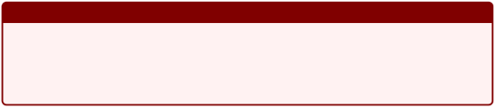

Soient deux suites réelles (un )n∈N et (vn )n∈N qui est non nulle à partir d’un certain rang. On dit que (un )n∈N est dominée par (vn )n∈N si et seulement si le quotient

un

est borné à partir d’un certain rang.

vn

Ainsi, pour savoir si une suite est dominée devant une autre, il suffit simplement d’étudier le quotient de ces deux suites et de montrer que ce quotient reste borné.

Exemple 1.10. La suite (un)n∈N définie pour tout entier n par un = 6 n +2 est dominée pEnar effet,la suitela limite(v ) de la suite quotient un estnégale 6, elle est donc bien bornée à

n n∈N définie pour tout entier n par v = 7 n + 4 .

vn n∈N 7

partir d’un certain rang.

3. Suites équivalentes

Il s’agit d’un dernier point à étudier et qui sera aussi très utile au moment de l’analyse de fonctions. Cette notion d’équivalence est importante lorsque l’on cherche à faire des approximations asymptotiques des suites ou même des fonctions.

Définition 1.10: Suites équivalentes

Soient deux suites réelles (un )n∈N et (vn )n∈N. On dit que les deux suites sont équivalentes s’il existe une suite (wn)n∈N tendant vers 1 telle que un = vn × wn à partir d’un certain rang.

On note alors un ∼ vn.

Noter que la relation d’équivalence entre deux suites est une relation symétrique. Ainsi si la suite (un )n∈N est équivalente à la suite (vn )n∈N, on pourra également dire que la suite (vn )n∈N est équivalente à la suite (un )n∈N (ce qui n’était pas le cas avec les notions dominées et négligeables).

Proposition 1.12: Caractérisation équivalence

Soienrang. tOndeuxdit quesuites(ruéelles) (un)n∈N et (vn)n∈N qui)n∈Nestsinonet seulemennulle à partirt si d’unlim certainun = 1 .

n n∈N est équivalente à (vn n→+ ∞ vn

Plus que les définitions en soit, ce sont des surtout les exemples des équivalents de références qu’il sera bon de mémoriser pour l’usage pratique.

Exemple 1.11. On considère une suite réelle (un )n∈N telle que sa limite lorsque n tend vers + ∞ est égale à 0. On a alors alors les équivalents suivants :

1. sin(un) ∼ un, 5. ln(1 + un) ∼ un,

u2 6. eun − 1 ∼ un,

2. cos(un) − 1 ∼ n ,

2 7. (1 + un)α − 1 ∼ αu n.

3. sh(un) ∼ un,

u2

4. ch(un) − 1 ∼ n ,

2

Pour toutes les démonstrations, on se rappelle que la suite (un )n∈N est une suite qui converge vers 0.

- Pour sin(un) ∼ un :

  On utilisera la définition du nombre dérivée en une valeur. Plus précisément, on utilisera le fait que f est une fonction dérivable en a, on alors

f (x) − f (a) ′

lim~~ = f (a).

x→a x − a

En appliquant cette définition à la fonction f = sin et en prenant a = 0 et x = un, nous avons alors

lim sin(un) − sin(0) = lim sin(un) = sin′(0) = cos(0) = 1. n→+∞ un − 0 n→+∞ un

- Pour cos(un) − 1 ∼ − 2n :

u

2

On pourrait être tenté de refaire la même procédure que précédemment vu que cos(0) = 1 , en écrivant

lim cos(un) − cos(0) = lim cos(un) − 1 = cos′(0) = − sin(0) = 0. n→+∞ un − 0 n→+∞ un

Mais on remarque cette limite tend vers 0 et nous n’avons pas montré une quelconque équivalente entre les deux suites. Il va donc falloir travailler un peu et notamment ... utiliser quelques relations trigonométriques.

Pour cela, on se rappelle que pour tout x nous avons

cos(2x) = cos(x)2 − sin(x)2,

- cos(x)2 + sin(x)2 = 1 soit cos(x)2 = 1 − sin(x)2
- 1 − 2sin(x)2,

cos(2x) − 1 = − 2sin(x)2.

un

En prenant x = et en utilisant l’équivalence démontrée précédemment, nous

2

avons

cos(un) − 1 = − 2sin  un 2 ,

2

- sin(un) ∼ un u2
- − 2 n ,

  4

  u2

- − n .

  2

- Le principe est exactement le même pour les fonctions sh et ch. En revanche, nous ne savez pas comment elles sont définies actuellement donc on s’en occupe pas (on les manipuleras peu dans le cadre de ce cours).
- Pour ln(1 + un) ∼ un :

  On se sert à nouveau de la définition du nombre dérivé dans ce cas pour trouver notre équivalent. On veut montrer que lim ln(1 + un) = 1 , or

n→+∞ un

lim n = lim ln(1 + un) − ln(1) = ln′(1) = 1.

ln(1 + u )

n→+∞ un n→+∞ (1 + un) − 1

- Pour eun − 1 ∼ un :

  C’est exactement pareil dans ce cas

eun − 1 eun − e0

lim = lim = e′0 = 1.

n→+∞ un n→+∞ un − 0

- Pour (1 + un)α − 1 ∼ αu n :

  A nouveau, on va employer notre définition du nombre dérivé et on se rappelle que la dérivée de (1+ x)alpha est donnée par α(1+ x)α− 1 dont la valeur est égale

  àα lorsque x = 0 .

  D’où

(1 + un)α − 1 (1 + un)α − 1α

lim~~ = lim~~ = α.

n→+∞ un n→+∞ (1 + un) − 1

Quelques remarques importantes pour finir sur ces notions d’équivalents.

- Il est possible de faire le produits de deux équivalents, i.e. si an ∼ bn et un ∼ vn alors anun ∼ bnvn
- Cela reste également valable si on souhaite faire le quotient de deux équivalents.
- On peut également prendre la puissance de deux équivalents (c’est d’ailleurs ce que nous utilisé à un moment), i.e. si un ∼ vn, alors pour tout α ∈ R, on a aussi uαn ∼ vnα

En revanche de façon générale, la notion d’équivalents n’est pas compatible avec la somme ou la différence.

Exemple 1.12. Considérons le suites (un )n∈N⋆ et (vn )n∈N⋆ définies par

un = n13 + n1 et vn = n12 − n.

1

1 −1

valents,u Anlorsnousn1u3trouverions∼n12 etn1v2unn ∼équivalentn à

n n lorsque n tend vers + ∞ . Si on somme les deux équi- 0, ce qui est absurde! En réalité, nous avons

n + v = + ∼ lorsque n tend vers + ∞ .

2  Fonctions usuelles
1. Logarithme

On commence par présenter le logarithme népérien et on présentera rapidement la définition du logarithme en base quelconque, qui présentera un intérêt dans l’étude ultérieure de certains algorithmes.

Logarithme Népérien

Définition 2.1: Logarithme népérien

La fonction logarithme népérien , notée ln, est l’unique primitive sur ]0, + ∞ [ de la

1

fonction x → qui s’annule en 1.

x

Par définition, pour tout x ∈]0,+ ∞ [ nous avons

x 1

ln(x) = dt.

1  t

De cette même définition, on peut déduire que la fonction x →ln(x) est continue et dérivable sur ]0, + ∞ [ et que pour tout x dans ce même intervalle, nous avons

ln′(x) = 1.

x

1

On se rappelle de la définition de fonction x → , cette fonction est strictement

x

positive sur ]0, + ∞ [. Ceci implique la fonction ln est strictement croissante sur ce même

intervalle.

Avant de poursuivre sur l’étude de la fonction en elle même, regardons quelques unes de ses propriétés, notamment vis-à-vis du produit et du quotient. Ces propriétés sont résumées par la proposition suivante :

Proposition 2.1: Propriétés logarithme népérien 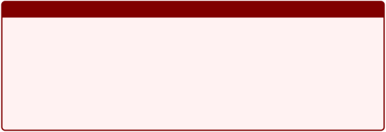Pour tout (x,y) ∈R2 et pour tout n ∈Z, nous avons

1) ln( xy) = ln( x) + ln( y), 1
1) ln = − ln(x),

` `x

x

3) ln = ln( x) − ln(y), y
3) ln(xn) = n ln(x).

Démonstration. On va uniquement démontrer le premier point de cette proposition. En effet, les trois autres points n’en sont que des conséquences.

Pour tout y ∈]0,+ ∞ [on considère la fonction f : x →ln(xy) pour tout x ∈]0,+ ∞ [. La fonction f est dérivable sur l’intervalle ]0, + ∞ [ comme composée de deux fonctions dérivables sur ce même intervalle. Ainsi, pour tout x ∈]0,+ ∞ [, nous avons

f ′(x) = y = 1.

yx x

Ainsi, f ′(x) = ln ′(x) pour tout réel x ∈]0,+ ∞ [. Comme les fonctions f et ln ont la même dérivée sur cet intervalle, elles sont donc égales à une constante près sur ce même intervalle . On en déduit

∀x ∈]0,+∞[, f (x) = ln(x) + c,

où c est une certaine constante. Cependant, pour x = 1 , nous avons f (1) = ln( y) = ln(1) + c = c.

On en déduit que c = ln( y), donc

∀x ∈]0,+∞[, f (x) = ln(xy) = ln(x) + ln(y).

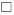

Nous avons vu que la fonction ln était strictement croissante entre ]0, + ∞ [, il nous reste donc pas à voir quelles sont les limites de cette fonction en les bornes de cet inter- valle. Ces limites sont données par le résultat suivant :

Proposition 2.2: Limites

La fonction ln admet des limites en 0 et + ∞ qui sont :

lim ln(x) = −∞ et lim ln(x) = + ∞ . x→0+ x→+∞

Démonstration. Pour montrer ces deux résultats, on va utiliser la croissante de la fonc- tion ln ainsi que la quatrième propriété de cette fonction énoncée dans la Proposition 2.1.

La croissante stricte de la fonction ln implique ln(2) > ln(1) = 0 . Ainsi, en utilisant la quatrième partie, on a

lim ln(2n) = lim n ln(2) = +∞.

n→+∞ n→+∞

La fonction ln est une fonction croissante qui n’est donc pas majorée, on a donc

lim ln(x) = +∞.

x→+∞

De plus,

1

lim ln(x) = lim − ln = lim − ln(t) = − lim ln(t) = −∞. x→0+ x→0+ x t→+∞ t→+∞

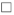

Ce dernier résultat nous permet d’affirmer que la fonction ln réalise une bijection croissante et continue de ]0, + ∞ [ dans R. On pourra également dresser le tableau de variation de cette fonction ln et en donner une représentation graphique (voir Figure 3).

|x|
+∞

0 1
|||
| - | - | :- | :- |
|1 x||+|0|
|ln||
+∞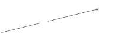

0

−∞
||

3

|||||||||||||||||||||||
| :- | :- | :- | :- | :- | :- | :- | :- | :- | :- | :- | :- | :- | :- | :- | :- | :- | :- | :- | :- | :- | :- |
|||||||||||||||||||||||
|||||||||||||||||||||||
|||||||||||||||||||||||
|||||||||||||||||||||||
|||||||||||||||||||||||
|||||||||||||||||||||||
|||||||||||||||||||||||
|||||||||||||||||||||||
|||||||||||||||||||||||
|||||||||||||||||||||||
|||||||||||||||||||||||
||||||||||||||||||x |→|ln(|x)||
|||||||||||||||||||||||
2

1

0 −1 −2 −3 −4

−1 0 1 2 3 4 5 6 7 8 9 10

Figure 3 – Représentation de la fonction logarithme népérien sur R+ ⋆

|x|
+∞

0 1
|||
| - | - | :- | :- |
|1 x||+|0|
|ln||
+∞

0

−∞
||

Logarithme en base quelconque

Définition 2.2: Logarithme en base a

Soit a un nombre réel strictement positif et différent de 1. On appelle logarithme de base a, que l’on note loga, la fonction définie sur ]0, + ∞ [ par :

ln(x)

loga(x) = ln(a).

Exemple 2.1. Mettre quelques exemples d’utilisation du logarithme en base quelconques

2. Fonction exponentielle

Définition 2.3: Exponentielle

La fonction exponentielle, notée exp, est la fonction réciproque de la fonction ln. Elle est donc bijective et strictement croissante de R dans ]0, + ∞ [.

Remarque Il est également possible de définir la fonction exponentielle comme la seule solution de l’équation différentielle avec la condition suivante

y′(x) = y(x), y(0) = 1.

Mais nous n’aborderons pas le thème des équations différentielles dans le cadre de ce cours. On gardera cependant en tête que la dérivée de la fonction exponentielle est elle même, i.e.

∀x ∈R, exp′(x) = exp(x)

Ecrire la preuve ou pas?

Mais qu’est-ce qu’une fonction bijective? Commençons par donner une définition formelle avant de l’expliquer plus en détail et d’en trouver quelques caractéristiques simple.

Définition 2.4: Applications injectives, surjectives et bijectives

Soient I et J deux intervalles de R et considérons une fonction f : I → J . Alors la fonction f est dite

- injective : si pour tout y ∈J il existe au plus un x ∈I tel que f (x) = y, i.e. f est injective si tout point de l’espace d’arrivée admet au plus un antécédent par f .
- surjective : si pour tout y ∈ J il existe au moins un x ∈ I tel que f (x) = y, i.e. f est surjective si tout point de l’espace d’arrivé admet au moins un antécédent par f .
- bijective : si elle est à la fois injective et surjective, i.e. si pour tout y ∈J il existe un seul et unique x ∈I tel que f (x) = y, donc tout point de J admet un seul et unique antécédent par f .

Soient x1,x2 ∈I alors f est injective si et seulement si on a l’implication suivante

f (x1) = f (x2) =⇒ x1 = x2.

Pour caractériser les fonctions bijectives, on pourra se contenter de montrer que cette dernière est strictement monotone ( i.e. strictement croissante ou strictement dé- croissante) de I dans J .

Revenons à notre fonction exponentielle, cette dernière est donc bijective de R dans R⋆ et sa fonction réciproque n’est rien d’autre que la fonction ln. Nous avons donc les

\+

relations suivantes :

6

<table><tr><th colspan="1"></th><th colspan="1"></th><th colspan="1"></th><th colspan="1"></th><th colspan="1"></th><th colspan="1"></th><th colspan="1"></th><th colspan="1"></th><th colspan="1"></th><th colspan="3"></th></tr>
<tr><td colspan="1"></td><td colspan="1"></td><td colspan="1"></td><td colspan="1"></td><td colspan="1"></td><td colspan="1"></td><td colspan="1"></td><td colspan="1"></td><td colspan="1"></td><td colspan="3"></td></tr>
<tr><td colspan="1"></td><td colspan="1"></td><td colspan="1"></td><td colspan="1"></td><td colspan="1"></td><td colspan="1"></td><td colspan="1"></td><td colspan="1"></td><td colspan="1"></td><td colspan="3"></td></tr>
<tr><td colspan="1"></td><td colspan="1"></td><td colspan="1"></td><td colspan="1"></td><td colspan="1"></td><td colspan="1"></td><td colspan="1"></td><td colspan="1"></td><td colspan="1"></td><td colspan="3"></td></tr>
<tr><td colspan="1"></td><td colspan="1"></td><td colspan="1"></td><td colspan="1"></td><td colspan="1"></td><td colspan="1"></td><td colspan="1"></td><td colspan="1"></td><td colspan="1"></td><td colspan="3"></td></tr>
<tr><td colspan="1"></td><td colspan="1"></td><td colspan="1"></td><td colspan="1"></td><td colspan="1"></td><td colspan="1"></td><td colspan="1"></td><td colspan="1"></td><td colspan="1"></td><td colspan="3"></td></tr>
<tr><td colspan="1"></td><td colspan="1"></td><td colspan="1"></td><td colspan="1"></td><td colspan="1"></td><td colspan="1"></td><td colspan="1"></td><td colspan="1"></td><td colspan="1"></td><td colspan="3"></td></tr>
<tr><td colspan="1"></td><td colspan="1"></td><td colspan="1"></td><td colspan="1"></td><td colspan="1"></td><td colspan="1"></td><td colspan="1"></td><td colspan="1"></td><td colspan="1"></td><td colspan="3"></td></tr>
<tr><td colspan="1"></td><td colspan="1"></td><td colspan="1"></td><td colspan="1"></td><td colspan="1"></td><td colspan="1"></td><td colspan="1"></td><td colspan="1" valign="bottom">x</td><td colspan="1" valign="bottom">` `→ln(</td><td colspan="2" valign="bottom">x)</td><td colspan="1"></td></tr>
<tr><td colspan="1" rowspan="2"></td><td colspan="1" rowspan="2"></td><td colspan="1" rowspan="2"></td><td colspan="1" rowspan="2"></td><td colspan="1" rowspan="2"></td><td colspan="1" rowspan="2"></td><td colspan="1" rowspan="2"></td><td colspan="1" valign="top">x</td><td colspan="1" valign="top">` `→exp</td><td colspan="2" valign="top">(x)</td><td colspan="1"></td></tr>
<tr><td colspan="1"></td><td colspan="1"></td><td colspan="1"></td></tr>
</table>
4

2

0 −2 −4

−4 −2 0 2 4 6

Figure 4 – Représentation de la fonction logarithme népérien sur R+ ⋆. Le graphique met également le caractère réciproque des fonctions logarithme et exponentielle via la symétrie par rapport à la droite d’équation y = x.

∀x ∈R, ln(exp( x)) = x et ∀x ∈]0,+ ∞ [, exp(ln( x)) = x.

On peut alors dresser le tableau suivant et représenter la fonction exponentielle ainsi que sa fonction réciproque en Figure 5. En tant que fonction réciproque l’une de l’autre, il est important de garder à l’esprit que ces deux fonctions sont donc symétriques par rapport à la droite d’équation y = x.

|x|−∞ 0 +∞|
| - | - |
|
′

exp (x)
|+|
|exp|
+∞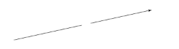

1

0
|

Les limites de la fonction exponentielle se déduisent directement des limites du logarithme népérien par symétrie avec la droite d’équation y = x. Tout comme nous l’avons fait pour le logarithme, nous pouvons également donner quelques propriétés de

la fonction exponentielle.

Proposition 2.3: Propriétés de l’exponentielle

Pour tous réels x,y ∈R et pour tout n ∈Z, la fonction exp vérifie les propriétés suivantes

1) exp(x + y) = exp( x)exp(y), 1
1) exp(− x) =~~ ,

exp(x)

exp(x)

3) exp(x − y) =~~ , exp(y)
3) exp(nx) = (exp( x))n.

Démonstration. Pour démontrer les différents points, on utilisera le fait que l’exponen- tielle se définit comme la fonction réciproque du logarithme népérien.

i) Pour tous x,y ∈R, nous avons

ln(exp(x)exp(y)) = ln(exp(x)) + ln(exp(y)) = x + y = ln(exp(x + y)).

En utilisant la bijectivité de ln, on en déduit la relation : exp(x+ y) = exp( x)exp(y).

Les points ii), iii) et iv) sont des conséquences immédiates du point i). En effet

exp(x)exp(−x) = exp(x − x) = exp(0) = 1

et on déduit directement la relation ii). Pour obtenir la relation iii), il suffit d’écrire

exp(x)

exp(x − y) = exp(x + (−y)) = exp(x)exp(−y) =~~ .

exp(y)

Enfin, pour la relation iv), on va à nouveau utiliser la fonction ln. Ce qui nous donne, pour tout x ∈R et pour tout n ∈Z

ln(exp(x)n) = n ln(exp(x)) = nx = ln(exp(nx)).

3. Fonctions puissances

Maintenant que l’on a définit les fonctions exp et ln, nous sommes capables de définir en tout généralité les fonctions puissances .

Jusqu’à présent, les fonctions puissances f (x) = xn, ont été définies pour tout en- tier n ∈N voir pour des entiers n ∈Z.

Or, nous avons vu que pour tout entier n, x n = en ln(x) qui est donc définie pour tout x > 0.

On pourra naturellement étendre cette définition au cas où n est un nombre réel, mais uniquement sur ]0, + ∞ [.

|Définition 2.5: Fonction puissance α|
| - |
|
Soit α un nombre réel. On définit sur ]0, + ∞ [ la fonction puissance α par :

∀x ∈]0,+∞[, xα = eα ln(x).
|
||
|Proposition 2.4: Propriétés de la fonction puissance|
|
Soient α et β deux nombres réels, alors pour tout x,y > 0, nous avons

i) 1α = 1 ,

ii) xα yα = ( xy)α ,

iii) ln(xα ) = α ln(x),

iv) xα xβ = xα+ β,

v) (xα )β = xαβ .
|

Démonstration. kl,kl 

On se propose maintenant d’étudier les variations de cette fonction puissance selon

le signe α. Pour cela considérons, pour tout réel α, la fonction f α (x) définie pour tout réel x strictement positif. On a donc

fα(x) = xα = eα ln(x).

On en déduit que la fonction f α est dérivable pour tout x > 0, comme composée de deux fonctions dérivables (nous verrons ce point là ultérieurement donc nous l’admettons pour le moment). La dérivée de cette fonction est donnée par :

- α α ln(x) α α α−1

fα(x) = x e = x x = αx .

Etudions le signe de cette dérivée selon le signe de α. nous avons donc trois cas à

distinguer.

- Cas où α = 0 :

  Dans ce cas, pour tout réel x, nous avons f 0(x) = 1 et la fonction puissance est donc la fonction constante égale à 1.

  La dérivée est également constante et égale à 0 pour tout réel x.

- Cas où α > 0 :

  Dans ce deuxième cas, la dérivée f ′ (x) > 0 pour tout réel x > 0, et la fonction

α

f α est donc strictement croissante. De plus

- 
- lim α ln(x) = −∞,  lim fα(x) = 0,

  x→0 donc x→0

- lim α ln(x) = +∞,  lim fα(x) = +∞.

  x→+∞ x→+∞

Remarquons que l’on peut même prolonger la fonction par continuité en 0 en lui attribuant la valeur 0. On en déduit alors directement le tableau des variations

de cette fonction.

- Cas où α < 0 :

  Dans ce troisième cas, la dérivée f α′ (x) < 0 pour tout réel x > 0, et la fonction f α est donc strictement décroissante. De plus

- 
- lim α ln(x) = +∞,  lim fα(x) = +∞,

  x→0 donc x→0

- lim α ln(x) = −∞,  lim fα(x) = 0.

  x→+∞ x→+∞

Nous représentons les différentes fonctions pour différentes valeurs α en Figure 5. Notons également, dans le cas α > 0, la position relative de x →xα selon que x > 1 ou

x < 1.

Considérons deux réels α1 et α2 tels que α1 < 1 < α 2, alors, pour tout x > 1

xα1 ≤ x ≤ xα2 .

De la même façon, si l’on considère deux réels α1 et α2 tels que α1 < 1α2 < 1, nous avons, pour tout x < 1

xα2 ≤ x ≤ xα1 .

Nous pourrions effectuer une étude similaire dans le cas où l’exposant α est négatif.

Nous poursuivons notre étude de fonctions avec les fonctions dites circulaires . Ce sont des fonctions moins courantes mais que l’on peut retrouver fréquemment, notamment lorsque l’on sera amené à travailler sur des données périodiques ou sinusoïdales ou plus généralement dans le domaine de la théorie du signal .

6 4 2 0

6 4 2 0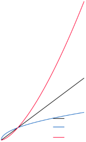

<table><tr><th colspan="1"></th><th colspan="1"></th><th colspan="1"></th><th colspan="1"></th><th colspan="1"></th><th colspan="1"></th><th colspan="2"></th></tr>
<tr><td colspan="1"></td><td colspan="1"></td><td colspan="1"></td><td colspan="1"></td><td colspan="1"></td><td colspan="1"></td><td colspan="2"></td></tr>
<tr><td colspan="1"></td><td colspan="1"></td><td colspan="1"></td><td colspan="1"></td><td colspan="1"></td><td colspan="1"></td><td colspan="2"></td></tr>
<tr><td colspan="1" rowspan="2"></td><td colspan="1" rowspan="2"></td><td colspan="1" rowspan="2"></td><td colspan="1" rowspan="2"></td><td colspan="1"></td><td colspan="1"></td><td colspan="2"></td></tr>
<tr><td colspan="1"></td><td colspan="1" valign="top">x x → x →</td><td colspan="1" valign="top">
→x

x1/ 2 x3/ 2
</td><td colspan="1" valign="top"></td></tr>
<tr><td colspan="1"></td><td colspan="1"></td><td colspan="1"></td><td colspan="1"></td><td colspan="1"></td><td colspan="1"></td><td colspan="1"></td><td colspan="1"></td></tr>
</table>
||||||x →|x− 1||
| :- | :- | :- | :- | :- | - | - | :- |
||||||x →|x− 4||
|||||||||
|||||||||
|||||||||
|||||||||
|||||||||
0 2 4 6 0 2 4 6 Figure 5 – Représentation de la fonction puissance α pour différentes valeurs de α.

4. Fonctions circulaires

Les fonctions circulaires sont des fonctions déjà rencontrées dans des contextes géométriques et notamment lors de mesures d’angles dans un triangle à partir des côtés adjacent , opposé ou encore de l’hypoténuse. On se rappelle que dans un triangle rectangle, nous pouvions obtenir ces différentes mesures d’un angle α par les relations :

opposé adjacent opposé sin(α) =~~ , cos(α) = et tan (α) =~~ . hypoténuse hypoténuse adjacent

De ces définitions vous avez également pu étudier, de ces relations découlez le théo- rème de Pythagore ou une version généralisée appelée le théorème d’Al-Kashi.

Vous vous souviendrez également de quelques valeurs particulières de ces fonctions en fonction de l’angle étudié, ces différentes valeurs sont rappelées en Figure 6.

Nous mettons ici de côté l’aspect géométrique pour nous focaliser sur l’aspect analytique. On rappelle que les fonctions sinus et cosinus sont définies sur R et sont 2π-périodiques, ce qui signifie que pour tout réel x

sin(2π + x) = sin( x) et cos(2π + x) = cos( x).

La fonction cosinus est une fonction paire et la fonction sinus est fonction impaire et vérifient donc pour tout réel x

sin(− x) = − sin(x) et cos(x) = cos( − x).

Ces deux propriétés peuvent facilement se voir sur les graphiques de ces fonctions présentées en Figure 7. Elles sont également dérivables pour tout x ∈R et

sin(α) 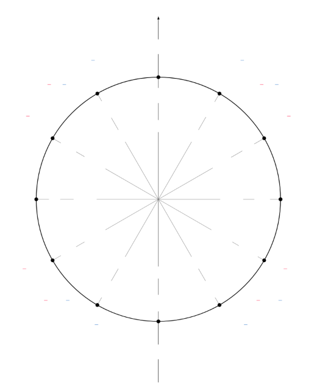(0, 1)

- √
- 1, 3 1, 3
2  2 2 2
- √ √ √
- 2, 2 π 2, 2

  2 2 2 2 2

2π π

- 3 3 √
- 3, 1 π 3, 1

  2 2 34π 90◦ 4 2 2

120◦ 60◦

5π π

6 6

150◦ 30◦

(−1, 0) (1, 0) 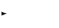

~~π 180◦ 3600◦ ◦ 2π~~ cos(α)

210◦ 330◦

7π 11π

6 6

- 5π 240◦ ◦ 300◦ 7π √3
- 23,− 12 4 270 4 2 ,− 12 4π 5π

3 3

- √22,− √22 32π √22,− √22
  - √
  - 1,− 3 1,− 3

    2 2 2 2

(0, −1)

Figure 6 – Cercle trigonométrique. On lit abscisse le cosinus de l’angle α (première coordonnée) et en ordonnée le sinus de ce même angle α (deuxième coordonnée)

sin′(x) = − cos(x) et sin′(x) = cos( x).

A partir de ces relations là, on peut dresser les tableaux de variations de ces deux fonctions circulaires

Si ces formules de dérivées paraissent pour le moment sortir de nul part, elles sont

en fait issues d’une autre définition de ces fonctions circulaires en utilisant l’ exponentielle complexe.

Fonction directe Notre objectif n’est pas de rentrer dans le détail de l’exponentielle complexe mais simplement d’utiliser les liens existants entre ces deux fonctions.

Définition 2.6: Fonctions circulaire

Les fonctions sinus et cosinus peuvent se définir à l’aide de l’exponentielle com- plexe, i.e. pour tout x ∈R nous avons

exp(ix) + exp(−ix) exp(ix) − exp(−ix) cos(x) =~~ et sin(x) =~~ , 2 2i

où i est le nombre vérifiant i2 = − 1.

S’il ne s’agit pas là de la "vraie" définition de ces deux fonctions circulaires, elles seront amplement suffisantes ici et suffiront à démontrer ce que sont les dérivées des fonctions sin et cos.

En revanche de ces relations, on pourra montrer que pour tout réel x nous avons

cos2(x) + sin 2(x) = 1 . (1)

Remarque Bien que les nombres complexes ne soient pas étudiés dans le cadre, nous attirons l’attention du lecteur sur le fait que les nombres complexes, sont également em- ployés dans d’autres champs des mathématiques comme les probabilités, pour déterminer une fonction caractéristique d’une variable aléatoire qui suit une distribution connue, per- mettant ainsi de la recnnaître ou encore de calculer des moments de ceete loi (espérance, variance).

`  `πIl nous reste à étudier la fonction tangente tan . Elle est définie pour tout x ∈ R \ + kπ par

2

sin(x)

tan(x) =~~ .

cos(x)

49 - Analyse I - L1 Informatique ![ref2]

1.2 1 0.8 0.6 0.4 0.2 0

|||||||||||
| :- | :- | :- | :- | :- | :- | :- | :- | :- | :- |
|||||||||||
|||||||||||
|||||||||||
|||||||||||
|||||||||||
|||||||||||
|||||||||||
|||||||||||
|||||||||||
|||||||||||
|||||||||||
|||||||||||
|||||||||||
|||||||||||
|||||||||||
|||||||||||
|||||||||||
|||||||||||
|||||||||||
|||||||||||
||||||||x →co|s(x)||
|||||||||||
−0.2 −0.4 −0.6 −0.8

−1 −1.2

−3.14 0 3.14

Figure 7 – Représentation graphique des fonctions trigonométriques sinus et cosinus dans l’intervalle [− 2π, 2π].

La fonction tan est donc  πpar définition  une fonction impaire et elle est également dérivable pour tout x ∈R \ + kπ . Pour ces même réels x, sa dérivée est donnée par

2

tan ′(x) = 1 = 1 + tan 2(x). La deuxième égalité est donnée par la relation (1).

cos2(x)

Une représentation graphique de la fonction tangente est donnée en Figure 8. [Sur ](#_page43_x89.29_y94.25)cette même figure, on montre qu’il est également possible de lire graphiquement la valeur

de la tangente d’un angle α directement à partir du cercle trigonométrique, en considérant une droite formant un angle α avec l’axe des abscisses et la droite d’équation x = 1 .

Fonction réciproque Précédemment, nous avons vu que les fonctions logarithme et exponentielle sont réciproques l’une de l’autre. Dans le cas présent, on ne peut pas dire

que les fonctions circulaires sont bijectives de R dans R en raison de leur périodicité. On pourra revanche noter que les restrictions des fonctions sin : − [π/ 2,π/ 2] → [− 1,1], cos : [0,π] → [− 1,1] et tan : [− π/ 2,π/ 2] →] − ∞ ,+ ∞ [ sont des bijections. On peut donc définir des fonctions réciproques que l’on appelle respective arcsin,arccos et arctan .

Il n’existe malheureusement pas d’expression de ces fonctions, on se contentera donc uni- quement de leur existence.

Terminons cette présentation des fonctions usuelles en présentant les fonctions dites hyperboliques.

||||||||||
| :- | :- | :- | :- | :- | :- | :- | :- | :- |
||||||||||
||||||||||
||||||||||
||||||||||
||||||||||
||||||||||
||||||||||
||||||||||
||||||||||
||||||||||
||||||||||
||||||||||
||||||||||
||||||||||
||||||||||
||||||||||
||||||||||
||||||||||
||||||x|` `→tan|(x)||
||||||||||
2 1.6 1.2 0.8 0.4 0

tan(α) tan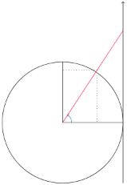

sin(α)

−0.4 −0.8 −1.2

α

O cosα

−1.6 −2

−3.14 0 3.14

Figure 8 – Représentation de la fonction tangente, tan , à gauche

et illustration de l’interprétation géométrique de la tangente. La valeur de la tangente est représentée par la longueur du segment rouge sur la figure de droite.

5. Fonctions hyperboliques

Ces fonctions ressemblent fortement à celles étudiées précédemment, elles portent d’ailleurs des noms très proches. On les retrouve plus rarement que les précédentes mais l’une d’elle, la tangente hyperbolique est souvent utilisé dans des modèles d’apprentissage que l’on appelle réseaux de neurones . Commençons par les définir.

Définition 2.7: Fonctions hyperboliques

Les fonctions sinus hyperbolique et cosinus hyperbolique , notées respectivement sh et ch, sont définies pour tout réel x par les relations

exp(x) − exp(−x) exp(x) + exp(−x) sh(x) =~~ et ch(x) =~~ . 2 2

A partir de ces fonctions, nous pouvons également introduire la fonction tangente hyperbolique, notée th, définie pour tout réel x par la relation

sh(x) exp(x) − exp(−x) th(x) = =~~ .

ch(x) exp(x) + exp(−x)

Les fonctions hyperboliques et plus particulièrement la tangente sont définies sur R tout entier contrairement à son homologue circulaire. Une représentation graphique de ces fonctions est donnée en Figure 10.

De ces définitions, on peut directement décrire quelques liens entre ces fonctions

4

<table><tr><th colspan="1"></th><th colspan="1"></th><th colspan="1"></th><th colspan="1"></th><th colspan="1"></th><th colspan="2"></th><th colspan="3"></th><th colspan="2"></th></tr>
<tr><td colspan="1"></td><td colspan="1"></td><td colspan="1"></td><td colspan="1"></td><td colspan="1"></td><td colspan="2"></td><td colspan="3"></td><td colspan="2"></td></tr>
<tr><td colspan="1"></td><td colspan="1"></td><td colspan="1"></td><td colspan="1"></td><td colspan="1"></td><td colspan="2"></td><td colspan="3"></td><td colspan="2"></td></tr>
<tr><td colspan="1"></td><td colspan="1"></td><td colspan="1"></td><td colspan="1"></td><td colspan="1"></td><td colspan="2"></td><td colspan="3"></td><td colspan="2"></td></tr>
<tr><td colspan="1"></td><td colspan="1"></td><td colspan="1"></td><td colspan="1"></td><td colspan="1"></td><td colspan="2"></td><td colspan="3"></td><td colspan="2"></td></tr>
<tr><td colspan="1"></td><td colspan="1"></td><td colspan="1"></td><td colspan="1"></td><td colspan="1"></td><td colspan="2"></td><td colspan="3"></td><td colspan="2"></td></tr>
<tr><td colspan="1"></td><td colspan="1"></td><td colspan="1"></td><td colspan="1"></td><td colspan="1"></td><td colspan="1"></td><td colspan="1"></td><td colspan="3" valign="top">x → x →</td><td colspan="1" valign="top">sh(x) ch(x)</td><td colspan="1"></td></tr>
<tr><td colspan="1" rowspan="2"></td><td colspan="1" rowspan="2"></td><td colspan="1" rowspan="2"></td><td colspan="1" rowspan="2"></td><td colspan="1" rowspan="2"></td><td colspan="1" rowspan="2"></td><td colspan="1"></td><td colspan="3">x →</td><td colspan="1">th(x)</td><td colspan="1"></td></tr>
<tr><td colspan="2"></td><td colspan="1"></td></tr>
</table>
2

0 −2

−4

−4 −2 0 2 4

Figure 9 – Représentation des fonctions sinus hyperbolique , cosinus hyperbolique et tangente hyperbolique

hyperboliques, tout comme nous l’avons fait pour les fonctions circulaires. Par exemple, pour tout réel x nous avons les relations

ch(x) + sh( x) = ex et ch2(x) − sh2(x) = 1 . (2) Etudions maintenant ces fonctions d’un peu plus et notamment leurs propriétés.

Concernant le signe Pour tout x ∈ R, la fonction ch est positive comme somme de deux fonctions positives. La fonction sh est positive pour tout x ≥ 0 et négative sinon. En effet, sh(x) ≥ 0 ⇐⇒ ex ≥ e− x et cette dernière inégalité est vérifiée si et seulement

si x ≥ 0. Enfin, tout comme la fonction sh, la fonction th est positive pour tout x ≥ 0 et négative dans le cas contraire.

Concernant la dérivabilité Ces différentes fonctions circulaires sont dérivables sur R comme la somme ou le quotient de fonctions dérivables sur R. En effet, nous avons vu plus tôt que la fonction exp est une fonction définie et dérivable sur R. Leurs dérivées sont données par la proposition suivante

Proposition 2.5: Dérivées fonctions hyperboliques

Les fonctions ch,sh et th sont dérivables sur R et pour tout x ∈R, nous avons :

1 sh′(x) = ch( x), ch′(x) = sh( x) et th ′(x) = ch2(x).

Démonstration. On se contentera de montrer le premier point uniquement et les deux autres dérivées seront laissés à titre d’exercices.

Pour tout réel x, la fonction sh est dérivable. On utilisera simplement le fait que dérivée de la fonction x →exp(u(x)) = u′(x)exp(u(x)). Ce qui nous donne

sh′(x) = exp(x) − exp(−x) ′ = exp(x) − (−)exp(−x) = exp(x) + exp(−x) = ch(x).

2 2 2

La deuxième relation se montre de la même façon et la troisième nécessitera, en
plus, d’uiliser la dérivée d’un quotient de deux fonctions. 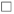

On peut également réécrire la dérivée de la fonction th en fonction de la fonction th elle même à l’aide de la relation (2[), ](#_page44_x188.02_y428.44)ce qui nous donne

- ch2(x) − sh2(x) 2

∀x ∈R, th (x) = ch2(x)~~ = 1 − th (x).

Concernant les limites Les limites de ces fonctions s’obtiennent à partir des limites de la fonction exponentielle. Ainsi :

- ch(x) = ch( x) = + ∞ .

  x→+∞ x→−∞

- sh(x) = −∞ et sh(x) = + ∞ . x→−∞ x→+∞
- th( x) = − 1 et (x) = 1 . x→−∞ x→+∞

Fonctions réciproques On finit cette présentation des fonctions en étudiant l’exis- tence de fonctions réciproques en se basant sur la représentation graphique des fonctions circulaires données en Figure 10.

La fonction sh est une fonction strictement strictement croissante de R dans R car sa dérivée est positive et ne s’annule qu’en un seul point. Elle est donc bijective et admet une fonction réciproque qui est également définie de R dans R. Elle est notée argsh pour argument sinus hyperbolique et est définie par

argsh(x) = ln x + 1 + x2 .

La fonction ch est une fonction strictement strictement croissante de R+ dans [1, + ∞ [ car sa dérivée est positive et s’annule qu’en un seul point. Elle est donc bijective

de R+ dans [1, + ∞ [et admet une fonction réciproque qui est également définie de [1, + ∞ [ dans R+ . Elle est notée argch pour argument cosinus hyperbolique et est définie par

argsh(x) = ln x + x2 − 1 .

La fonction th est une fonction strictement strictement croissante de R dans R car sa dérivée est positive et s’annule qu’en un seul point. Elle est donc bijective et admet une fonction réciproque qui est également définie de R dans R. Elle est notée argth pour argument tangente hyperbolique et est définie par

1  1 + x

argth(x) = , .

2  1 − x

En réutilisant le fait qu’une fonction et sa réciproque sont symétriques par rapport

à la droite d’équation y = x, il est très facile d’obtenir une représentation graphique des fonctions réciproques hyperboliques. Nous pourrions également étudier les dérivées mais nous allons nous arrêter là car elles ne présentent que peu d’intérêt pour la suite et elles sont peu utilisées dans un cadre d’analyse de données.

La prochaine section s’intéresse à l’étude de la continuité et de la dérivabilité des fonctions en général.

3  Continuité des fonctions réelles

Dans cette section, nous présentons les définitions de continuité et de dérivabi- lité d’une fonction d’une variable réelle. Cela sera également l’occasion de revenir sur l’étude des variations des fonctions et le lien qui existe entre dérivée d’une fonction et sa monotonie.

1. Quelques caractéristiques des fonctions

Commençons par définir quelques propriétés simples des fonctions, comme la mo- notonie, la parité ou encore la périodicité.

Définition 3.1: Variations et Monotonies

Soit I un intervalle de R et f une fonction définie de I dans R. La fonction f est dite :

- croissante si ∀(x,y) ∈I 2, x ≤ y =⇒ f (x) ≤ f (y),
- décroissante si ∀(x,y) ∈I 2, x ≤ y =⇒ f (x) ≥ f (y),
- strictement croissante ∀(x,y) ∈I 2, x ≤ y =⇒ f (x) < f (y),
- strictement décroissante ∀(x,y) ∈I 2, x ≤ y =⇒ f (x) > f (y).

On pourra aussi caractériser les fonctions constantes en disant que ce sont des fonctions à la fois croissantes et décroissantes. L’étude des variations d’une fonction va permettre de mieux comprendre les relations qui existent une variable d’entrée (un input en informatique) et la variable de sortie ( l’output ). On pourra exemple étudier l’évolu- tion d’une variable en fonction d’une autre variable sur le plan statistique (c’est ce que

l’on fera dans un contexte de régression linéaire ). Etudier les variations d’une fonction va également nous permettre de construire des algorithmes dont le but sera de trouver

le minimum (ou maximum) d’une fonction (sous réserves de bonnes propriétés de cette dernière). Mais aussi d’étudier la convergence de certaines suites qui interviennent natu- rellement dans certains algorithmes.

Mais ce sont pas les seules propriétés que l’on peut étudier. On pourra également s’intéresser à d’autres propriétés comme les notions de parité ou de périodicité des fonc- tions : utiles pour le calcul d’intégrale ou encore pour simplifier certains calculs (utiles aussi sur le plan théorique).

Commençons par regarder la notion de parité

56 - Analyse I - L1 Informatique ![ref2]

6 4 2

6

|||||||||||||
| :- | :- | :- | :- | :- | :- | :- | :- | :- | :- | :- | :- |
|||||||||||||
|||||||||||||
|||||||||||||
|||||||||||||
|||||||||||||
|||||||||||||
|||||||
| :- | :- | :- | :- | :- | :- |
|||||||
|||||||
|||||||
|||||||
|||||||
|||||||
|||||||
|||||||
|||||||
|||||||
|||||||
4

2

0

−2

−4

0 −3 Figure 10

−6

−2 −1 0 1 2 3 −2 0 2 – Exemple d’une fonction paire (à gauche) et d’une fonction impaire (à droite)

Définition 3.2: Parité d’une fonction

Soit I un intervalle de R et f une fonction définie de I dans R. La fonction f est dite :

- paire si pour tout x ∈I, f (x) = f (− x),
- impaire si pour tout x ∈I, f (− x) = − f (x).

Sur le plan graphique (voir Figure 10) une fonction paire se reconnaît par son graphe symétrique par rapport à l’axe des ordonnées. Une fonction impaire est elle symétrique par rapport à l’origine du repère, i.e. si l’on effectue une rotation du graphe d’un angle de 180, ce dernier est invariant.

Exemple 3.1. Les fonctions f : x →x2,x4 ou plus généralement f : x →x2n, n ∈ N sont des fonctions paires.

En effet, posons f (x) = x2n,n ∈N alors

f (−x) = (−x)2n = (−1)2 n (x2n) = x2n = f (x).

Les fonctions cos et ch le sont également. Plus généralement la somme de deux fonctions paires reste une fonction paire.

Exemple 3.2. Les fonctions f : x →x,x 3 ou plus généralement f : x →x2n+1 , n ∈N sont des fonctions paires.

En effet, posons f (x) = x2n,n ∈N alors

f (−x) = (−x)2n+1 = (−1) (−1)2 n (x2n+1) = −x2n+1 = −f (x).

Les fonctions sin et sh le sont également. Plus généralement la somme de deux fonctions impaires reste une fonction impaire.

Définition 3.3: Périodicité d’une fonction

Soit I un intervalle de R, T un nombre réel tels que pour tout x ∈I, x + T ∈I. Soit f une fonction définie de I dans R.

On dit que la fonction f est périodique de période T (ou encore que f est T- périodique) si pour tout x ∈I, f (x + T) = f (x).

Cette notion de périodicité est importante en Analyse de Fourier lorsque l’on cherche à étudier des signaux notamment, ce qui est très courant dans le domaine médical lorsque l’on effectue des électro-cardiogrammes ou des électro-ancéphalogrammes mais aussi dans l’accoustique.

Nous avons déjà rencontrés des fonctions périodiques dans la section précédente lorsque nous avons introduit les fonctions circulaires, comme les fonctions cos et sin représentées en Figure 11.

Exemple 3.3. On peut aussi créer soit même des fonctions qui ne sont pas forcément 2π-périodiques. Si on considère la fonction f : R+ → R définie par

59 - Analyse I - L1 Informatique ![ref2]



x

x − 1

...

f (x) = x..−. (k + 1)

x − k

si x ∈[0,1[, si x ∈[1,2[,

, si x ∈[k,k + 1[,

si x ∈[k + 1 ,k + 2[,

` `- Analyse I - L1 Informatique ![ref2]

pour n’importe quel entier naturel k. Alors la fonction f est 1-périodique. En effet, pour tout réel x, il existe un entier k tel que x ∈[k,k + 1[, donc x + 1 ∈[k + 1 ,k + 2[

f (x + 1) = x + 1 − (k + 1) = x − k = f (x), où la dernière découle du fait que x ∈[k,k + 1[.

On peut également changer la période d’une fonction périodique en multipliant la
variable x par une certaine valeurs. En effet, soit a > 0, et considérons une fonction f

T

qui est T-périodique. Alors la fonction g : x →f (ax) sera − périodique. Ce sont des

a

notions que l’on retrouve très souvent en analyse harmonique.

|||||||||
| :- | :- | :- | :- | :- | :- | :- | :- |
|||||||||
|||||||||
|||||||||
|||||||||
|||||||||
|||||||||
||||||x x |→sin( →cos(|x) x)|
|||||||||||||
| :- | :- | :- | :- | :- | :- | :- | :- | :- | :- | :- | :- |
|||||||||||||
|||||||||||||
|||||||||||||
10.5 0

1

−0.5 −1

0

−3.14 0 3.14 0 1 2 3 4 5 6 Figure 11 – Exemples de deux fonctions 2π-périodiques à gauche et d’une fonction

1-périodique à droite.

Exemple 3.4. Considér  ons la fonction cos qui est 2π-périodique, et soit T > 0. Alors la

2π

fonction f : x →cos x est T-périodique.

T

En effet, pour tout réel x nous avons

2π 2π 2π

f (x + T) = cos (x + T) = cos x + 2π = cos x = f (x).

T T T

Regardons maintenant une autre caractéristique des fonctions que l’on appelle la

continuité.

2. Continuité

C’est une caractéristique élémentaire que l’on a tus rencontré dans sa vie. On a toujours présenté la continuité d’une fonction à l’aide de sa représentation graphique. Nous disions naïvement qu’une fonction est continue si nous pouvons la représenté gra- phiquement d’ un seul trait ou encore sans lever le crayon .

Ce n’est pas une définition rigoureuse de la continuité mais on comprend l’idée que l’on peut finalement approcher n’importe quel point du graphe en suivant la courbe sans que cette dernière ne présente d’interruption, que cela soit dans un sens de parcours, ou dans l’autre.

Essayons de traduire cela avec la notion de limite et regardons ce qu’il se passe en un point de notre courbe pour une fonction f donnée.

Définition 3.4: Continuité en un point

Soit f une fonction réelle définie sur un intervalle I de R et soit a un point de I. On dit que f est continue en a si lim f (x) = f (a).

x→a

Lorsque la fonction f est définie en a, si f admet une limite en a, cette limite ne peut pas être différente de f (a).

Ainsi f est continue en a si et seulement si elle admet une limite a qui est égale à f (a).

x Exemple 3.5. Soit a un nombre réel et considérons la fonction f : x →~~ , la x − a

fonction f n’est pas définie en a, elle ne peut donc pas être continue en a.

Exemple 3.6. Considérons la fonction f définie pour tout réel x par

x2 si x ≤ 0,

f (x) =

x + 1 si x > 0.

La fonction f est bien définie en 0, mais n’est pourtant pas continue en 0. Elle présente un saut de discontinuité en ce point.

On représente aussi graphiquement des fonctions discontinues en Figure 12 avec
des sauts de discontinuité ou encore dans le cas d’une fonction, la fonction sinus cardinal

sin(x)

qui est la fonction x →~~ , où la discontinuité, sur le plan graphique, est moins

x

évidente.

Dans l’Exemple 3.6, la fonction est bien définie pour tout nombre réel mais elle n’est pourtant pas continue en 0.

En effet, si on considère les limites de la fonction f en 0 suivantes :

lim f (x) = 1 et lim f (x) = 0 . x→0+ x→0−

On va donc introduire des notions de limite à gauche et de limite à droite pour une fonction, ce qui peut servir à étudier la continuité de cette dernière en un point donné.

62 - Analyse I - L1 Informatique ![ref2]

|||||||||||||
| :- | :- | :- | :- | :- | :- | :- | :- | :- | :- | :- | :- |
|||||||||||||
|||||||||||||
|||||||||||||
1

0

0  1 2 3 4 5 6

 

|||||||||
| :- | :- | :- | :- | :- | :- | :- | :- |
|||||||||
|||||||||
|||||||||
|||||||||
|||||||||
1

0 −1

−10 −5 0 5 10

63 - Analyse I - L1 Informatique ![ref2]

Figure 12 – Exemple de deux graphes de fonctions discontinues. La fonction représentée

à gauche est celle de l’Exemple [3.3 ](#_page49_x89.29_y360.92)qui présente des discontinuités lorsque pour toute valeur entière de x. Le graphe de droite est celui de la fonction sinus cardinal , définie par

sin(x)

x = pour tout x non nul. Cette fonction n’est pas définie en 0 donc pas continue

x

en ce point.

Définition 3.5: Limite à gauche (à droite)

Soit f une fonction réelle définie sur un intervalle I de R et soit a un point de I. On dit que :

- f est continue à gauche en a si lim f (x) = f (a), x→a−
- f est continue à gauche en a si lim f (x) = f (a). x→a+

f sera alors continue en a si sa limite à gauche et à droite en a est bien la même. A l’aide de cette notion de limite à gauche et à droite, nous pourrons même définir des fonctions en des points en lesquels elles ne sont pas initialement continues. C’est ce que l’on appelle le prolongement par continuité .

Soit a un nombre réel et considérons une fonction f définie pour tout réel x ∈ R \ { a}.

lim f (x) = lim f (x).

x→a− x→a+

Exemple 3.7. Soit f la fonction définie pour tout réel x par

x2 sin(1/x ) si x = 0 ,

f (x) =

0 si x = 0 .

La fonction f est continue en 0 car pour tout réel x ∈R⋆, nous avons

|f (x)| = x2| sin(1/x)| ≤ x2.

Comme lim x2 = 0 , on a lim f (x) = 0 = f (0).

x→0 x→0

Exemple 3.8. Considérons la fonction sinus cardinal, sinc définie pour tout réel x non nul par

sin(x) sinc(x) =~~ . x

Cette fonction n’est pas définie en 0, mais nous avons que son graphe (voire gra- phique de droite en Figure [12) ](#_page52_x89.29_y94.25)semblait continue, i.e. que les limites à gauche et à droite

0 et même égales à 1.

Nous pourrons justifier pourquoi au moment où l’on aura introduit la notion de nombre dérivé d’une fonction.

Maintenant que nous avons caractérisé la continuité d’une fonction en un point a d’un intervalle I. Nous pouvons caractériser la continuité sur tout l’intervalle.

Définition 3.6: Continuité sur un intervalle

Soit f une fonction définie de I dans R, f est dite continue sur I si elle est continue en tout point de I, i.e. si pour tout a ∈I, on a bien lim f (x) = f (a).

x→a

Une telle fonction f sera alors dite C0 (pour dire continue) ou plus précisément, on écrira que f ∈C0(I, R).

Bien évidemment, la somme ou encore le produit de fonctions continues reste une fonc- tion continue!

On peut donner une autre définition de la continuité beaucoup plus abstraite mais qui nous sera utile pour caractériser d’autres formes de la continuité pour des fonctions.

Définition 3.7: Continuité

Soit f une fonction définie dans un intervalle I de R à valeurs dans R, la fonction f est alors dite continue en tout point x ∈I, si

∀x ∈I, ∀ε > 0,∃η > 0, tel que

∀y ∈I, |x − y| ≤ η =⇒ |f (x) − f (y)| ≤ ε.

Cette définition ne sera pas utilisée en pratique mais nous l’utilisons pour des sou- cis de rigueur de présentation de futurs résultats.

Le résultat suivant permet d’étudier l’existence d’un zéro pour une fonction de données ou, plus généralement l’existence d’une solution de l’équation f (x) = a, a ∈R pour une fonction f continue.

Théorème 3.1: Existence

Soit f une fonction continue de I dans R, et soient a et b deux points de I tels que a < b .

Si f (a)f (b) ≤ 0, alors il existe c ∈[a,b] tel que f (c) = 0 .

La démonstration se fait par dichotomie. Elle est constructiviste ce qui peut faire un excellent exercice de programmation.

Démonstration. Soit a < b deux nombres réels et f une fonction continue sur l’intervalle [a,b] telle que f (a) et f (b) soient de signes opposés. Par exemple f (a) > 0 > f (b).

10 5 0

|||||||
| :- | :- | :- | :- | :- | :- |
|||||||
|||||||
|||||||
|||||||
|||||||
|||||||
|||||||
−5 −10

0 2 4

Dichotomie : On va chercher à couper, itérativement, notre intervalle de recherche en deux. On considère deux suites (an )n∈N et (bn )n∈N qui vont définir les bornes de notre

intervalle de recherche, telles que a0 = a et b0 = b.

On pose m1 = a0 2 0 et on évalue f (m1). On a donc deux possibilités :

+ b
1. f (m1) et f (a0) sont de signes contraires,
1. f (m1) et f (b0) sont de signes contraires.

Dans le premier cas, cela signifie que la valeur c recherchée se trouve dans l’inter- valle [a0,m1], sinon, deuxième cas, elle se trouve dans l’intervalle [m1,b0].

- Si on est dans le cas 1), on posera alors a1 = a et b1 = m1
- Si on est dans le cas 1), on posera alors a1 = m1 et b1 = b

Et on recommence le processus! On posera ensuite m2 = 1 +2 b1 et on évalue

a

f (m2) et on applique la même règle que précédemment.

On a donc deux possibilités :

1. f (m2) et f (a1) sont de signes contraires,
1. f (m2) et f (b1) sont de signes contraires.

Dans le premier cas, cela signifie que la valeur c recherchée se trouve dans l’intervalle [a1,m2], sinon, deuxième cas, elle se trouve dans l’intervalle [m2,b1] ...

L’algorithme de dichotomie est appliqué à chaque fois au sous-intervalle dans lequel on observe un changement de signe. On peut y voir là un algorithme récursif au cours duquel la longueur de l’intervalle étudié est divisée par 2 à chaque itération.

L’erreur absolue de cette méthode; après n étapes est donc au plus égale à

b− a

. 2n+1

Enfin, si on cherche à approcher la solution avec une erreur au plus égale à ε > 0, on peut alors dénombrer le nombre d’itérations nécessaires pour cela :

b− a b− a

- ε =⇒ N = log ,

2N 2 ε

où ⌈x⌈désigne le plus petit entier supérieur à x.

Remarque : sur le plan algorithmique, ce n’est pas la méthode la plus efficace pour re- cherche un 0 d’une fonction, sa convergence est lente. Il existe d’autres méthodes (comme la méthode de Newton) qui permet de rechercher des zéros de façon plus efficace.

En revanche cette méthode a l’avantage d’être applicable à beaucoup plus de situations. Le pseudo-code de cette recherche par dichotomie est présentée en Algorithme 3

|Algorithm 3: Procédure de recherche par dichotomie|
| - |
|
Entrée: a < b ∈R, une fonction continue f sur [a,b], ε > 0 Sortie : un zéro de la fonction f

Factorielle( n)

1: while (b− a) ≥ ε do

b+ a

m =

2: 2

3: if f (a)f (m) ≤ 0 then 4: b= m

5: else

6: a = m 7: end if

8: end while
|

Une application directe de ce résultat permet de justifier que tout polynôme de degré impair s’annule au moins une fois.

Exemple 3.9. Soient a et b deux nombres réels. Considérons un polynôme P de degré impair, par exemple P (x) = x2n+1 + ax + b. Lorsque x → + ∞ , alors P (x) > 0 et

lorsque x → −∞ , alors P (x) < 0. Une application du résultat nous assure l’existence d’un nombre réel x0 tel que P (x0) = 0 .

On peut alors utilisée une approche par dichotomie pour déterminer la valeur de x0.

Ce résultat permet par exemple de montrer que si deux fonctions f et g sont (i) toutes deux continues sur un intervalle I et (ii) dont la différence change de signe dans ce même intervalle. Alors il existe un réel x0 ∈I tel que f (x0) = g(x0).

Exemple 3.10. Considérons la fonction f définie pour tout réel x par I = [0,ln(6)], définie par f (x) = ex − 6x. On peut montrer que cette fonction f s’annule au moins une

fois sur cet intervalle.

En effet, nous avons f (0) = 1 > 0 et f (ln(6)) = 6 − 6ln(6) = 6(1 − ln(6)) < 0.

On peut également utiliser ce résultat pour montrer qu’une fonction f admet un point fixe en appliquant ce même résultat à la fonction f (x) − x.

Le résultat précédent peut se généraliser de la façon suivante

Théorème 3.2: Théorème des valeurs intermédiaires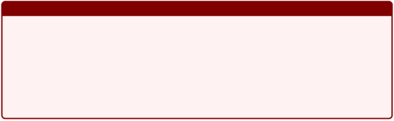

Pour toute fonction f continue sur un intervalle I de R à valeurs réelles, l’image f (I) est un intervalle de R.

Ou encore, de façon équivalente :

Pour toute application continue f de [a,b] dans R et tout réel u compris entre f (a) et f (b), il existe au moins un réel c compris entre a et b tel que f (c) = u.

Regardons maintenant les principaux résultats que l’on peut tirer de la continuité d’une fonction mais aussi les différentes continuités qui existent.

3. Extrema d’une fonction et fonction lipschitzienne

Le premier résultat porte sur le caractère borné des fonctions continues sur un intervalle I de R.

Théorème 3.3: Théorème de Weierstrass

Soit f une fonction continue sur un intervalle fermé I de R. Alors la fonction f est bornée et atteint ses bornes.

Il est fait mention d’un intervalle fermé I dans ce résultat, il s’agit d’intervalle I de la forme [a,b] où a,b ∈R. A contrario, un intervalle I est dit ouvert s’il est de la forme ]a,b[, ]− ∞,b[, ]a, +∞[

A noter qu’un intervalle peut être ni ouvert ni fermé, comme c’est le cas des intervalles

de la forme [a,b[, ]a,b] ou encore ]− ∞ ,b] ou encore [a, + ∞ [.

Comme une fonction f continue est bornée et atteint ses bornes, on peut également avoir des informations sur la nature de l’ensemble image par la fonction f .

Théorème 3.4: Image d’un segment par une fonction continue

Soit f une fonction continue sur un intervalle fermé I de R. Alors l’image de l’intervalle I par la fonction f est également un intervalle fermé et borné.

La définition et le résultat suivants sont plus anecdotiques mais permettent sim- plement de montrer que la notion de continuité évoquée en Définition 3.7 peut être spécialisée, comme le montre la définition suivante?

Définition 3.8: Continuité Uniforme

Soit f une fonction définie sur un intervalle I dans R, f est dite uniformément continue sur I si :

∀ε > 0, ∃η > 0 tels que

∀(x,y) ∈I 2, |x − y| ≤ η =⇒ |f (x) − f (y)| ≤ ε.

Exemple 3.11. On peut considérer la fonction f : I = [1,+ ∞ [→ R, alors f est uni- formément continue. En effet, pour tout ε > 0, nous avons, pour tout x,y ∈ I nous avons

1  1 |x − y|

|f (x) − f (y)| = x − y  = xy ≤ |x − y|. En posant η = ε, on a démontré le résultat souhaitait.

Remarquons que la continuité uniforme implique la continuité simple. Pourquoi selon vous? Notons que la réciproque est fausse, comme nous le voyons dans l’exemple ci-dessous.

Exemple 3.12. Considérons la fonction f : R → R définie par f (x) = x2. La fonction f n’est pas uniformément continue sur R.

Pour montrer cela, nous devons définir ce que cela signifie de ne pas être unifor- mément continue en prenant la négation la Définition 3.8. Nous devons donc montrer que

∃ε > 0,∀η > 0 tels que

∃(x,y) ∈I 2, |x − y| ≤ η =⇒ |f (x) − f (y)| ≥ ε.

Dit autrement, il suffit d’exhiber un couple (x,y) dont la différence peut être ren- due aussi proche de 0 que l’on souhaite mais pour lequel la différence des images, i.e. |f (x) − f (y)| ne sera jamais aussi petite qu’on le souhaite (ce "souhait" est déterminé par la valeur de ε).

Pour cela, on va considérer les suites (xn )n∈N⋆ et (yn )n∈N⋆ définies par

xn = n + n1 et yn = n.

Ainsi, pour tout tout n > 0, nous avons

1 1 2 2 1

|xn − yn| = n et |f (xn) − f (yn)| = n + n n2

- n = 2 + .

En particulier lorsque n → + ∞ , nous avons lim |xn − yn| = 0 et lim |f (xn)−

n→+∞ n→+∞

f (yn)| = 2 .

Nous avons donc montrer que l’on peut rendre xn et yn infiniment proche de 0 pour autant la différence des images sera toujours plus grande que 2.

Exemple 3.13. On va reprendre notre fonction f : x →x2 mais nous considérons cette sa restriction sur l’intervalle [0,a] où a > 0. Dans ce cas, le fonction f est uniformément continue.

Dans ce cas

|f (x) − f (y)| = |x2 − y2| = |x − y|(x + y) ≤ 2a|x − y|.

ε

Ainsi, en choisissant η = , on obtient directement |f (x) − f (y)| < ε .

2a

Ce troisième exemple semble indiquer que si une fonction est continue sur un in- tervalle fermé, i.e. un segment alors elle est uniformément continue. C’est le théorème de Heine.

Théorème 3.5: Théorème de Heine

Toute fonction continue sur un segment est uniformément continue sur ce segment.

On va maintenant exiger une propriété plus forte de continuité qui contrôle aussi les variations de notre fonction. Il s’agit du caractère lipschitzien.

Définition 3.9: Fonction Lipschtizienne

Soit I un intervalle de R, une fonction f définie sur I est dite lipschitzienne s’il existe un réel k > 0 tel que :

∀(x,y) ∈I 2, |f (x) − f (y)| ≤ k|x − y|. On dit alors que f est k-lipschitzienne .

Cette propriété aura une grande importance lorsque l’on abordera, l’année suivante, les algorithmes de descente de gradient. On la retrouvera également dans certaines théo- ries de l’apprentissage machine, notamment pour étudier les algorithmes.

1

Exemple 3.14. Considérons la fonction f : R → R définie par f (x) = . Alors la

+ 1 + x

fonction f est 1-lipschitzienne.

En effet, pour tout x,y ≥ 0, nous avons

1 + x − 1 +1 y  = (1 + x)(1 + y)  ≤ |x − y|.

1 x − y

1

La dernière inégalité est due au fait que pour tout x ≥ 0, 1+ x ≥ 1, donc ≤ 1.

1 + x

Dans le cas où la fonction f est k-lipschitzienne avec 0 ≤ k < 1, la fonction f est dite contractante .

En outre, on peut montrer que toute application lipschitzienne est uniformément continue.

En effet, si on se donne une fonction f qui est k-lipschitzienne, alors pour tout x,y nous avons

|f (x) − f (y)| ≤ k|x − y|.

ε

Il suffit alors de choisir η = pour retrouver la définition de continuité uniforme.

k

Ainsi, on pourra également montrer qu’il existe un lien étroit entre le fait d’être lipschitzien et le fait d’être dérivable car la constante de lipschitz kM n’est rien d’autre que, par définition

|f (x) − f (y)| max~~ . x,y |x − y|

et en prenant, en particulier, y = x + h et en faisant tendre h vers 0, on retrouve notre définition de notre nombre dérivé, objet d’étude de notre prochaine section et comme illustré en Figure 13.

2 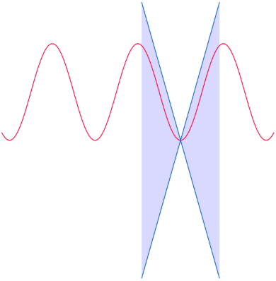1.5 1 0.5 0 

|||||||||||||
| :- | :- | :- | :- | :- | :- | :- | :- | :- | :- | :- | :- |
|||||||||||||
|||||||||||||
|||||||||||||
|||||||||||||
|||||||||||||
|||||||||||||
|||||||||||||
|||||||||||||
|||||||||||||
|||||||||||||
|||||||||||||
|||||||||||||
|||||||||||||
|||||||||||||
|||||||||||||
−0.5 −1 

−1.5 

−2 

−9.42 −6.28 −3.14 0 3.14 6.28 9.42

Figure 13 – Illustration du caractère lipschitzien d’une fonction. En déplacant le cône le long de la courbe, ce dernier ne viendra jamais intersecter la courbe. On peut aussi voir la caractère lipschitz comme le fait que la courbe représentative de la fonction sera toujours dans la "zone bleue" quelque soit la position du cône, i.e. la courbe ne se trouvera jamais dans la "zone blanche".

4 Dérivabilité

La dérivabilité des fonctions va nous permettre d’étudier le comportement de cette dernière, i.e. sa monotonie, aussi bien globalement que localement.

1. Définition de la dérivabilité

Définissons tout d’abord ce qu’est un nombre dérivé. Définition 4.1: Nombre dérivé

Soit une fonction f définie de I dans R, et soit a un point de I. La fonction f

f (x) − f (a)

est dite dérivable en a si la quantité~~ admet une limite finie lorsque x

x − a

tend vers a. On appelle alors cette limite nombre dérivée de f en a et on la note f ′(a).

La Figure [14 ](#_page63_x89.29_y94.25)illustre cette définition. On y compare le graphe de la fonction f , la fonction définissant le nombre dérivée (D) et la tangente de f au point a, Ta.

Plus x est proche de a, plus la droite D et la tangente en a se confondent.

On rappelle que la tangente en a a pour équation

y = f (a) + f ′(a)(x − a), où f ′(a) traduit le taux d’accroissement de la tangente.

On peut définir la notion de nombre dérivée à gauche et à droite pour une fonction f selon que l’on approche du point a par valeurs supérieures ou par valeurs inférieures.

f (x) − f (a)

Ainsi, si la fonction f est définie à droite de a et si la quantité admet

(x − a)

une limite à droite en a ; on appelle cette limite à droite le nombre dérivée de f en a à droite et on le note f ′(a+ ).

On peut faire exactement la même chose à gauche! Cette distinction est importante car on peut potentiellement trouver des limites différentes à gauche et à droite pour cette fonction, comme ce fut le cas pour la continuité. Bien évidemment, si ces limites sont différentes, la fonction n’est donc pas contnuement dérivable en ce point a.

La notion de dérivabilité est également étroitement liée à celle de la continuité

D Ta

a x

Figure 14 – Représentation d’une fonction f quelconque (en rouge). On compare la droite (en pointillés) reliant deux points de coordonnées (x,f (x)) et (a,f (a)) à la tangente à la courbe représentative f au point a.

Proposition 4.1: Lien avec la continuité

Soit f une fonction définie de I dans R et soit a un point de I. Si la fonction f est dérivable en a, alors elle est continue en a

f (x) − f (a) Démonstration. Supposons que f est dérivable en a. Alors la quantité~~ admet x − a

une limite en a et elle est donc bornée au voisinage de a. Ainsi, il existe M > 0 et α > 0 tels que pour tout x ∈[a − α,a + α]∩I et x = a, nous ayons

f (xx) −− fa(a) ≤ M.

On a alors, pour tout x ∈∈[a − α,a + α]∩I, |f (x) − f (a)|M|x − a|.

Or lim |x − a| = 0 , donc lim |f (x) − f (a)| = 0 , c’est-à-dire lim f (x) = f (a) ; la fonction

x→a x→a x→a f est donc continue en a. 

On s’intéresse à quelques résultats généraux sur la dérivation de fonctions. Il s’agit essentiellement de faire quelques rappels sur la dérivation de somme, produit ou de com- posé de fonctions.

Proposition 4.2: Opérations sur la dérivation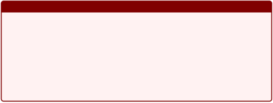

Soient f et g deux fonctions définies sur un intervalle I et dériables en a ∈ I. Alors :

- pour tout λ ∈R, λf est dérivable en a et (λf )′(a) = λf ′(a),
- la fonction f + g est dérivable en a et (f + g)′(a) = f ′(a) + g′(a),
- la fonction fg est dérivable en a et (fg)′(a) = f ′(a)g(a) + f (a)g′(a)
- si g(a) = 0 , la fonction 1/g est dérivable en a et (1/g )′(a) = − g′(a)/g (a)2.
- si g(a) = 0 , la fonction f/g est dérivable en a et (f/g )′(a) =
- g(a)2′~~ .

f (a)g(a) − g (a)f (a)

Exemple 4.1. Considérons la fonction f : R → R qui, à tout réel x, associe (2x2 +1) ex.

La fonction se présente comme un produit de deux fonctions dérivables u et v, où u(x) = 2 x2 + 1 et v(x) = ex, toutes deux dérivables sur R.

Ainsi, pour tout réel x, nous avons

f ′(x) = u′(x)v(x) + u(x)v′(x) = 4xex + (2x2 + 1)ex = ex(2x2 + 4x + 1).

Le plus souvent, nous rencontrons des fonctions qui sont composées avec d’autres

fonctions.

Proposition 4.3: Dérivation composition

Soit f une fonction définie de I dans R, soit g une fonction définie d’un intervalle J de R dans R tel que f (I) ⊂ J , et a ∈I.

Si f est dérivable en a et si g est dérivable en f (a), alors g◦ f est dérivable en a et

(g ◦ f )′(a) = f ′(a) × (g′ ◦ f )(a).

Exemple 4.2. Considérons la fonction f : R → R, qui à tout réel x associe ln(3x2 +2) .

La fonction f est bien dérivable sur R car 3x2 + 2 > 0 pour tout réel x.

La fonction se présente sous la forme ln(u(x)) où u(x) = 3 x2 + 2 . Ainsi, la dérivée est donnée par

f ′(x) = u′(x) 1 = 6~~ .

u(x) 3x2 + 2

De la dérivation d’une fonction composée découle immédiatement la proposition

suivante.

Proposition 4.4: Dérivation fonction réciproque

Soit f une bijection strictement monotone et continue dans I dans un intervalle

J ; on note sa réciproque f − 1.

Si f est dérivable en a et si f ′(a) = 0 alors f − 1 est dérivable en b= f (a) et :

1

(f −1)′(b) = f ′ ◦ f −1(b).

Ces résultats peuvent bien sûr s’étendre à n’importe quel réel a d’un intervalle

I ⊂ R.

2. Dérivation et extrema

   On peut également lier la notion de dérivée à celle d’extrema. Par exemple :

- on dit que f admet un minimum local en a s’il existe un voisinage de a sur lequel la restriction de f admet un minimum en a :

∃α > 0,∀x ∈[a − α,a + α]∩I, f (x) ≥ f (a).

- on dit que f admet un maximum local en a s’il existe un voisinage de a sur lequel la restriction de f admet un maximum en a :

∃α > 0,∀x ∈[a − α,a + α]∩I, f (x) ≤ f (a).

La recherche de ses minima ou maxima d’une fonction sont des points essentiels en optimisation mais constituent les principaux problème que l’on cherchera à résoudre en analyse de données ou encore en apprentissage machine.

Exemple 4.3. Soit f : R → R définie par f (x) = x2. Cette fonction f admet un unique minimum (qui est global), égal à 0 et qui est atteint en x = 0 .

Il est possible de caractériser l’existence d’un extremum en étudiant la dérivée première d’une fonction, plus précisément en cherchant une valeur pour laquelle elle s’annule :

Proposition 4.5: Caractérisation extremum

Soit une fonction f définie de I dans R, et soit a un poit de I tel que I contienne un segment de la forme [a − α,a + α], avec α > 0.

Si f est dérivable en a et admet un extremum local en a, alors f ′(a) = 0 .

Exemple 4.4. Soit f : R → R la fonction définie par

1

f (x) =

1 + x2

Cette fonction admet un extremum qui est atteint en x = 0 et qui est égal à 1. En effet, la fonction f est dérivable sur R et pour tout réel x, nous avons

f ′(x) = −2x~~ . (1 + x2)2

La fonction f ′ s’annule en x = 0 , la fonction f admet donc un extremum en ce point, qui est un maximum après une étude rapide de la fonction.

Remarque La proposition précédente permet de caractériser un extremum pour une fonction, elle nous dit bien que si la fonction admet un extremum en un point, alors elle s’annule en ce point.

Mais la réciproque n’est pas forcément vraie! Il faudra donc faire attention et il est parfois nécessaire de procéder à une étude plus fine de la fonction pour savoir si cette dernière admet un extremum.

Exemple 4.5. Considérons la fonctions f : R → R qui à x associe f (x) = x3.

Cette fonction n’admet pas d’extremum bien que sa dérivée, f ′ : x →3x2 s’annule

en x = 0 .

3. Etude des accroissements d’une fonction

Les résultats suivants vont nous permettre de justifier les variations d’une fonction telles qu’elles ont été présentées dans le secondaire. Le premier d’entre eux, le Théorème de Rolle, illsutré en Figure 15, permet d’établir l’existence d’un point pour lerquel la dérivée d’une fonction continue sur un segment s’annule.

Théorème 4.1: Théorème de Rolle

Soit une fonction f définie dans un segment [a,b] à valeurs dans R, telle que f soit continue sur [a,b] et dérivable sur ]a,b[. Si f (a) = f (b), alors il existe un réel c tel que f ′(c) = 0 .

Démonstration. On suppose que f est continue sur [a,b], dérivable sur ]a,b[et que f (a) = f (b).

Cette démonstration repose sur le fait que si f admet un extremum local en c ∈]a,b[ et que f est dérivable en c, on peut alors conclure que f ′(c) = 0 .

Γf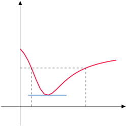

a c b

Figure 15 – Illustration du Théorème de Rolle

- Premier cas : si f est constante, tout point c ∈]a,b[ est donc un extremum de f , on a donc f ′(c) = 0 en tout point c ∈]a,b[.
- Deuxième cas : si f n’est pas constante. Comme f est continue sur un seg- ment, elle est donc bornée et atteint ses bornes (Weierstrass!). Il existe donc

  un minimum m et un maximum M sur [a,b]. De plus, f n’étant pas constante, l’une au moins des deux valeurs n’est pas égale à f (a) = f (b), elle l’est alors forcément en une valeur c ∈]a,b[, où la fonction f admet un extremum, donc f ′(c) = 0 .

Le prochain résultat permet de décrire la variation de f entre deux points à l’aide de la valeur d’une de ces dérivées entre ces deux points.

Théorème 4.2: Egalité des accroissements finis

Soit une fonction f définie dans un segment [a,b] dans R, telle que f soit continue sur [a,b] et dérivable sur ]a,b[. Il existe c ∈]a,b[ tel que f (b) − f (a) = f ′(c)(b− a).

Ce théorème est illsutré en Figure 16

Cette égalité des accroissements finis permet d’obtenir un encadrement de la varia-
tion de f entre a et b à l’aide d’un encadrement de f ′ sur ]a,b[. C’est ce que l’on appelle

l’inégalité des accroissements finis.

Γf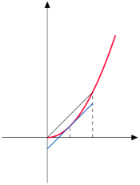

a c b

Figure 16 – Illustration de l’égalité des accroissements finis Corollaire 4.1: Inégalité des accroissements finis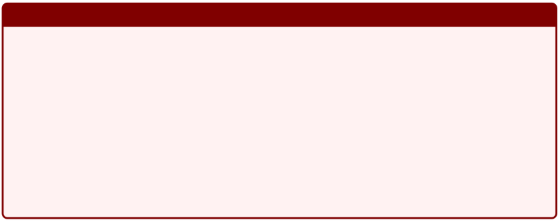

Soit f une fonction définie d’un segment [a,b] dans R, telle que f soit continue sur [a,b] et dérivable sur ]a,b[.

- si m et M sont des réels tels que pour tout x ∈]a,b[, m ≤ f ′(x) ≤ M, alors on a :

m(b− a) ≤ f (b) − f (a) ≤ M(b− a).

- si M est un réel tel pour tout x ∈]a,b[, |f ′(x)| ≤ M alors on a

|f (b) − f (a)| ≤ M|b− a|.

De cette même égalité des accroissements finis, on peut obtenir une autre caracté- risation des fonctions lipschitziennes!

Corollaire 4.2: Dérivabilité et Lipschitz

Soit f une fonction définie dans un intervalle I de R et dérivable sur I.

Si k est un tel que pour tout x ∈I, |f ′(x)| ≤ k alors f est k-lipschitzienne.

Enfin, la dernière application mais la plus importante est l’étude des variations d’une fonction f sur un intervalle I de R. L’égalité des accroissements finis permet de montrer que

1) f est constante si et seulement si pour tout x ∈I, f ′(x) = 0 .
1) f est croissante si et seulement si pour tout x ∈I, f ′(x) ≥ 0.
3) décroissante si et seulement si pour tout x ∈I, f ′(x) ≤ 0.

On souhaite étudier les propriétés de continuité des dérivées d’une fonction.

4. Régularité des fonctions réelles

On souhaite maintenant caractériser les fonctions dérivables et dont la ou les déri- vées successives sont également continues.

|Définition 4.2: Fonction de classe C1|
| - |
|
Soit f une fonction définie de I dans R et dérivable sur I. Si la fonction f ′ est continue sur I alors la fonction f est dite continuement dérivable sur I, ou encore

de classe C1 sur I.

On notera alors C1(I, R) l’ensemble des fonctions définies de I dans R et de classe C1 sur I.
|
||
|Proposition 4.6: Fonction composée|
|Soient des fonctions f ∈ C1(I, R) et g ∈ C1(J, R) où J est un intervalle tel que f (I) ⊂ J . Alors la fonction f ◦ g est de classe C1 sur I.|
||
|Proposition 4.7: Fonction réciproque|
|Soit f une bijection de classe C1 définie de I dans J . Si f ′ ne s’annule pas sur I, alors f − 1 est de classe C1 sur J .|

On peut également définir, par une relation de récurrence, les dérivées n-ème d’une fonction f si ces dernières existent. Dit autrement, si f est une fonction de classe C1 et que sa dérivée f ′ est dérivable, alors on a f ′′ = ( f ′)′. Et de façon générale, si f est une fonction de classe Cn dont la dérivée énième f (n) est dérivable, alors f (n+1) = ( f (n))′.

Proposition 4.8: Dérivées successives

Soit n ∈ N et soient f et g deux fonctions définies sur un intervalle I à valeurs dans R que l’on suppose de classe Cn sur I, alors

1) Pour tout réel λ, la fonction λf est de classe Cn sur I et (λf )(n) = λf (n).
1) La fonction f + g est aussi de classe Cn sur I et (f + g)(n) = f (n) + g(n).
1) La fonction f × g est de classe Cn sur I et (f × g)(n) = n n f (k) × k=0 k

   g(n− k).

1 f

4) Si la fonction g ne s’annule pas sur I, les fonctions et sont de classe g g

   Cn sur I.

Démonstration. Les trois premiers points de la proposition se démontrent par récurrence dont les deux premiers découlent directement de la linéarité de la dérivation.

Le troisième point (appelé formule de Leibniz ) est intéressant à démontrer par récurrence mais très calculatoire : il s’agit de démontrer que la fonction f × g est de classe

Cn sur I et que (f × g)(n) = n n f (k) × g(n− k).

k=0 k

Pour cela, on partira de la relation

n

(f × g)(n) = n f (k) × g(n−k) ′ .

k

k=0

Il s’agit ensuite de connaître les relations entre les coefficients binomiaux pour arriver au résultat souhaité.

n n ′

(f × g)(n) = f (k) × g(n−k) ,

k

k=0

n

- n f (k+1) × g(n−k) + f (k) × g(n+1−k) ′ ,

  k

k=0

- on sépare notre somme en deux

  n n n n

- f (k+1) × g(n−k) + f (k) × g(n+1−k) ,

k k

k=0 k=0

- on réindexe la première somme en posant j = k + 1

  n+1 n (n+1−j) n n (k)

- f (j) × g + f × g(n+1−k) , j − 1 k

j=1 k=0

- on sépare les termes en j = n + 1 et k = 0

  n n n

- f (n+1)g(0) + f (j)g(n+1−j)

n j − 1

j=1

n n (k) (n+1−k) n (0) (n+1)

+ f g + f g , k 0

k=1

- on factorise

n

- n + 1 f (n+1)g(0) + n + n f (k)g(n+1−k) n + 1 k − 1 k

k=1

+ n + 1 f (0)g(n+1),

  0

- propriété des coefficients binomiaux

84 - Analyse I - L1 Informatique ![ref2]

- n + 1 f (n+1)g(0) + n n + 1 n + 1 k

k=1

+ n + 1 f (0)g(n+1),

  0

- on rassemble
- n n + 1 f (k) × g(n+1−k) . k

  k=0

f (k)g(n+1−k)

` `- Analyse I - L1 Informatique ![ref2]

On peut, de façon similaire démontrer les résultats suivants qui sont identiques à ceux énoncés dans le cas des fonctions une fois dérivables.

Proposition 4.9: Fonction composée

Soit n ∈ N et soient des fonctions f ∈ Cn(I, R) et g ∈ Cn(J, R) où J est un intervalle tel que f (I) ⊂ J . Alors la fonction f ◦ g est de classe Cn sur I.

Proposition 4.10: Fonction réciproque

Soit n ∈N et soit f une bijection de classe Cn définie de I dans J . Si f ′ ne s’annule pas sur I, alors f − 1 est de classe Cn sur J .

5  Etude des fonctions convexes

Les fonctions convexes sont d’une importance extrême dans le domaine de la Data Science et notamment en Machine Learning lors de la formulation de certains problèmes.

Elles ont des propriétés intéressantes pour une majeure partie des algorithmes d’optimisiation. Plus précisément, lorsque l’on cherche à minimiser une quantité comme une certaine "erreur" que l’on exprime avec une fonction convexe, on est sûr de pouvoir atteindre son minimum, donc de minimiser l’erreur.

1. Caractérisations de la convexité

On va, dans cette partie, essentiellement donner des propriétés et comment carac- tériser des fonctions convexes dans le cas où l’erreur que l’on cherche à minimiser ne dépend que d’un seul paramètre.

Définition 5.1: Fonction convexe

Soit f une fonction définie d’un intervalle I dans R. Cette fonction f est dite convexe si elle vérifie la propriété suivante :

∀x,y ∈R, ∀λ ∈[0,1], f (λx + (1 − λ)y) ≤ λf (x) + (1 − λ)f (y).

Cette définition peut très facilement se représenter graphiquement (voire Figure 17

et signifie que les cordes d’une fonction se retrouve au dessus de sa courbe représentative .

Exemple 5.1. La fonction x →x2 est une fonction convexe. Pour montrer cela, d’après la définition, il faudrait montrer que pour tout x,y ∈R et pour tout λ ∈[0,1], nous avons

(λx + (1 − λ)y)2 ≤ λx2 + (1 − λ)2y. Nous allons montrer que la différence est négative

(λx + (1 − λ)y)2 − (λx2 + (1 − λ)y2),

- λ2x2 + (1 − λ)2y2 + 2λ(1 − λ)xy − λx2 − (1 − λ)y2,
- − λ(1 − λ)x2 − λ(1 − λ)y2 + 2λ(1 − λ)xy,
- − λ(1 − λ)(x − y)2,
- 0.

Il existe bien d’autres fonctions dont on pourra admettre la convexité :

x y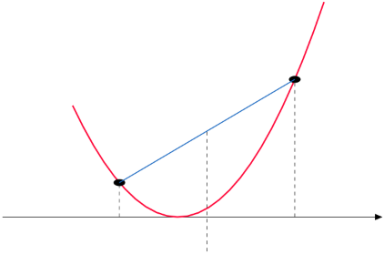

λx + (1 − λ)y

Figure 17 – Représentation d’une fonction convexe. On observe que sur le segment [x,y], la courbe représentation de la fonction (en rouge) se trouve en dessous de la corde (en bleue)

- toute les fonctions affines, i.e. x →ax + b, a,b ∈R
- la fonction exponentielle
- la fonction x →x2 ou plus généralement x →x2n, n ∈N
- la restriction de la fonction x →1/x sur l’intervalle x > 0

A l’inverse, une fonction f sera dite concave si son opposé − f est une fonction

convexe .

Définition 5.2: Fonction concave

Soit f une fonction définie d’un intervalle I dans R. Cette fonction f est dite concave si elle vérifie la propriété suivante :

∀x,y ∈R, ∀λ ∈[0,1], f (λx + (1 − λ)y) ≥ λf (x) + (1 − λ)f (y).

Cette définition peut également se représenter graphiquement (voire Figure 18 et
signifie que les cordes d’une fonction se retrouve en dessous de sa courbe représentative .

Exemple 5.2. Les fonctions suivantes sont des fonctions concaves sur leur ensemble de définition

- les fonctions linéaires et affines, donc de la forme ax + b
- la fonction x →ln(x)

x y

λx + (1 − λ)y

Figure 18 – Représentation d’une fonction concave. On observe que sur le segment [x,y], la courbe représentation de la fonction (en rouge) se trouve en dessous de la corde (en bleue)

√ 

- la fonction x → x
- la fonction x → −x2n

Dans la suite, nous étudierons uniquement les fonctions convexes. Les définitions étant analogues pour les fonctions concaves en remplaçant la fonc- tion par son opposé. Lors de l’étude des extrema des fonctions, nous prendrons par contre le soin de distinguer les propriétés liées aux fonctions convexes de celles des fonctions concaves.

La définition de convexité peut également être généralisée à l’utilisation de plusieurs points xk dans notre intervalle I comme le montre la proposition suivante (que vous retrouverez en probabilités)

Proposition 5.1: Inégalité de Convexité

Soit f une fonction définie de I dans R telle que f soit convexe sur I. Soit n ∈N⋆, soit x1,x2,...,x n des éléments de I et λ1,...,λ n des nombres réels tels que pour

tout k ∈ 1,n , λk ≥ 0 et nk=1 λk = 1 , alors

n n

f λkxk ≤ λkf (xk).

k=1 k=1

Cette définition n’est que très peu utilisée pour montrer qu’une fonction est convexe car elle devient trop complexe à manipuler pour la plupart des fonctions, comme la fonction exponentielle ou encore la fonction inverse.

On va cependant voir qu’ils existent d’autres caractérisations de la convexité qui sont plus simples à utiliser pour montrer la convexité d’une fonction.

x x0 y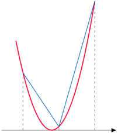

Figure 19 – Représentation de la fonction φx0 de la Proposition [5.2 par](#_page75_x89.29_y393.75) les pentes des droites en bleues. On note que la pente en x < y est plus faible que la pente en y.

On commencera par fournir une autre caractérisation de la convexité en étudiant les pentes des sécantes dont une des extrémités est fixée (voir Figure 19).

Proposition 5.2: Caractérisation convexité, ordre 0

Soit f une fonction définie de I dans R. Alors les propositions suivantes sont équivalentes

1) La fonction f est convexe.
1) Pour tout x0 ∈ I, la fonction φ f (x) − f (x0 )

   est croissante. x0 : I → R par φx0 (x) = x − x0

On peut fournir une deuxième caractérisation des fonctions convexes en étudiant ses tangentes (voir Figure 20), si la fonction étudiée est dérivable.

Proposition 5.3: Caractérisation convexité, ordre 1

Soit f une fonction définie de I dans R et dérivable sur I. Alors la fonction f est convexe si et seulement si sa fonction dérivée f ′ est croissante.

x y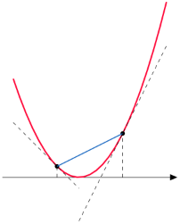

Figure 20 – Représentation de tangentes d’une fonction convexe (en noires pointillées). Pour une telle fonction, les tangentes se trouvent toujours sous la courbe représentative de la fonction, contrairement à la corde (en bleue) se trouve au dessus de la courbe représentative de la fonction.

Proposition 5.4: Caractérisation convexité, ordre 1 bis

Soit f une fonction définie de I dans R et dérivable sur I. Si f est convexe sur I, alors la courbe représentative de f est au dessus de chacune de ses tangentes.

Démonstration. On considère x0 un élément de I. La tangente à la courbe Cf , représen- tative de la fonction f , en x0 a pour équation

y = f (x0) + f ′(x0)(x − x0). Définissons sur I la fonction s pour tout x ∈I par

s(x) = f (x) − f (x0) − f ′(x0)(x − x0).

Cette fonction s représente, pour l’abscisse x donnée, la différence entre la courbe et sa tangente. On va montrer que cette quantité est toujours positive. Or, pour tout x ∈I, s′(x) = f ′(x) − f ′(x ) et, puisque la fonction f est croissante (car f est convexe)

0

on peut alors dresser le tableau de variation suivant

|x|
x

0
||
| - | - | :- |
|
′

s (x)
|−|0 +|
|s|0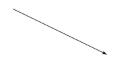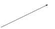||

Ainsi ∀x ∈I, s (x) ≥ 0, donc la courbe de f est toujours au dessus de sa tangente

en x0. 

Ce dernier résultat permet de donner une dernière caractérisation de la convexité en utilisant la dérivée seconde de la fonction f et qui exploite directement le lien entre convexité et croissante de la dérivée.

Corollaire 5.1: Caractérisation des fonctions convexes, ordre 2

Soit f une fonction définie d’un intervalle I dans R et deux fois dérivables sur I. Alors la fonction f est convexe sur I si et seulement si sa fonction dérivée seconde

f ′′ est positive sur I.

C’est cette dernière caractérisation que nous serons essentiellement amenés à uti- liser pour montrer la convexité d’une fonction

Exemple 5.3. Soit f : R → R qui à x associe exp(x2).

Cette fonction est deux fois dérivables sur R et ses dérivées sont données par

f ′(x) = 2 x exp(x2) et f ′′(x) = (2 + 4 x2)exp(x2).

La dérivée seconde est positive donc la fonction f est convexe sur R.

Exemple 5.4. Soit f : R⋆+ → R qui à x associe ln(x).

Cette fonction est deux fois dérivables sur R⋆+ et ses dérivées sont données par

f ′(x) = 1 et f ′′(x) = −~~ .

1

x x2

La dérivée seconde est négative donc la fonction f est concave sur R⋆

\+ Exemple 5.5. On considère maintenant la fonction f définie pour tout réel x par

f (x) = 1x3 − 9x2 + 4.

3

La fonction f est deux fois dérivables sur R en tant que polynôme du second degré. Ses dérivées sont données par

f ′(x) = x2 − 18x = x(x − 18) et f ′′(x) = 2 x − 18 = 2( x − 9).

La dérivée seconde s’annule en x = 9 . Elle est négative pour tout x < 9, donc la fonction f est concave sur cet intervalle. Elle est positive pour tout x > 9, elle est donc convexe sur cet intervalle.

2. Lien avec la recherche d’extremum

Dans cette section, on ne va pas énoncer de résultats particuliers, on va simplement spécifier la recherche d’extrema aux cas des fonctions convexes et concaves.

En reprenant ce que nous avons vu dans les sections précédentes, nous pouvons énoncer les résultats suivants concernant les fonctions convexes.

Lemme 5.1: Extrema fonction convexe, C0

Soit f une fonction convexe sur un intervalle I de R. Si f admet un minimum local, alors ce minimum est un minimum global.

Exemple 5.6. La fonction x →x2, et convexe et admet un minimum local en x = 0 . C’est donc aussi le minimum global de notre fonction.

Lemme 5.2: Extrema fonction convexe, C1

Soit f une fonction convexe sur un intervalle I de R que l’on suppose dérivable Si

′

f admet un point critique, i.e. s’il existe x0 ∈ I tel que f (x0) = 0 , alors x0 est point en lequel la fonction f atteint son minimum.

Exemple 5.7. La fonction f , définie de R dans R, par f (x) = x4 +4 x2 − 6 est convexe sur R. Elle est également une fois dérivable et sa dérivée est donnée par f ′(x) = 4 x3 +8 x qui s’annule en x = 0 .

La fonction f admet donc un minimum en x = 0 .

Remarquez que le fait d’être convexe n’implique pas nécessairement l’existence d’un minimum. Il ne faut pas oublier l’existence du point critique pour garantir l’existence du minimum, comme le montre l’exemple de la fonction exponentielle qui est bien convexe mais qui n’admet pas de minimum.

Il n’est donc pas forcément nécessaire de passer par le tableau de variations pour savoir si un point critique est un minimum ou non, l’étude de la convexité est suffisante.

Pour les fonctions concaves, nous avons les résultats analogues suivants. Lemme 5.3: Extrema fonction concave, C0

Soit f une fonction concave sur un intervalle I de R. Si f admet un maximum local, alors ce maximum est un maximum global.

Lemme 5.4: Extrema fonction concave, C1

Soit f une fonction concave sur un intervalle I de R que l’on suppose dérivable Si f admet un point critique, i.e. s’il existe x0 ∈ I tel que f ′(x0) = 0 , alors x0 est

point en lequel la fonction f atteint son maximum.

6  Intégration

L’objectif de cette dernière section n’est pas de présenter la construction de l’inté- grale à l’aide des fonctions continues par morceaux, mais simplement de donner quelques outils permettant leurs calculs : comme l’intégration par parties ou encore le chan- gement de variables .

1. Généralités sur l’intégrale

   Le calcul d’intégrale peut se voir comme l’opération complémentaire au calcul de

dérivée.

Si la dérivée permettait de nous renseigner quant à l’évolution d’une fonction, i.e. sa monotonie, l’intégrale de cette dernière nous donnera une évaluation de cette fonction,

à savoir, l’aire comprise entre la courbe représentative de la fonction et l’axe des abscisses.

Par exemple, en Figure 21; on cherchera à évaluer l’intégrale de la fonction de la fonction f , définie sur l’intervalle [− 2, 4] par

√ 

f (x) = (x + 2) 3 + x − x2,

dont on cherchera la valeur de l’intégrale sur le segment [− 1, 3].

Cette intégrale n’est pas calculer de façon directe par nos ordinateurs, elle est simplement approchée en créant des subdivisions de l’intervalle sur lequel on chercher à calculer la valeur de notre intégrale. A l’aide de cette subdivision, on définir une fonction f qui sera continue par morceaux (voire même constante par morceaux) permettant la définition de rectangles qui vont servir à approcher la valeur de notre intégrale, comme illustré en Figure 22.

Plus la subdivision sera fine, meilleure sera l’approximation de notre intégrale. C’est ce principe qui est appliqué par nos ordinateurs pour le calcul d’une intégrale. La valeur retournée n’est qu’une approximation de la valeur recherchée à l’aide de ce principe, que l’on étudiera en TP.

Bien évidemment, les outils mathématiques vont nous permettre de calculer la valeur de la plupart des intégrales que l’on rencontrera par la suite, à l’aide du calcul de primitives.

2. Calculs de primitives et intégrales

On présente maintenant la notion de primitives et quelques outils de calculs de primitives et donc d’intégrales.

6

|||||||||||||
| :- | :- | :- | :- | :- | :- | :- | :- | :- | :- | :- | :- |
|||||||||||||
|||||||||||||
|||||||||||||
|||||||||||||
|||||||||||||
|||||||||||||
|||||||||||||
4

2

0 −2

−2 −1 0 1 2 3 4

√ 

Figure 21 – Représentation de la fonction continue f : x →(x + 2) 3 + x − x2 dont on cherche à évaluer l’intégrale sur le segment [− 1, 3]

6 4 2 0

6 4 2 0

|||||||||||||
| :- | :- | :- | :- | :- | :- | :- | :- | :- | :- | :- | :- |
|||||||||||||
|||||||||||||
|||||||||||||
|||||||||||||
|||||||||||||
|||||||||||||
|||||||||||||
|||||||||||||
| :- | :- | :- | :- | :- | :- | :- | :- | :- | :- | :- | :- |
|||||||||||||
|||||||||||||
|||||||||||||
|||||||||||||
|||||||||||||
|||||||||||||
|||||||||||||
−2

−2

−2 −1 0 1 2 3 4 −2 −1 0 1 2 3 4

Figure 22 – Calcul approché de l’intégrale à l’aide de fonctions continues par morceaux, ici des fonctions dites étagées car constantes par morceaux.

Primitives La notion de primitive, notée F , est primordiale pour le calcul d’intégrale d’une fonction f continue sur un intervalle I de R. C’est, en effet, en évaluant les valeurs de cette primitive en les bornes de l’intervalle de I que l’on pourra déterminer la valeur de l’intégrale de notre fonction f sur I.

Définition 6.1: Primitive

Soit f une fonction réelle définie et continue sur un intervalle I de R. On appelle primitive de f sur I, toute fonction F définie et dérivable sur I telle que F ′ = f

Cette définition montre que la primitive d’une fonction f n’est pas unique! En effet, si F est une primitive de f , alors ∀k ∈R la fonction F + k est aussi une primitive de f .

Démonstration. Soit F une primitive de f , et considérons la fonction une autre primitive de la fonction f dérivable sur I.

Alors on a

G′ = f et F ′ = f F ′ − G′ = 0 .

Ce qui veut donc dire qu’il existe une constante k ∈R telle que G = F + k. 

Exemple 6.1. Soit f la fonction définie sur R par f (x) = 3 x2.

Alors la fonction F définie sur R par F (x) = x3 + k, k ∈R est une primitive de f

En effet, pour tout réel x, nous avons F ′(x) = 3 x2 = f (x).

La proposition suivante permet de définir une primitive d’une fonction f de façon unique.

Proposition 6.1: Primitive qui s’annule en un point

Soit f une fonction réelle définie et continue sur un intervalle I de R, et soit a un point de I.

Alors la fonction F définie sur I par

x

F (x) = (t) dt

a

est l’unique primitive de f qui s’annule en a.

Démonstration. Si l’existence d’une telle primitive est difficile à démontrer, l’unicité est simple à prouver.

En effet, si f admet une autre primitive G qui s’annule également en a, alors il existe une constante k ∈R telle que G = F + k. Ainsi

0 = G(a) = F (a) + k = k

.

Donc F = G. 

De ce résultat découle directement les deux corollaires suivants, dont le premier permet de voir une intégrale comme la différence des valeurs de la primitive en les bornes de l’intervalle d’intégration.

Corollaire 6.1: Un premier calcul d’intégrale

Soit f une fonction réelle définie et continue sur I, et soit F une primitive de f sur I alors :

b

∀a,b ∈I, f (t) dt = F (b) − F (a).

a

Soient a,b ∈I et soit G définie sur I par

x

G(x) = f (t) dt.

a

G est une primitive de f donc il existe une constante k ∈R telle que G = F + k, or 0 = G(a) = F (a) + k, donc G(a) = − F (a).

On a donc

b

f (t) dt = G(b) = F (b) + k = F (b) − F (a).

a

En particulier, si on suppose maintenant que la fonction f est de classe C1, nous avons le résultat suivant

Corollaire 6.2: Lien avec la dérivée

Soit f une fonction de classe C1 sur un intervalle I de R, alors

b

∀a,b ∈R, f (b) − f (a) = f (t) dt.

a

Regardons maintenant quelques méthodes de calculs.

Méthodes de calculs Pour déterminer des primitives d’une fonction donnée, il sera bon de connaître toutes les formules de dérivation, mais dans "l’autre sens" pour les fonctions les plus classiques.

Dans des cas plus complexes, deux outils s’offrent à nous pour le calcul pratique d’intégrales et de primitives : l’intégration par parties et le changement de variables .

Proposition 6.2: S

ient u et v deux fonctions de classe C1 sur un intervalle I de R, alors

b u(t)v′(t) dt = [u(t)v(t)]b − b u′(t)v(t) dt.

a

a a

Démonstration. La démonstration repose sur la formule de dérivation d’un produit et ensuite l’intégration des différents termes.

Soient u et v des fonctions de classe C1 sur I et (uv)′ = u′v + uv′, donc d’après le corollaire précédent, nous avons

b b b

[u(t)v(t)]ba = (uv)′(t) dt = u′(t)v(t) dt + u(t)v′(t) dt,

a a a

Ainsi, en réarrangeant les termes :

b b

u(t)v′(t) dt = [u(t)v(t)]ba − u′(t)v(t) dt.

a a

Regardons deux exemples d’applications, dont le premier est le calcul de la primitive de la fonction x →ln(x).

Exemple 6.2. Considérons la fonction f : x →ln(x) définie et continue sur R⋆+ . Utili- sons la formule de l’intégration par parties pour déterminer la primitive de cette fonction

qui s’annule en 1

x x

ln(t) dt = 1ln(t) dt,

1 1

- On considère ensuite u′(t) = 1 et v(t) = ln(t) x 1
- [t ln(t)]x − t × dt,

1 1 t

x

- x ln(x) − 1 dt,

1

- x ln(x) − [t]x dt, 1
- x ln(x) − x + 1.

Ainsi, une primitive de la fonction x → ln(x) est donnée par la fonction x → x ln(x) − x.

Cette proposition peut également servir plus directement au calcul d’intégrale

Exemple 6.3. Considérons la fonction f définie sur l’intervalle I = [0,e− 1] par f (x) =

x

(x + 1) 2 et déterminons son intégrale sur I.

e−1 t e−1 1

(t + 1)2 dt = 0 (t + 1)2

t ×~~ dt,

0 ↓ On considère ensuite u′(t) = 1 et v(t) = t

(t + 1)2

t e−1 e−1 1

- − − −~~ dt,

  (t + 1) 0 0 (t + 1)

  e − 1 e−1

- − e − 0 − [ln(t + 1)]0

,

1

- − 1 + + 1,

e

1

- .

  e

On la retrouvera très souvent dans des calculs en probabilités, notamment pour le calcul d’espérances de variances qui nécessiteront de calculer des quantités de la forme

tf (t) dt ou encore t2f (t) dt,

où f sera une fonction que l’on appellera densité de probabilité. Par exemple, pour calculer la moyenne d’une variable aléatoire X distribuée selon une loi normale de densité

1 1

f (t) = ~~√~~ exp −~~ (t − µ)2 ,

2πσ2 2σ2

nous devons effectuer le calcul d’intégrale suivant

+∞ +∞ 1 1

E[X] = tf (t) dt = t~~√~~ exp −~~ (t − µ)2 dt.

−∞ −∞ 2πσ2 2σ2

Pour évaluer cette intégrale, nous aurons besoin de la formule d’intégration parties mais aussi de la formule de changement de variable qui fait l’objet de la proposition suivante

Proposition 6.3: Changement de variable

Soit f une fonction réelle définie sur un intervalle I de R, et soit φ une fonction de classe C1 définie sur un segment [a,b] et à valeurs dans I, alors

b φ(b)

f (φ(t))φ′(t) dt = f (u) du. a φ(a)

x

Démonstration. Définissons une fonction F sur l’intervalle I par F (x) = f (t) dt.

φ(a)

F est alors la primitive de f qui s’annule φ(a). F est de classe C1 sur [a,b] et (F ◦ φ)′ = φ′(F ′ ◦ φ).

Ainsi

φ(b) b b

f (u) du = F (φ(b)) − F (φ(a)) = (F ◦ φ)′(t) dt = f (φ(t))φ′(t) dt. φ(a) a a

Un cas intéressant de cette fonction, notamment pour la pratique, est le cas où la fonction φ est bijective, donc strictement monotone sur son intervalle de définition.

En posant, dans la proposition précédente, α = φ(a) et β = φ(b), on a alors

β −1(β) b

f (u) du = f (φ(t))φ′(t) dt = f (φ(t))φ′(t) dt.

α φ−1(α) a

Cela revient à effectuer le changement de variable u = φ(t).

Prenons un cas d’usage pour rendre cela plus clair.

Exemple 6.4. Considérons la fonction f : x →cos( (x)) définie et continue sur l’in- tervalle [1,4]. Déterminons la valeur de l’intégrale de cette fonction sur cet intervalle.

√ 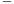

Cela est de suite moins évident, la fonction x → x nous empêche de déterminer directement une primitive de notre fonction.√ Qu’à cela ne tienne, nous n’avons qu’à ap- pliquer le changement de variable u = x, qui est une fonction bijective de [1,4] dans [1,2]

Il faut donc penser à changer les bornes de notre intégrale et à la fonction que l’on intègre.

Les bornes : lorsque x est égal 1, u prend la valeur 1. De la même façon, lorsque x = 4 , u prend la valeur 2.

La fonction intégrer : notre variable initiale est la variable x, nous devions donc intégrer avec l’opérateur " dx", mais notre nouvelle variable devient la fonction u, d’où

√ 

u(x) = √x =⇒ u′(x) = du = x = ( (x))′ = ~~√~~1 = 1 ⇐⇒ du = 1 .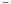

dx dx 2 x 2u dx 2u Ainsi l’opérateur " dx" devient 2udu.

C’est une façon plutôt physicienne d’écrire le changement de variables, mais elle permet de limiter les erreurs liées à la formule de changement de variable.

En combinant tout cela on a donc

4 √ 2 2

cos( x) dx = cos(u)2udu = 2u cos(u) du. 1 1 1

On applique une intégration par parties pour conclure ce calcule.

2 2

2u cos(u) du = [2u sin(u)]21 2sin(u) du = 2(2sin(2) − sin(1) + cos(2) − cos(1)) . 1 1

En guise d’entraînement, le lecteur est invité à calculer l’intégrale suivante :

+∞ +∞ 1 1

tf (t) dt = t~~√~~ exp −~~ (t − µ)2 dt,

−∞ −∞ 2πσ2 2σ2

en effectuant le changement de variable linéaire u = t − µ (qui est bien un change- ment de variable bijectif de classe C1 de R dans R) et en utilisant le résultat suivant

+∞ ~~√~~ 1~~ exp − 1~~ (x)2 dx = 1.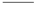

−∞ 2πσ2 2σ2

Ce dernier résultat pourra être démontré l’année prochaine, à l’aide d’un change- ment de variables (en coordonnées polaires) et à l’aide d’une intégrale double .

3. Quelques propriétés de l’intégrale

On termine cette présentation de l’intégrale par quelques propriétés ou résultats généraux.

Une des premières chose à retenir est la relation suivante

b a

f (t) dt = − f (t) dt.

a b

Ainsi, parcourir l’intégrale dans un sens ou dans l’autre change le signe de la valeur de cet intégrale. C’est une conséquence directe des propositions de la section précédente.

Proposition 6.4: Linéarité

Soient f et g deux fonctions réelles définies sur un intervalle I de R et soient deux réels λ et µ et a,b deux points de I.

Alors

b b b

(λf + µg)(t) dt = λ f (t) dt + g(t) dt.

a a a

La notion de linéarité sera pleinement étudiée l’année prochaine, mais pour ré- sumer, concernant l’intégrale, on dit simplement que l’intégrale d’une somme de deux fonctions est égale à la somme des intégrales de ces deux fonctions .

Proposition 6.5: Relation de Chasles

Soit f une fonction définie et continue sur un intervalle I de R et soient a < b < c trois nombres réels dans I, alors :

c b

f (t) dt =

a a

Cela peut être utile de connaître cette relation pour certains calculs d’intégrales

Exemple 6.5. Supposons que l’on souhaite calculer la valeur de l’intégrale de la fonction x →sin(x) sur l’intervalle [− π,π], alors

π 0 π

sin(t) dt = sin(t) dt + sin(t) dt,

−π −π 0

- en posant le changement u = -t dans la première intégrale 0 π
- − sin(−u) du + sin(t) dt,

  π 0

- pour tout x, sin(−x) = − sin(x)

  0 π

- sin(u) du + sin(t) dt,

  π 0

π π

- − sin(u) du + sin(t) dt, 0 0
- 0.

Les deux dernières propositions permettent d’établir quelques inégalités simples sur la valeur d’une intégrale qui peuvent s’avérer utiles pour démontrer d’autres résultats dans de futurs cours.

Proposition 6.6: Inégalité de la moyenne

Soit f une fonction réelle définie sur un intervalle I de R et soient a et b deux points de I, alors

b

f (t) dt ≤ sup |f (x)||b− a| a x∈I

Proposition 6.7: Une dernière inégalité

Soit f une fonction réelle définie sur un intervalle I de R et soient a et b deux points de I, alors :

b b

f (t) dt  ≤ |f (t)| dt  .

a a

7 Développements Limités

Cette courte section est une introduction aux développements limités d’une fonc- tion d’une variable réelle.

Les développements limités sont des approximations des fonctions à l’aide de poly- nômes qui permettent, dans certaines situations, de simplifier des analyses de problèmes complexes. Cela nous permettra également d’introduire le Développement de Taylor d’une fonction que l’on sera amené à réutiliser lorsque l’on présentera des algorithmes d’opti- misation de fonctions convexes.

1. Formule de Taylor

La Formule de Taylor [2 ](#_page90_x124.81_y635.33)permettent d’effectuer une étude locale d’une fonction f au voisinage d’un point a à l’aide de ses dérivées successives en ce point.

Présentons, sans plus tarder, la Formule de Taylor-Young Proposition 7.1: Formule de Taylor-Young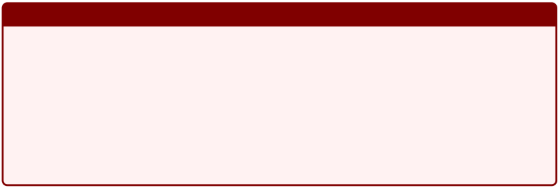

Soit n un entier naturel, soit f une fonction réelle définie et de classe Cn sur I, un intervalle de R et a ∈I.

Alors il existe une fonction h définie sur I et vérifiant lim h(x) = 0 telle que :

x→a

n f (k)(a)

∀x ∈I, f (x) = (x − a)k + (x − a)nh(x),

k!

k=0

où f (k) désigne la dérivée k-ème de la fonction f .

Cette proposition présente ce que l’on appelle une forme de développement limité

à l’ordre n d’une fonction. Bien évidemment, en pratique, nous n’irons jamais jusque là

et on se contentera principalement d’effectuer des développements limités à l’ordre 1 ou 2 pour les problèmes étudiés.

2. Développements limités

Regardons une définition plus formelle de ce qu’est un développement limité et faisons ensuite le lien avec le développement de Taylor.

2\. Il serait plsu exact de dire les Formules de Taylor car de nombreuses formulations existent

selon la qualité selon ce que l’on souhaite tirer comme information de notre fonction. Nous présentons ici la formule dite de Taylor-Young mais le lecteur curieux pourra également regarder les formules de Taylor-Lagrande ou de Taylor avec reste intégral.

Considérons tout d’abord une fonction f définie sur un intervalle I de R et un point a de I.

Définition 7.1: Développement limité

Soit n ∈ N. On dit que la fonction f admet un développement limité à l’ordre n au voisinage de a s’il existe des nombres réels a0,a1,a2,...,a n et une fonction ε définie sur I et vérifiant lim ε(x) = 0 , tels que

x→a

n

∀x ∈I, f (x) = ak(x − a)k + (x − a)nε(x).

k=0

Dans le cas particulier où a = 0 , on obtiendra un développement limité de la fonction au voisinage de 0.

Cela est utile afin de pouvoir également fournir des développements limités de fonction au voisinage de l’infini, ce que l’on appelle aussi un développement asymptotique .

Développement asymptotique On considère une fonction f définie sur un intervalle de la forme [α, + ∞ [. Déterminer un développement asymptotique de la fonction f consiste à écrire f sous la forme

f (x) = a + a1 + a2 + ... + an + o 1 .

0 x x2 xn xn

1

Pour obtenir un tel développement, on définit sur l’intervalle 0, , la fonction

α

1

g : t →f définissant ainsi la fonction g au voisinage de 0.

t

Ainsi, si g(t) = a0 + a1t + ... + antn + tnε(t) avec lim ε(t) = 0 , alors :

t→0

f (x) = g(1/x ) = a + a1 + 2 + ... + an + ε 1 , où lim ε 1 = 0

a 1

0  x x2 xn xn x x→+∞ x

Formule de Taylor

Proposition 7.2: DL à l’ordre n

Soit n un entier naturel et soit f une fonction de classe Cn sur un intervalle I de R. Alors f admet un développement limité à l’ordre n au voisinage de tout point a de I et ce développement est :

n

∀x ∈I, f (x) = ak(x − a)k + o((x − a)n).

k=0

En réalité, le lecteur a déjà effectué plusieurs développement limité de fonctions au voisinage d’un point ... lorsqu’il a déterminé l’équation de la tangente à une fonction en un point!

Nous terminons cette présentation des développements limités (même s’il reste plein de de propriétés et d’opérations sur les développements limités que nous pourrions montrer) en présentant quelques développements limités de références.

Lemme 7.1: Quelques DL usuels

Soit n un entier naturel. On a alors les développement limités suivants au voisinage

de 0

1  = n k ).
3) esh(ln(1=x)+=x) =nkxnk=0k! +nkx(2=1xok+2((k+x−+1on1)(2(2(1)!)xx.kkn)!++xok1)!(x+ o(x 2)n.+2

   1 − x k=0

   x n

k=0

k

k−1 n

2k+1

4) sin(x) = k=0 (− 1)k x~~ + o(x ).
4) cos(x) = nk=0 (− 1)k 2k + o(x2n+1 )

2n+2 ).

vii) ch(x) = nk=0 x2k + o(x2n+1 )

(2k)!

viii) Soit α ∈R, alors

(1 + x)α = n kj=0−1(α − j)xk + o(xn).

k!

k=0

L’obtention de ces derniers est une simple application de la Proposition précédente.

8  Formulaire

Cette section rassemble les quelques formules usuelles que le lecteur pourra être amené à utiliser au cours de sa formation.

1. Dérivées des fonctions usuelles

|Fonction||Ensemble def.|Dérivée||Ensembe dér.|
| - | :- | - | - | :- | - |
|a ∈R||R|0||R|
|ax + b, a,b ∈R||R|a||R|
|
n

x , n ∈N
||R|
n−1

nx
||R|
|1/x||R|
n−1

nx
||R|
|
−n

x ,n ∈N
||
⋆

R
|
−(n+1)

−nx
||
⋆

R
|
|
√ 

x
||
R

+
|
1 √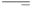

2 x
||R⋆ +|
|
α

x , α ∈R
||
⋆ +

R
|
α−1

αx
||
⋆ +

R
|
|
x

e
||R|
x

e
||R|
|ln(x)||
⋆ +

R
|1/x||
⋆ +

R
|
|cos(x)||R|− sin(x)||R|
|sin(x)||R|cos(x)||R|
|tan(x)||
R \

π 2

+ kπ

, k ∈Z
|
2

1 + tan (x) =

1

cos2(x)
||
R \

π 2

+ kπ

, k ∈Z
|
|ch(x)||R|sh(x)||R|
|sh(x)||R|ch(x)||R|
|th(x)||R|
1 − th2(x) =

1
||R|
||||ch2(x)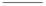|||
2. Formules de dérivations générales

Dans cette section, on supposera que u et v sont des fonctions dérivables sur R. On supposera également que u− 1, la fonction réciproque de u est aussi dérivable sur R. Seuls quelques exemples sur la dérivation de composée de fonctions sont données avec quelques fonctions usuelles, car il s’agit essentiellement de combiner la dérivée de la com- position de fonction avec la dérivée de la fonction usuelle.

|Fonction|Dérivée|Ensemble der.|
| - | - | - |
|u(x)2|2u′(x)u(x)|R|
|
n

u(x) , n ∈N
|nu′(x)u(x)n−1|R|
|u(x)|
u(x)

2

u(x)
|x ∈R | u(x) > 0|
|
α

u(x) , α ∈R
|αu′(x)u(x)α−1|x ∈R | u(x) > 0|
|1 u(x)|−u′(x) u(x)2|x ∈R | u(x) = 0|
|u(x) v(x)|u′(x)v(x) − v′(x)u(x) v(x)2|x ∈R | v(x) = 0|
|u(x)v(x)|u′(x)v(x) + u(x)v′(x)|R|
|u ◦ v(x)|v′(x)u′ ◦ v(x)|R|
|
−1

u (x)
|
1

u′ ◦ u−1(x)
|
′ −1

x ∈R | u ◦ u (x) = 0
|
|
u

e (x)
|u′(x)eu(x)|R|
|ln(u(x)))|u′(x) u(x)|x ∈R | u(x) > 0|
|cos(u(x))|−u′(x)sin(u(x))|R|
|sin(u(x))|u′(x)cos(u(x))|R|
|ch(u(x))|u′(x)sh(u(x))|R|
|sh(u(x))|u′(x)ch(u(x))|R|

3. Développements limités

Les développements limités sont donnés à l’ordre n pour les fonctions classiques ou encore 2n + 1 et 2n + 2 pour les fonctions circulaires et hyperboliques.

|Fonction|Développement limité|
| - | - |
|1 1 − x|1 + x + x2 + x3 + ... + xn + o(xn)|
|1 1 + x|1 − x + x2 − x3 + ... + (−1)nxn + o(xn)|
|(1 + x)α|
α(α − 1) 2 + ... + 1 + αx +~~ x

2!

α(α − 1) ... (α − n + 1) n

n) n!

x + o(x
|
|ln(1 + x)|
x − x2 + x3 − x4 + ... + (−1)n+1 xn + o(xn)

2 3 4

n
|
|ln(1 − x)|
−x − x2 − x3 − x4 + ... − xn + o(xn)

2 3 4

n
|
|
x

e
|
x2 x3 xn n 2! 3! n!

1 + x + + + ... + + o(x )
|
|cos(x)|
1 − x2 + x4 + ... + (−1)n x2n + o(x2n+1)

2! 4! 2n!
|
|sin(x)|
x − X 3 + x5 + ... + (−1)n x2n+1 + o(x2n+2)

3! 5! (2n + 1)!
|
|ch(x)|
1 + x2 + x4 + ... + x2n + o(x2n+1)

2! 4! 2n!
|
|sh(x)|
x + X 3 + x5 + ... + x2n+2 + o(x2n+2)

3! 5! (2n + 1)!
|

4. Primitives des fonctions usuelles

|Fonction|Primive||Ensemble def.|
| - | - | :- | - |
|a ∈R|ax + C,C ∈R||R|
|ax + b, a,b ∈R|
1 2 2

ax + cx + C, C ∈R
||R|
|
n

x , n ∈N
|
1 n+1

x + C, C ∈R

n + 1
||R|
|1/x|ln(|t|)||R⋆|
|
√ 

x
|
2 3

3/2

x + C,C ∈R
||R|
|
α

x , α ∈R \ {−1}
|
xα+1 α + 1

+ C, C ∈R
||R|
|
x ⋆

a ,a ∈R + \{1}
|
ax

+ C,C ∈R, a ∈

ln(a)

R⋆ \ {1}

+
||R|
|
x

e
|
x

e + C, C ∈R
||R|
|ln(x)|x ln(x) − x + C, C ∈R||R⋆|
|cos(x)|sin(x) + C, C ∈R||R|
|sin(x)|− cos(x) + C, C ∈R||R|
|tan(x)|− ln(| cos(t)|) + C, C ∈R|R \|
`  `π

+ kπ , k ∈Z

2
|
|ch(x)|sh(t) + C, C ∈R||R|
|sh(x)|ch(t) + C, C ∈R||R|
|th(x)|ln(ch(t)) + C, C ∈R||R|
|
1 ⋆

,a ∈R

a2 2

+ x
|
1  x 

arctan + C, C ∈ a

a R,a ∈R

⋆
||R|

Troisième partie

Analyse des fonctions à plusieurs variables

Cette deuxième partie se concentre sur l’analyse des fonctions à plusieurs variables et consiste essentiellement à étendre les concepts présentés en première partie à de telles fonctions.

La plupart des problèmes concrets que l’on va étudier mettent un jeu un grand nombres de variables et la plupart des quantités étudiées que l’on va chercher à estimer peuvent dépendre de plusieurs facteurs.

C’est par exemple le cas lorsque l’on cherche à estimer le prix d’un logement en fonction de ces différentes caractéristiques.

Prix

•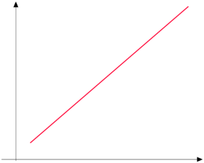

•

- •

•

•

•

C’est aussi le cas lorsque l’on cherche à classer des individus dans certaines caté- gories en fonction de leurs multiples caractéristiques, ce que l’on peut couramment faire en marketing.

x2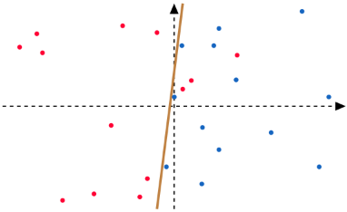

x1

Pour étudier et résoudre ces problèmes là, nous aurons besoin des outils d’algèbre linéaires : comme la manipulation de vecteurs et de matrices ainsi que quelques notions de géométries.

Nous commencerons donc par présenter ce que sont les fonctions à plusieurs va- riables, étudier leur continuité et définir ce que signifie être dérivable pour de telles fonc- tions. Ces points là seront d’une extrême importance pour la résolution de problèmes d’optimisations à l’aide d’algorithme de descentes de gradient que nous présenterons dans un troisième temps :

lim f (x). x∈Rd

L’étude plus approfondie des propriétés de la fonction f , comme la convexité ou encore l’étude de sa dérivée seconde vont nous permettre de déterminer les solutions du précédent problème. Cela permettra également d’établir des garanties de convergence des algorithmes que nous développerons dans le cadre de ce cours.

Enfin, il est aussi intéressant de voir comment la théorie de l’intégration peut s’étendre à de telles fonctions, et comment on peut intégrer sur différents domaines qui ne sont pas forcément linéaires.

9  Généralités sur les fonctions à plusieurs variables

Dans cette première partie, on commence par définir ce qu’est une fonction de plusieurs variables.

Définition 9.1: Fonctions à valeurs vectorielles

Une focntion de plusieurs variables à valeurs fectorielles f est une application d’un domaine D ⊂ Rn dans Rp, où D est supposé non vide.

Exemple 9.1. La fonction f : R2 → R3 définie par

f (x,y) = (x + y,ex+y,x − y)

est une fonction à valeurs vectorielles, i.e., l’image du couple (x,y) par f est un vecteur.

Dans cet exemple, il est d’usage de désigner les composantes du vecteur image comme les composantes des images de la fonction f .

Dans le cas où l’espace image est un sous ensemble de R, la fonction est dite à valeurs réelles .

Définition 9.2: Fonctions à valeurs réelles

Une fonction f de plusieurs variables est dite à valeurs réelles si l’espace d’arrivée de cette fonction est un sous-ensemble de R.

C’est ce type de fonction que nous rencontrerons le plus dans le cadre de ce cours. Exemple 9.2. La fonction f : R2 → R définie par

f (x,y) = x2 − y2,

est une fonction à valeurs réelles.

Un autre exemple de fonction à valeurs réelles que l’on peut rencontrer sont les affines de la forme

f (x) = ⟨a,x⟩+ c = a1x1 + ...a nxn + c, où a = ( a1,...,a n) et x = ( x1,...,x n).

On peut représenter graphiquement les fonctions définies par plusieurs variables mais nous sommes bien évidemment limité à une vue en trois dimensions. Ainsi nous ne pou- vons représenter graphiquement que des fonctions réelles qui dépendent de deux variables. Exemple 9.3. Les graphes des fonctions f : R2 → R définie par f (x,y) = x2 − y2 et g : R2 → R définie par g(x,y) = 3 x + 2 y + 3 , où g est une fonction affine :

4 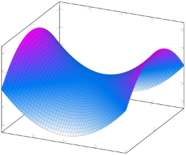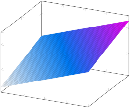

10 

2 

0 

0 

−2 

2 2 −4

−2 0 −2 0

−1 x 0 1 2 −2 y −1 x 0 1 2 −2 y

Plus généralement, on définit un graphe comme suit :

Définition 9.3: Graphe d’une fonction

Soit f une fonction définie sur un sous-ensemble D de Rn à valeurs réelles. On appelle graphe de la fonction f , l’ensemble :

{(x,f (x)) ∈Rn+1 : x = (x1,...,xn) ∈D}.

Le graphe d’une fonction affine, comme nous avons pu le voir dans l’exemple pré- cédent, est un hyperplan de l’espace d’arrivée.

Lorsque l’on étudie le graphe d’une fonction à plusieurs variables, nous sommes parfois amenés à étudier ce que l’on appelle les lignes de niveaux de la fonction, comme on peut le retrouver en cartographie. C’est notamment employé dans certains outils dans

le domaine de l’optimisation de fonctions.

Définition 9.4: Ligne de niveaux

Considérons une fonction f : Rn → R. On appelle ligne de niveau de la fonction f pour un réel c ∈Im(f ), l’ensemble des points

{x ∈Rn : f (x) = c}.

Exemple 9.4. Considérons la fonction f : R2 → R2 définie par f (x,y) = yx2 + xy2. Le graphe ainsi que la ligne de niveau f (x,y) = 1 sont représentés ci-dessous.

118 - Analyse I - L1 Informatique ![ref2]

10 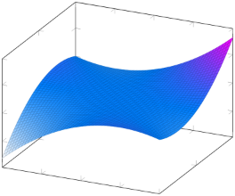

0 

−10 2

−2 −1 0 1 0 y

x 2 −2

4 

1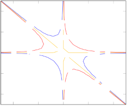

2 −

0

0 0 1 0 0 −10

−2 1

−4

−4 −2 0 2 4

` `- Analyse I - L1 Informatique ![ref2]

A votre avis, à quoi ressemble les lignes de niveau des fonctions affines? Prenez une fonction affine f : R2 → R2 et montrer que que ses lignes de niveau sont des hyperplans de R2.

Opérations sur les fonctions à plusieurs variables Pour finir, cette section, on présente quelques propriétés des opérations effectuées sur les fonctions à plusieurs va- riables. De façon générale, les opérations définies pour les fonctions définies de R dans R restent valable pour les fonctions à plusieurs variables.

Considérons maintenant deux fonctions f et g définies sur des domaines D et D′ et λ un nombre réel.

Alors

- La fonction λ(f + g) est définie sur D ∩D′ par

λ(f + g)(x) = λf (x) + λg(x).

- La fonction fg est définie sur D ∩D′ par :

fg(x) = f (x)g(x).

- La fonction f/g est définie sur D ∩D′ \ { x ∈D′ | g(x) = 0 } par f f (x)

(x) =~~ .

g g(x)

10 Continuité et Dérivabilité

On va maintenant revenir sur les notions fondamentales de continuité et de déri- vabilité en étudiant leurs définitions dans le cas des fonctions à plusieurs variables.

1. Continuité

On commence par définir la continuité. Définition 10.1: Continuité

Considérons une suite (xn )n∈N à valeurs dans Rn dont la limite existe est égale à x0 ∈Rn. Soit f : Rn → Rp.

Alors f est dite continue en x0 si et seulement si

lim f (xn)) = f lim xn = f (x0).

n→∞ n→∞

Ou, de façon équivalente, si et seulement si lim f (x)) = f (x0).

x→x0

Nous avons déjà rencontré plusieurs exemples de fonctions continues

- les fonctions linéaires et affines de la forme f (x) = ⟨a,x⟩+ c, qui sont continues sur R.
- les fonctions polynomiales de la forme f (x) = ( ⟨a,x⟩+ c)d.
- les fonctions exponentielles de la forme f (x) = e⟨a,x⟩+ c le sont aussi sur R
- les projections sur un sous-espace (ou sur une composante) sont des fonctions continues car linéaires et continues en 0.

On peut également énoncé un résultat sur la continuité concernant la composition de deux deux fonctions continues.

Proposition 10.1: Composition et continuité

Soit f est une fonction définie sur un sous-ensemble D de Rn à valeurs dans R et g une fonction définie sur un intervalle I de R.

Si f est une fonction continue en tout point x ∈D et si g est continue sur I, alors g ◦ f est continue sur D.

Cette proposition permettra de montrer que des fonctions complexes sont continues et les écrivant comme la composition de fonctions continues plus simples.

Exemple 10.1. Considérons la fonction f : R2 → R2 définie par

1

f (x,y) =

x2 + y2 + 1

x2 + y2 + 1 , continue sur R2 car polynomial2e et z →1z, continue sur R⋆+ .

Alors la fonction f est continue sur R comme la composition des fonctions (x,y) →

Avec ce même résultat, on peut même montrer que la fonction norme x → ∥x∥est continue.

2. Fonctions différentiables et dérivables

Le nombre dérivée d’une fonction réelle à valeurs réelles f en un point x0 a été définie comme décrivant l’évolution de la fonction f au voisinage de ce point. Plus préci- sément, nous l’avions défini comme la variation de f au voisinage de x0 par la quantité

- f (x0 + h) − f (x0)

f (x0) = lihm0 h~~ .

Dans le cas unidimensionnel, nous n’avions que deux façons de faire tendre h vers 0, par valeurs inférieures ou valeurs supérieures. Dans le cas multi-dimensionnel il ne faudra plus considérer des h réels mais vectoriels car il existe une infinité de directions qui pointes vers un point x0, ce qui nous ramène à notre étude des espaces vectoriels et

la décomposition des vecteurs dans une base.

La direction h considérée étant à présent un vecteur de Rn, on peut donc le décomposer dans une base, la base canonique (e1,e2,..., en) par exemple et écrire

h = h1e1 + h2e2 + ... + hnen.

Ainsi, en étudiant les variations rapport aux différents vecteurs de la base, on pourra étudier les variations de la fonctions par rapport à n’importe quel vecteur h et donc dans n’importe quelle direction.

Ce dernier point laisse donc à penser que la dérivée, que l’on l’appellera gradient , d’une fonction à plusieurs variables sera donc un vecteur .

De cette remarque, on va donc s’intéresser aux dérivées partielles de la fonction par à ces différentes composantes.

Définition 10.2: Fonctions partielles

Soit f une fonction définie sur un domaine de D de Rn et x ∈D. Pour tout i ∈ 1,n , on appelle f i les fonctions partielle définies par

x

fxi (u) = f (x1,x2,...,xi−1,u,xi+1,...,xn), où u est tel que {(x1,x2,...,x i− 1,u,x i+1 ,...,x n)} ⊂ D.

Une fonction partielle peut finalement être vue comme une fonction d’une seule variable, i.e., une fonction pour laquelle toutes les variables sont figées sauf une .

Dans le cas où ces différentes fonctions partielles sont dérivables, on parle alors de derivées partielles.

Définition 10.3: Dérivées partielles

Soit f une fonction définie d’un ensemble D de R dans R. Si la fonction f admet

∂f

des dérivées partielles en tout point x ∈D, alors on note l’application

∂xi

x → ∂f (x) = ∂f (x1,x2,...,xi,...,xn (x).

∂xi ∂xi

On peut facilement faire une analogie avec la définition de nombre dérivée pour les fonctions d’une variable réelle

∂f (x) = lim f (x + hei) − f (x). ∂xi h→0 h

On regardera seulement la variation dans une direction, ou selon une composante, du vecteur x.

Exemple 10.2. Soit f : Rn → Rn une fonction affine définie par f (x) = ⟨a, x⟩+ c, où a ∈Rn et c ∈R.

Alors les dérivées partielles de f existent et sont définies, pour tout i ∈ 1,n  par

∂f

(x) = a

∂xi

Exemple 10.3. Considérons la fonction f : R2 → R2 définie par f (x,y) = e− x2+ y2 −

1

3xy +~~ .

x2 + y2 + 1

La fonction f admet des dérivées partielles par rapport à x et à y qui sont données par

∂f −x2+y2 2x ∂f −x2+y2 2y

(x,y) = − 2xe − 3y−~~ et (x,y) = − 2ye − 3x−~~ . ∂x (x2 + y2 + 1)2 ∂y x2 + y2 + 1

On peut également définie le concept de fonctions de classe C1 pour les fonctions à plusieurs variables, il faut et il suffit que les différentes dérivées partielles soient conti- nues.

Cependant, la généralisation à des fonctions de classe Cn n’est pas aussi évidente. nous limiterons au cas des fonctions de classe C2 que nous étudierons ultérieurement.

Maintenant que nous avons introduit les dérivées partielles, on peut introduire la notion de gradient qui représente la valeur de la dérivée d’une fonction f selon toutes ses composantes.

Définition 10.4: S

it f une fonction définie sur un domaine D de Rn à valeurs dans R et soit a un point de D. Si f admet des dérivées partielles d’ordre 1 par rapport aux différentes variables, alors, on appelle gradient de f en a et on note ∇f (a), le vecteur de

Rn définie par

- 
- ∂f (a)
- ∂x1 

   .. 

∇f (a) =  . 



- 
- ∂f 

  (a)

  ∂xn

De plus, si f est une fonction de classe C1, alors le gradient est une application continue de D dans Rn.

Exemple 10.4. Considérons la fonction f : R3 → R3 définie par

f (x,y,z) = 3x2yz − 2x3y2z4 + ex.

La fonction f admet des dérivées partielles continues en tout point de D et son gradient est donnée par

- 

6xyz − 6(xyz2)2 + ex ∇f (x) =  3x2z − 4x3yz4  .

- 
-  3x2y − 8x3y2z3

Lorsque la fonction est à valeurs vectorielles la notion de gradient change car l’image n’est plus un simple nombre réel mais un vecteur. Il sera donc important de regarder comment se comporte les différentes composantes de l’image par la fonction selon les différentes variables.

Exemple 10.5. Considérons la fonction f : R3 → R3 définie par

f (x,y,z) = (3xy, 6xy, −2yz).

On voit que chaque composante évolue différemment selon les variables x,y et z. On va donc regarder chaque composante de l’image une par une et leurs différentes dérivées partielles.

On sera donc amenés à calculer un nombre de dérivées partielles qui dépend à la fois du nombre de variables, mais aussi de la dimension de l’espace d’arrivée. On pourra alors obtenir, dans le cas d’une fonction à valeurs vectorielles, une matrice , que l’on appelle la matrice Jacobienne .

Définition 10.5: Matrice Jacobienne

Soit a ∈ Rn et soit f une fonction définie sur un ensemble de Rn dans Rp telle que

f (x) = (f1(x),f2(x),...,fp(x)) ,

où les fonctions f j sont des fonctions à valeurs réelles qui admettent des dérivées partielles d’ordre 1.

On appelle matrice jacobienne de f en a, notée Jac f (a) ∈Rp× n définie par

- 

∂f1 ∂f

∂x1 ∂xn (a)

(a) ...

(a) =  ... ... 

Jacf  ∂fp ∂f 



(a) ... (a)

∂x1 ∂x1

La matrice Jacobienne est alors une généralisation gradient pour les focntions à valeurs réelles.

Exemple 10.6. Soit A ∈Rp× n, soit f : Rn → Rp définie par f (x) = Ax . Alors le Jacobien de f est donné par la matrice A elle même.

De façon générale, la dérivée d’une application linéaire est elle même.

Exemple 10.7. Considérons la fonction f : R3 → R3 définie par

f (x,y,z) = (3xy, 6xy, −2yz).

alors la matrice Jacobienne de f en un point (x,y,z) de R3 eest donnée par

- 

3y 3x 0 

- 
- 

Jacf (x) = 6y 6x 0 



- 
- 
0  −2z −2y

Regardons maintenant quelques opérations sur les dérivées partielles.

Opération sur les dérivées partielles Les propriétés des opérations sur les dérivées partielles sont très semblables à celles pour les fonctions réelles à valeurs réelles. Considérons une fonction f : D → R et g : D′ → R et soit ∈ R. Si les fonctions f et g admettent des dérivées partielles d’ordre 1 en un point a ∈D ∩D′, alors nous avons

- la fonction λ(f + g) possède des dérivées partielles d’ordre 1 en a et

∂(λ(f + g)) ∂f ∂g

∀i ∈ 1,n ,~~ (a) = λ~~ (a) + λ~~ (a).

∂xi ∂xi ∂xi

- La fonction fg possèdent des dérivées partielles d’ordre 1 en a et

∂(fg) ∂f ∂g ∀i ∈ 1,n ,~~ (a) = g(a)~~ (a) + f (a)~~ (a). ∂xi ∂xi ∂xi

- La fonction f/g possède également des dérivées partielles d’ordre en a si g(a) = 0 et
- f 1 ∂f ∂g

(a) = g(a)~~ (a) − f (a)~~ (a) .

∂x1 g g(a)2 ∂xi ∂xi

Les règles de dérivations sont identiques au cas d’une seule variable lorsqu’il s’agit de calculer les dérivées partielles.

Il nous reste à étudier comment cela se comporte avec la composition.

Proposition 10.2: Dérivation de composée de fonctions

Soit DS un sous ensemble de Rn et soient f : D → R et ϕ : R → R et a un point de D.

Si f et ϕ sont de classe C1, alors la fonction composée ϕ ◦ f : D → R est aussi de classe C1 sur D et on a

- ′ ∂f ′ ∂f

∀i ∈ 1,n  (ϕ ◦ f )(a) = (ϕ ◦ f )(a)~~ (a) = ϕ (f (a))~~ (a). ∂xi ∂xi ∂xi

Le gradient de la composée s’écrit alors

∇(ϕ ◦ f ) = (ϕ′ ◦ f )∇f.

On peut également l’étendre à des fonctions à valeurs vectorielles. Proposition 10.3: Dérivation de fonctions composée

Soit D un sous ensembles de Rn et soient f : D → R une focntion de classe C1 sur D et g : R → Rn, une fonction réelle à valeurs vectorielles, g(x) = (g1(x),...,gn(x)) qui admet des dérivées partielles, et a un point de D.

La fonction composée f ◦ g (à valeurs réelles) est alors dérivable sur R et pour tout réel t on a

d(f ◦ g) n ∂f

(t) = ′

dt ∂x (g(t))gi(t),

i=1 i

- ∇f (g(t))T Jacg(t),
- ⟨∇f (g(t)),Jacg(t)⟩,

où Jac g(t) ∈Rn× 1 désigne la matrice jacobienne de g en t.

Jusqu’à présent, nous avons étudier les dérivées de d’une fonction différentiable f par rapport au vecteur de la base de Rn. C’est-à-dire que nous avons étudié l’évolution

de la fonction f par rapport aux vecteurs de bases, i.e. dans n directions différentes.

A partir de cela, nous sommes maintenant capables d’étudier la dérivée de cette même fonction f dans n’importe quelle direction d ∈Rn qui va s’écrire

n

d = dj ej .

j=1

On parle alors de dérivée directionnelle . Définition 10.6: Dérivée directionnelle

Soit f une fonction définie sur un domaine D ⊂ Rn, x un point de D et d un vecteur de norme unitaire [a.](#_page109_x140.40_y321.41) Considérons également la fonction ϕ : R → R par ϕ(t) = f (x + td).

Si ϕ est dérivable en 0, alors f est dérivable en x dans la direction d et sa dérivée est noté Dd f (x)

Ddf (x) = ϕ′(0),

ϕ(t) − ϕ(0)

- lim~~ ,

  t→0 t

f (x + td) − f (x)

- lim~~ . t→0 t

a. Pour rappel, cela signifie que ∥d∥= nj =1 d2j = 1.

Dans le cas où d n’est rien d’autre qu’un vecteur de base, on retrouve la définition de dérivée partielle.

Proposition 10.4: Dérivée directionnelle

Soit D un sous ensemble de Rn et soit f : D → R une fonction de classe C1 sur D, x un point de D et d un vecteur unitaire de Rn.

Alors la fonction f possède une dérivée dans la direction d égale à

Ddf (x) = ⟨∇f (x), d⟩.

Démonstration. Repartons de la définition et considérons ϕ(t) = f (x + td) = f (g(t)) où g : R → D définie par g(t) = x + td. On réécrit ainsi la fonction ϕ comme une composée de deux fonctions. En appliquant la Proposition ??, nous avons

ϕ′(t) = (f ◦ g)′(t) = ⟨∇f (g(t)),J(t)⟩. En t = 0 , nous avons :

ϕ′(0) = ⟨∇f (g(0)),J(0)⟩= ⟨∇(f (x)),d⟩.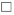

Regardons un petit exemple avec une fonction affine.

Exemple 10.8. Soit a ∈Rn et c un nombre réel. Considérons f la fonction affine définie de Rn dans Rn par

f (x) = ⟨a,x⟩+ c = a1x1 + ... + anxn + c.

Considérons maintenant une direction d = ( d1,d2,...,d n) de Rn. Alors, pour tout

réel t

ϕ(h) = f (x + td),

- ⟨a,x + td⟩+ c,
- a1(x1 + td1) + a2(x2 + td2) + ... + an(xn + tdn).

Donc la dérivée directionnelle est donnée par

a1d1 + ... + ndn = ⟨∇f (x),d⟩.

Ces notions de dérivées, de gradient, nous servent principalement, comme en di- mension 1 à déterminer une approximation de notre fonction au voisinage d’un point. Plus précisément, pour le moment, une approximation d’ordre 1 soit une approximation affine.

Cela suppose de deux choses. Si on note T l’approximation affine de la fonction f en un point a, alors T doit vérifier

- Il faut que la fonction et son approximation coïncide en le point a où la fonction est approchée

f (a) = T(a).

- Il faut aussi T devienne aussi proche de f lorsque x tend a et cela plus ra- pidement que la vitesse de convergence de x vers a, ce que l’on peut traduire par

f (x) − T(x)

lim~~ = 0. x→a ∥x − a∥

Pour obtenir une expression de cette approximation, nous avons besoin d’introduire une dernière définition, qui est celle de différentiabilité , même si le terme est déjà apparu auparavant. Cette définition va faire apparaître une fonction linéaire qui sera importante dans la définition de notre approximation T.

Définition 10.7: Différentielle des fonctions à plusieurs variables

Soit D un sous-ensemble de Rn, f une application de D à valeurs réelles et a un point de D. On dit que f est différentiable en a s’il existe une fonction linéaire L telle que

f (x) − (f (a) + L(a − a))

lim~~ = 0. x→a ∥x − a∥

Comme la fonction L est linéaire, elle peut s’écrire

L(x) = ⟨u,x⟩= u1x1 + u2x2 + ... + unxn. On doit donc avoir

f (x) − (f (a) + ⟨u,x − a⟩)

lim~~ = 0. x→a ∥x − a∥

On peut même montrer que le vecteur u dont il fait mention ici n’est rien d’autre que le vecteur des dérivée partielles de la fonction f évaluées en a, i.e.,

∂f

∀i ∈ 1,n , u = (a). i ∂xi

Ainsi, notre fonction T est définie par

n ∂f

T(x) = f (a) + ∂x (a)(xi − ai).

i=1 i

C’est cette dernière quantité

n ∂f ∂f ∂f

i=1 ∂xi (a)(h) = ∂x1 (a)h1 + ... + ∂xn (a)hn, que l’on appelle différentielle de f en a évaluée en h.

On remarque de suite que cette différentielle est aussi égale à

⟨∇f (a), h⟩== Dhf (a).

Prenons quelques exemples pour mieux comprendre les objets que l’on manipule.

Exemple 10.9. Considérons la fonction f : R2 √ 2 définie par f (x1,x2) = x1 2.

→ R 2 − x2

Et considérons le vecteur de R2 d = (1 / 2, 3/ 2), qui est bien unitaire.

Alors le gradient de la fonction f est donnée par

∇f (x)T =

2x1 −2x2 .

Ainsi, la dérivée directionnelle de f dans la direction d, qui est aussi la différentielle de f en x évaluée en d, est donnée par

√123 = x √



Ddf (x) = ⟨∇f (x),d⟩= 2x1 −2x2  1 − 3x2.

2

Ainsi, on peut évaluer l’accroissement de la fonction f en n’importe quel point x dans la direction d donnée.

Exemple 10.10. Considérons la fonction f : R2 → R2 définie par f (x,y) = cos x21 +

2

x22.

Et considérons le vecteur de R2 d = (4 / 5,3/ 5), qui est bien unitaire.

Alors le gradient de la fonction f est donnée par

2

∇f (x)T = −x sin x1 2x .

1 2 2

Ainsi, la dérivée directionnelle de f dans la direction d, qui est aussi la différentielle de f en x évaluée en d, est donnée par

- 

  45

Ddf (x) = ⟨∇f (x),d⟩= −x1 sin x221 2x2 3 = − 4x51 sin x221 + 65x2.

5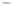

Par exemple, dans la direction donnée, cet accroissement ne cesse de changer de signe selon la valeur de x1.

Avec ces notions, on peut alors définir l’approximation linéaire d’une fonction f au voisinage d’un point.

Définition 10.8: Approximation affine

Soit D un sous-ensemble de Rn et f une fonction de D dans R.

Alors f possède une approximation affine en a ∈D, s’il existe une forme linéaire L telle que pour tout vecteur h vérifiant a + h ∈D on ait

f (a + h) = f (a) + L(h) + o(∥h∥),

où o(∥h∥) représente une fonction qui tend vers 0 lorsque h tend vers 0 plus vite que ∥h∥.

De plus, si f est de classe C1 sur D, alors on

f (a + h) = f (a) + ⟨∇f (a),h⟩+ o(∥h∥).

Si on pose h = x − a dans la définition précédente, nous sommes alors en mesure d’approcher la valeur de la fonction f en n’importe quel point x à partir de sa valeur en a de sa dérivée en ce point.

Ainsi, comme dans le cas uni-dimensionnel, l’équation

f (a) + ⟨∇f (a),x − a⟩ définit l’hyperplan tangent à f en a.

Exemple 10.11. Considérons la fonction f : R2 → R2 définie par f (x ,x ) = x2 + x2.

1  2 1 2

Et considérons le vecteur de R2 a = (1 / 2,1/ 2).

Alors le gradient de la fonction f est donnée par

∇f (x)T = .

2x1 2x2

Et le plan tangent de f au point a est donné par l’équation

1

T(x) = f (a) + ⟨∇f (a),x − a⟩= − + x + y.

2

Ce que l’on peut représenter graphiquement comme suit

135 - Analyse I - L1 Informatique ![ref2]

5 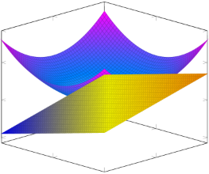0 

−5 

−2 2

0 0

x 2 −2 y

 

|||
| :- | :- |
5 0

−5

−2

0 2 −2 0 2

x y

` `- Analyse I - L1 Informatique ![ref2]

Dans la suite, nous allons nous concentrer sur les fonctions qui sont cette fois-ci deux fois différentiables.

3. Fonction différentiables : ordre 2

Le fait, pour une fonction d’être deux fois différentiables va nous permettre de fournir une caractérisation des fonctions convexes Nous pourrons aussi de déterminer la nature d’un extremum d’une fonction, comme nous l’avons fait dans le cas des fonctions réelles à valeurs réelles.

Commençons par regarder ce qu’est une fonction deux fois différentiables en défi- nissant les dérivées partielles d’ordre 2.

|Définition 10.9: Dérivées partielles d’ordre 2|
| - |
|
Soit D un sous-ensemble de Rn et x ∈Rn. Considérons une fonction f de D dans R dont les dérivées partielles d’ordre 1 admettent des dérivées partielles, i.e., telle

∂f

que pour i ∈ 1,n , (x) existent et soient différentiables.

∂xi

∂2f

Cette dérivée est notée (x).

∂xj ∂xi

Si les dérivées premières partielles admettent des dérivées partielles d’ordre 1, alors les fonctions

∂2f ∀i,j ∈ 1,n ,

∂xj ∂xi sont appelées dérivées partielles d’ordre 2
|

Exemple 10.12. Reprenons la fonction f : R2 → R2 définie par

f (x,y) = xy2 − yx2.

Cette fonction admet des dérivées partielles d’ordre 2. Les dérivées partielles d’ordre 1 sont

136 - Analyse I - L1 Informatique ![ref2]

∂f (x,y) = y2 − 2yx ∂x

Ainsi, les dérivées partielles d’ordre fois par rapport à la même variable

et ∂f (x,y) = 2 xy − x2.

∂y

2 sont définies par, lorsque l’on dérive deux

` `- Analyse I - L1 Informatique ![ref2]

∂2f ∂2f ∂2f ∂2f

(x,y) = (x,y) = − 2y et (x,y) = (x,y) = 2 x. ∂x∂x ∂x2 ∂y∂y ∂y2

Et les dérivées dites croisées sont données par

∂f ∂f ∂f ∂f

(x,y) = 2 y − 2x et (x,y) = 2 y − 2x.

∂y ∂x ∂x ∂y

Dans cet exemple, on remarque que les dérivées partielles croisées sont égales. Ce n’est pas propre à cet exemple et c’est une conséquence d’un résultat plus général que l’on appelle le Théorème de Schwarz .

Théorème 10.1: Théorème de Schwarz

Soit D un sous-ensemble de Rn et f une application de classe C2 de D dans Rn. Alors

∂f ∂f ∂f ∂f

∀i,j 1,n  = .

∂y ∂x ∂x ∂y

Ce théorème nous dit que dans le cas où la fonction étudiée est de classe C2, donc les dérivées partielles d’ordre 2 existent et sont continues, alors l’ordre de dérivation n’a pas d’importance.

Ce résultat peut également servir à montrer qu’une fonction f n’est pas de classe C2.

Exemple 10.13. Soit f la fonction définie de R2 dans R par

xy3

f (x,y) = si (x,y) = (0 ,0) et f (0,0) = 0

x2 + y2

.

2 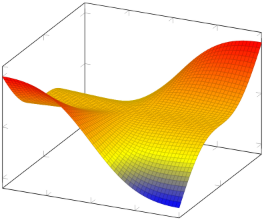0 

2

−2 

−2 −1 0 0

x 1 2 −2 y

La fonction f est bien de classe C1. Les dérivées partielles sont nulles en (0,0) et en dehors, nous avons

∂f (x,y) = y3 y2 − x2 et ∂f (x,y) = xy2 3x2 + y2~~ .

∂x (x2 + y2)2 ∂y (x2 + y2)2 Pour tout y non nul et x non nul respectivement, nous avons

∂f ∂f

(0,y) = − y et (x, 0) = x.

∂x ∂y

Ainsi

∂f ∂f

lim ∂x (0,y) − ∂x (0,0) = −1 y→0 y − 0

et

∂f ∂f

(x, 0) − (0,0)

∂y ∂y

lim~~ = 1 x→0 x − 0

Les dérivées partielles secondes en (0,0) ne sont pas égales. La fonction n’est donc pas de classe C2.

Tout comme nous avions défini le Jacobien d’une fonction f , quand cette dernière était de classe C1, nous définissons ce que l’on appelle une matrice hessienne , pour les fonctions de classe C2.

Définition 10.10: Matrice Hesienne

Soit f une fonction définie sur un sous-ensemble D de Rn à valeurs dans R et de classe C2. On appelle matrice hessienne ou parfois hessien de f en un point x ∈Rn, la matrice notée

∇2f (x) = ∂2f~~ (x) .

∂xi∂xj i,j=1,...,n

On peut également rencontrer la notation Hess pour désigner le hessien de la fonc-

tion f .

Plus généralement, si une fonction f est de classe Ck, on peut à nouveau approcher cette fonction par un développement de Taylor d’ordre au plus k.

Définition 10.11: Formules de Taylor-Young

Soit f une fonction définie sur un sous-ensemble D de Rn à valeurs réelles de classe

Ck et x un point de Rn,

Ainsi, une appromximation d’ordre 2 d’une fonction f de classe C2 au voisinage de x ∈R2 est donnée, ∀h = ( h1,h2) ∈R2, par

∂f ∂f

f (x + h) = f (x) + h1~~ (x) + h2~~ (x)

∂x1 ∂x2

+ 1 h2 ∂2f (x) + 2h h ∂2f~~ (x) + h2 ∂2f (x) + o(∥h∥2),
2  1 ∂x21 1 2 ∂x1∂x2 2 ∂x22
- f (x) + ⟨∇f (x),h⟩+ 1⟨∇2f (x)h,h⟩+ o(∥h∥2).

2

On servira de cette approximation lorsque l’on cherchera à étudier le fonctionne- ment d’algorithmes d’optimisation qui utilisent la dérivée seconde de la fonction.

Exemple 10.14. Soit la fonction f : R2 → R définie par

f (x,y) = yex + cos(xy).

Cette fonction f est bien de classe C2 sur R2 et admet donc un développement limité d’ordre 2 en 0 donnée par

f (x) = f (0) + x∂f (0) + y∂f (0) + 1 x2 ∂2f (0) + 2xyx ∂2f~~ (0) + y2x∂2f (0) ,

∂x ∂y 2 ∂x2 ∂x∂y ∂y2

où la gradient est donné par

139 - Analyse I - L1 Informatique ![ref2]

∇f (x) = yex − ysin(xy) ex − x sin(xy) La matrice hessienne est donnée par



soit ∇f (0) = 0 1 .

  

` `- Analyse I - L1 Informatique ![ref2]

∇2f (x) =  ex  soit ∇2f (0) = 0 1 .

yex − y2 cos(xy) − sin(xy) − xy cos(xy)

ex − sin(xy) − xy cos(xy) −x2 cos(xy) 1 0 Donc une approximation de f d’ordre 2 au point 0 est donnée par

f (x) = 1 + y + 2xy.

Nous avons maintenant tous les outils nécessaires à la caractérisations des extrema d’une fonction, ainsi qu’à l’étude des fonctions convexes.

11  Recherche d’extrema et applications aux fonctions convexes

On souhaite maintenant regarder comment les outils de calculs différentielles, i.e., l’étude de la dérivée des fonctions peut nous permettre de localiser et caractériser les extrema d’une fonction.

Nous reviendrons également sur les notions de convexité et la caractérisation de la convexité.

1. Retour sur la convexité

Les définitions que nous avons rencontré pour la convexité dans les cas des fonctions d’une seule variable se généralise pour les fonctions à plusieurs variables.

Définition 11.1: Convexité

Soit f une fonction définie sur un domaine D de Rd à valeurs dans R. On dit que la fonction f est convexe sur D si pour tout u,v ∈ Rd et pour tout α ∈ [0,1] nous avons

f (αu + (1) − α)v) ≤ α(u) + (1 − α)f (v).

Dans cette définition, si on remplace le signe ≤ par ≥ , on définit une fonction concave . De plus, si les inégalités larges sont remplacées par des inégalités stricte, la fonction sera dite strictement convexe ou strictement concave .

On rappelle également que si une fonction f est convexe alors − f est concave et récipro- quement.

On peut également caractériser la convexité d’une fonction en se basant sur le gradient de cette dernière ou encore en utilisant la matrice hessienne.

Définition 11.2: Convexité, caractérisation ordre 1

Soit f une fonction de classe C1 sur un ensemble D ∈Rd, alors

- f est convexe si tout hyperplan tangent à f est en dessous de son graphe, i.e.,

∀u,v ∈D, (u) ≥ f (v) + ⟨u − v,f (v)⟩.

- f est concave si tout hyperplan tangent à f est au dessus de son graphe, i.e.,

∀u,v ∈D, (u) ≤ f (v) + ⟨u − v,f (v)⟩.

Enfin, la caractérisation d’ordre 2.

Définition 11.3: Convexité, caractérisation ordre 2

Soit f une fonction de classe C2 sur un ensemble D ∈Rd, alors

- f est convexe si sa matrice hessienne est semie-définie positive ,i.e.,

∀u,v ∈D, uT ∇2f (v)u ≥ 0.

- f est concave si sa matrice hessienne est semie-définie négative ,i.e.,

∀u,v ∈D, uT ∇2f (v)u ≤ 0. Exemple 11.1. Soit f la fonction définie de R2 dans R définie par f (x,y) = (42y)2 + 5x2 + x + 3y + 4xy.

On va étudier la convexité de cette dernière.

Commençons par voir que la fonction f est une forme quadratique que l’on peut donc réécrire sous forme matricielle.

f (x,y) = (42y)2 + 5x2 + x + 3y + 4xy,

- 16 − 16y + 4y25x2 + x + 3y + 4xy,
- 5x2 + 4y2 + 4xy + x − 13y + 16,
- ⟨Au ,u⟩+ ⟨b,u⟩+ 16 ,
- 

T 5 2 T où u = x y , A =   et vb= 1 − 13



2 4

Pour cette forme quadratique, la matrice hessienne est donnée par 2A, or cette matrice A a une trace et un déterminant positif, ses valeurs propres sont donc positives

et la matrice A est donc positive. Ainsi f est convexe.

2. Conditions d’optimalité

Après ce bref rappel sur les fonctions convexes, nous lancer dans la recherche d’ex- trema d’une fonction f définie de D ⊂ Rd à valeurs dans R.

Let us first define the minimum of a function f .

x1 x2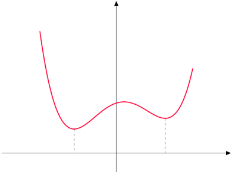

Figure 23 – Illustration du concept de minimum local et global d’une fonction. Le point x1 est le minimum global de la fonction alors que x2 est un simple minimum local.

Définition 11.4: Minimul local et global

Soit f : Rd → R une fonction continue. On dit que u ∈Rd est minimum local de f si pour tout voisinage V ⊂ Rd de u (c’est une ensemble qui contient de le point u) on a :

f (u) ≤ f (v), ∀v ∈V,

Le point u est un minimum global est une minimum global de la fonction f si et seulement si :

f (u) ≤ f (v), ∀v ∈Rd.

Noter bien la différence entre local et global, dans le premier cas, on supposera que la fonction a atteint son minimum dans un espace donné. Dans le second cas, elle doit pas atteindre une valeur plus faible que celle atteinte en u.

En d’autres termes, le minimum d’une fonction f est juste la valeur (u) où u est le point en lequel la fonction f atteint son minimum (local ou global) comme illustré par

la Figure 23.

Lorsque l’on peut représenter le graphe de la fonction, il est très simple de localiser

un minimum (ou un maximum). Mais cela devient plus difficile en dimension supérieure.

La proposition suivante permet de donner une première caractérisation d’un mini- mum (local) d’une fonction f . C’est ce que l’on appelle l’ inéquation d’Euler

Proposition 11.1: Inéquation d’Euler

Soit f : Rd → R une fonction continue U un ensemble convexe non vide de Rd. Considérons également u ∈ U un minimum de relatif de f par rapport à U. Si f est différentiable en u, alors

∇f (u)(v − u) ≥ 0, ∀v ∈ U

Cela signifie simplement que si on évalue le gradient de f en u alors la fonction sera croissante dans n’importe quelle direction v − u

Démonstration. Suppons que u est un minimiseur relatif par rapport à notre ensemble U. Alors pour tout tout α > 0 et tout vecteur v tels que α(u − v) ∈ U, nous avons

f (u) ≤ f (u + α(u − v)).

Ainsi

f (u) − f (u + α(u − v))

≥ 0.

α

En prenant la limite lorsque α tend vers 0, on trouve que

Ddf (u) ≥ 0.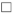

Mais ce résultat est rarement utilisé en pratique Si on revient à la Figure 23, on remarque que les extrema sont localisés en les points où le gradient de la fonction f s’annule. Cette condition d’optimalité est est connue sous le d’ équation d’Euler .

Proposition 11.2: Equation d’Euler

Soit f : Rd → R une fontion continue et différentiable en u ∈ Rd. Si u est un extremum alors :

∇f (u) = 0.

Démonstration. On fait la preuve dans le cas où u est un minimum, mais elle est ana- logue dans le cas où u est un maximum.

En utilisant la défintion de minimum dans un voisinage de u, i.e., ∀v ∈Rd,∃t > 0 tels que u + tv ∈V, nous avons

f (u) ≤ f (u + tv) = f (u) + ∇f (u)T (tv) + tvT ε(tv), t ≪ 1

⇐⇒ 0 ≤ ∇f (u)T (tv) + tvT ε(tv),

où ε est une fonction vectorielle dont les composantes tendent vers 0 lorsque t tend vers 0.

En divisant par t > 0 et en prenant la limite lorsque t → 0, on obtient :

0 ≤ ∇f (u)v

En remplacant maintenant v par − v on a, de façon similaire :

0 ≤ −∇f (u)T v.

Ainsi pour tout v ∈Rd on a ∇f (u)T v = 0 et donc ∇f (u) = 0 . 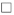

Les solutions de l’équation d’Euler définissent ce que l’on appelle des points cri- tiques ou des valeurs critiques .

Faites bien attention! Cette proposition ne donne qu’une condition nécessaire pour trouver un extremum d’une fonction, mais un peu point critique n’est pas forcément un extremum, la condition n’est pas suffisante comme nous avons pu le voir dans le cas unidimensionnel.

Exemple 11.2. Let us consider the functions f and g respectively defined by 1(x− 2)2− 2

2

and 1x3 − 1 and represented below.

2

 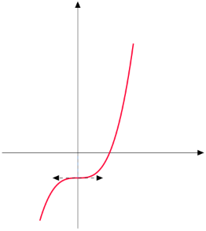

Les points x des deux graphes sont solutions de l’équation d’Euler ∇f (x) = 0 et ∇g(x) = 0 respectivement. Cependant, s’il s’agit bien d’un point en lequel la fonction f atteint son minimum, on ne peut pas dire que le point x soit un point en lequel la fonction g atteint un extremum.

Cet exemple montre qu’il est important de définir des critères qui permettent de caractériser la nature d’un point critique : minimum, maximum ou ... ni l’un ni l’autre.

Etant donnée une solution u de ∇f (u) = 0 , on peut dire que :

2

- u est un minimum local si ∇ f (u) = Hess f (u) ≥ 0, i.e. si la matrice hessienne de la fonction f évaluée en u est semie-définie positive. Cela signifie qu’en ce point, la fonction f est localement convexe!

  Ce point est un minimum global si f est convexe sur son ensemble de définition ou si pour tout v = u on a f (u) ≤ f (v).

- u est un maximum local si ∇2f (u) = Hess f (u) ≤ 0, si la matrice hessienne de la fonction f évaluée en u est semie-définie négative. Cela signifie qu’en ce point, la fonction f est localement convexe!

  Ce point est un minimum global si f est convexe sur son ensemble de définition ou si pour tout v = u on a f (u) ≤ f (v).

- Dans les autres cas, on ne peut rien dire ou il faut procéder à une étude plus poussée.

Exemple 11.3. Soit f la fonction définie de R2 dans R définie par

f (x,y) = (42y)2 + 5x2 + x + 3y + 4xy.

On va étudier la convexité de la fonction f et chercher ses extremum.

Commençons par voir que la fonction f est une forme quadratique que l’on peut donc réécrire sous forme matricielle.

f (x,y) = (42y)2 + 5x2 + x + 3y + 4xy,

- 16 − 16y + 4y25x2 + x + 3y + 4xy,
- 5x2 + 4y2 + 4xy + x − 13y + 16,
- ⟨Au ,u⟩+ ⟨b,u⟩+ 16 ,
- 

T 5 2 T où u = x y , A =   et vb= 1 − 13

- 

2 4

Pour cette forme quadratique, la matrice hessienne est donnée par 2A, or cette matrice A a une trace et un déterminant positif, ses valeurs propres sont donc positives

et la matrice A est donc positive. Ainsi f est convexe.

Pour rechercher ses extrema, on commence par résoudre l’équation d’Euler

∇f (u) = 2Au + b = 0. Cela nous amènes à résoudre le système



10x + 4y + 1 = 0,

4x + 8y − 13 = 0.

La solution de ce système est donnée par le vecteur

-   

u = x = −673032 .

y

32

La fonction f étant convexe, il s’agit du minimum global de la fonction f .

Etudions un deuxième exemple qui n’implique pas une forme quadratique.

Exemple 11.4. Soit f la fonction définie de R2 dans R définie par

f (u) = f (x,y) = 2x2 + 4(y2)2 + 4x + 6y2xy + 2y3.

On va reprendre la même étude que précédemment.

Nous avons un terme cubique donc on ne peut pas exprimer cette fonction à l’aide d’une matrice comme nous l’avons fait dans l’exemple précédent.

La matrice hessienne de notre fonction est donnée par

- 
- 4 −2

Hess (u) =  

f 

−2 12y + 8

Remarquons que la trace et le déterminant de cette matrice sont respectivement

7 égales à 12y+12 et 48y+28 . Ces deux quantités sont positives si et seulement si y ≥ − . 12

7

Ainsi la fonction est convexe sur R × −~~ ,+ ∞ .

12

Elle est concave si 12y + 12 est négatif et 48y + 28 est positif, donc si y vérifie y ≤ − 1

7

et y ≥ − . Ces deux conditions sont incompatibles donc la fonction n’est ni convexe, ni

12

7

concave en dehors de l’ensemble R × −~~ ,+ ∞ .

12

Pour trouver les extrema de cette fonction, on doit résoudre le système

- 

 4x + 4 − 2y = 0,  2x = y − 2, ∇f (u) = 0 ⇐⇒ 6y + 8y − 2x − 10 = 0. ⇐⇒ 6y + 7y − 8 = 0.



2 2

Ce système admet deux solutions u1 et u2 qui sont

- √   √ 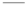

−31 241 −31 241

- −~~  ~~ +~~ 

u =  24 √24  et u2 =  24 √24 

1 7 241  7 241

- − − +
12  12 12 12

Le premier point u1 voit sa deuxième composante être plus petite que − 1, il ne s’agit donc ni d’un minimum, ni d’un maximum. Quant au deuxième point, sa deuxième composante est strictement positive, il s’agit donc d’un minimum local de cette fonction. Ce n’est pas un minimum global, car la fonction f tend vers −∞ lorsque ytend vers −∞ .

Reargons un dernier exemple

Exemple 11.5. Etudions f : [− 2,2]2 → R définie par

f (x) = 4 + x21 − 2cos(2πx1) + x22 − 2cos(2πx2) .

Cette fonction est intéressante car elle admet plusieurs minima locaux mais un seul minimum global. Elle est souvent utilisée pour tester l’efficacité d’un algorithme d’opti- misation.

10 5 

2

0 

−2 −1 0 0

1 2 −2

On peut voir que cette fonction n’est ni convexe, ni concave globalement. On peut regarder le gradient de cette fonction

∇f (x) = 2x1 + 4π sin(2πx1) 2x2 + 4π sin(2πx2) .

Les solutions de l’équation d’Euler sont données par la résolution du système

x1 = −2π sin(2πx1), x2 = −2π sin(2πx2).

Les deux équations sont indépendantes mais sont globalement difficiles à résoudre ... sauf si on garde l’esprit que sin(x) ∈[− 1,1]. Ainsi, on peut voir que le vecteur nul est un point critique, qui est aussi le minimum global de la fonction.

On va maintenant regarder quelques exemples concrets de problèmes que l’on va chercher à résoudre en Science des Données.

3. Problème d’optimisation

On va considérer que l’on se trouve dans un espace E de dimension det soit f : E → R. Un problème d’optimisation, ici de minimisation se présente comme

min f (x). x∈E

La fonction f s’appelle souvent la fonction de coût ou risque. Cela peut représenter

le coût associé au stockage de produits dans un entrepôt (représenté par le paramètre x) ou le risque lié à une prise de décision.

Regardons quelques problèmes d’optimisations classiques que vous étudierez plus en détail l’année prochaine. Ils sont là uniquement pour motiver la prochaine section.

La régression linéaire Etant donnée un vecteur de valeurs y ∈Rm et une matrice de données X = ( x1,..., xm ), xi ∈ Rd où d < m , On souhaite trouver un vecteur θ ∈ Rd qui permet d’expliquer au mieux y à l’aide de X en utilisant le modèle suivant :

y = Xθ + ε, où ε ∼ N (0,σ2I),

où ε représente les erreurs du modèle.

Pour trouver le meilleur vecteur θon cherche à résoudre le problème suivant : θmin∈Rd m εi = θmin∈Rd ∥y − Xθ∥22.

i=1

On peut observer que ce problème d’optimisation est convexe. En effet, son gradient est donné par

∇θ ε = −2X T (Y − Xθ),

et la solution de l’équation d’Euler est θ = ( XT X)− 1XT y. La dérivée seconde, égale à

∇2 = 2XT X

β

est une matrice de Rd× d symétrique et semi-définie positive. Notre problème est donc convexe.

Montrons que la matrice hessienne est bien semi-définie positive. Soit λ une valeur propre de XT X et uλ le vecteur propre associé. En utilisant la définition de vecteur

propre, nous avons

XT Xuλ = λuλ,

- en pré-multipliant par uT

λ

λ λ λuTλ uλ, uT XT Xu =

- droite : définition de norme
- gauche : propriété de la transposition

(Xuλ)T Xuλ = λ ∥uλ∥22 ,

- gauche : définition de norme

∥Xu λ∥22 = λ ∥uλ∥22 . Comme un vecteur propre est nécessairement non-nul, on a

∥Xu λ∥22

λ = ∥uλ∥22 ≥ 0.

Dans ce cas, nous avons obtenir une solution analytique à notre problème, mais ce n’est pas toujours possible.

Régression logistique La régression logistique est aussi problème de régression. En revanche le but ne sera plus de prédire une valeur réelle, mais plutôt l’appartenance à un groupe pour un individu donné, ce que l’on appellera une classe.

Pour prédire l’appartenance à une classe, on utilisera le modèle suivant g(x, θ) = log 1P−( Pv(xx| |yy==1)1) = θ0 + θ1x1 + ... + θdxd.

Les paramètres du modèle sont estimées par une méthode que l’on appelle, le maximum de vraisemblance , une quantité très utilisée en statistiques.

Plus précisément, on va se concentrer l’optimisation de la négative log-vraisemblance :

m 1

ℓ(X,θ) = − yi log(pi) + (1 − yi)log(1 − pi), où pi =~~ ,

i=1 1 + exp(− dj=1 θdXij )

où pi désigne une probabilité Xij désigne l’élément en i-ème ligne et j-ème colonne de la matrice X.

Malheureusement, il n’existe pas de solutions analytiques à ce problème. Pour trouver une solution, nous aurons besoin d’utiliser des algorithmes d’optimisation.

12 Optimisation : descente de gradient

Etant donnée une fonction function f : Rd → R, nous cherchons à résoudre : x⋆= arg min f (x).

x∈Rd

Notre objectif est de présenter quelques algorithmes qui permettent de construire

⋆

une suite (xn )n∈N qui converge cette solution x , la valeur x pour laquelle f atteint son minimum. 

x2 x4 x⋆ x3 x1

Pour cela, on nous utiliserons une technique appelée la descente de gradient qui va permettre d’orienter la direction de l’espace de recherche des solutions, dans la construc- tion de notre suite.

1. Introduction à la descente de gradient

Etant donnée une fonction f et un ensemble U non vide et sachant que le problème suivant admet une solution

u⋆= arg min f (v).

v∈U

l’idée est de construire une suite (uk)k∈N qui converge vers u⋆en utilisant le principe

suivant :

- choisir une valeur u0 : c’est le point de départ de notre algorithme d’optimisa- tion.
- uk → uk+1 : on choisit une direction dk et on minimise la fonction objective f le long de cette direction.
- on résout arg min f (uk − ρdk) = ρk : on cherche à quel point on doit se déplacer ρ>0

  dans la direction donnée pour minimiser la fonction f . Cette constante ρ est souvent appelé pas d’apprentissage .

- uk+1 = uk − ρkdk : on met à jour la valeur de notre suite.

  u0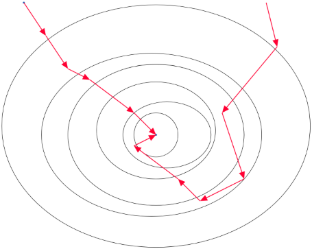

u1

u1

u2

u3

u4 u2

u⋆

u6

u5 u3

u4

Figure 24 – Illustration de la convergence vers u⋆de la fonction f via plusieurs chemins. Les différentes ellipses représentent les lignes de niveau de la fonction f .

Les trois dernières étapes du processus sont itérées jusqu’à ce que l’on soit suffi- samment proche de la solution u⋆.

Plusieurs questions se posent

1) comment choisir la direction de descente dk ?
1) jusqu’à quel point devant nous avancer dans la direction indiquée, i.e., quelle valeur donnée à ρk.

Cette question est tout à fait légitime dans la mesure où, comme le montre la Fi- gure 24, plusieurs chemins peuvent mener à la solution optimale. Cependant il y en a certainement un qui est préférable à un autre. Comment pouvons-nous utiliser la connais- sance que nous avons de la fonction à optimiser, et de ses dérivées pour construire un tel chemin.

Pour répondre à la première question i), nous nous intéressons à la quantité suivante

f (uk − ρdk).

Plus précisément, nous allons nous intéresser à l’approximation d’ordre 1 de cette

fonction. Ainsi, lorsque ρ est proche de 0, nous avons le développement limité d’ordre 1 suivant

f (uk − ρdk) = f (uk) − ρ⟨∇f (uk),dk⟩+ ρε(ρ),

où ε est une fonction qui tend 0 lorsque ρ tend vers 0.

Pour minimiser f (uk − ρdk) nous devons choisir la direction dk qui maximise le produit scalaire ⟨∇f (uk), dk⟩. Une application de l’inégalité de Cauchy-Scwhartz nous donne

⟨∇f (uk), dk⟩ ≤ ∥∇f (uk)∥∥dk∥.

mais surtout, que l’égalité est atteinte lorsque les deux vecteurs sont colinéaires! Ainsi, il suffit de choisir dk colinéaires au gradient de la fonction ∇f (uk) donc, par exemple, prendre

dk = ∇f (uk).

Nous pourrions alors écrire notre procédure comme suit

- choisir u0 pour initialiser notre algorithme,
- poser uk+1 = uk − ρk∇f (uk) pour ρk > 0 déterminé de façon à minimsier f (uk − ρk∇f (uk))

Il faut aussi regarder à quel moment notre algorithme s’arrête, car il n’est certai- nement pas possible, numériquement, d’atteindre exactement la solution optimale.

Pour cela, on utilisera le fait que la solution u⋆ est une valeur critique sui vérifie

∇f (u⋆) = 0.

Donc, lorsque la norme du gradient f est proche de 0 on peut supposer que l’on est proche de la solution optimale.

En pratique, on se fixe une constante strictement positive ε. On stoppe notre algorithme lorsque l’on a

∥∇f (uk)∥ ≤ ε.

Le dernier point à étudier est le le choix de la valeur de ρk pour les différentes itérations de l’algorithme.

Un choix plutôt simple consisterait à prendre ρk = ρ > 0 pour n’importe quelle valeur de k.

Ce qui donne notre premier algorithme de descente de gradient

x⋆ x4x3x2 x1 x3 x1 x⋆ x2 x4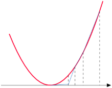

Figure 25 – Illustration de l’importance du choix du pas d’apprentissage ρ. Une valeur trop faible entraîne convergence très lente de l’algorithme (à gauche). Une valeur trop grande peut entraîner une divergence de l’algorithme (à droite).

Définition 12.1: Descente de gradient à pas constant

Soit f défini sur un sous-ensemble D de Rn à valeurs dans R et soit ρ,ε des nombres réels positifs.

Alors la descente de gradient à pas constant est décrit par

- choisir u0 pour initialiser notre algorithme,
- tant que ∥∇f (uk)∥ ≥ ε
1. calculer ∇f (uk)
1. poser uk+1 = uk − ρ∇f (uk)

Cependant, choisir la descente de gradient à pas constant n’est pas le meilleur choix. Cela peut conduire à une convergence extrêmement lente voire à une divergence de notre algorithme comme illustré en Figure 25.

On peut par contre choisir une suite de valeurs (ρk)k∈N qui soit décroissante selon

1

k, par exemple ρk = k. Mais il existe des choix plus performants.

2. Descente de gradient à pas optimal

Un des choix les plus intéressants est de choisir ρk, k ∈N qui minimise la fonction selon la direction de descente dk = ∇f (uk).

Cela conduit à un autre algorithme de descente de gradient que l’on appelle la descente de gradient à pas optimal .

Définition 12.2: Descente de gradient à pas optimal

Soit f défini sur un sous-ensemble D de Rn à valeurs dans R et soit ε > 0. Alors la descente de gradient à pas optimal est définie par

- choisir u0 pour initialiser l’algorithme, k = 0
- tant que ∥∇f (uk)∥ ≥ ε
1. calculer ∇f (uk)
1. résoudre arg min f (uk − ρ∇f (uk)) ρ>0
1. poser uk+1 = uk − ρ∇f (uk)

On voit qu’à chaque itération de l’algorithme, nous devons résoudre un autre pro- blème de minimisation mais selon une variable réelle uniquement. Cela peut rendre l’al- gorithme plus lent, mais il nécessite généralement peu d’itérations pour converger.

Néanmoins, on peut montrer que pour les fonctions dites fortement convexes , cet algorithme converge.

Nous avons déjà vu la notion de convexité, mais pas celle de convexité forte.

Définition 12.3: Fonction fortement convexe

Soit f une fonction continue et différentiable sur un sous-ensemble D de Rd à valeurs dans R. On dit que f est fortement convexe, α- fortement convexe ou encore α-elliptique s’il existe une constante α > 0 telle que

⟨∇f (v) − ∇f (u),v − u⟩ ≥α∥v − u∥2, ∀u,v ∈Rd

A l’aide de la dérivée seconde, on dit qu’une fonction f est α-elliptique si nous

avons

∇2f ⪰ αI, i.e. si pour tout u ∈Rd, uT ∇2f u ≥ α ∥u∥2.

Proposition 12.1: Convergence de l’algorithme à pas optimal

Si f est une fonction de classe C1 et α-fortement convexe, α > 0, alors la descente de gradient à pas optimal converge.

Démonstration. La démonstration de cette proposition sera effectuée en exercice. 

Regardons cet algorithme et plus précisément les liens entre les directions de des- cente des algorithmes.

Que pouvons-nous dire, pour tout entier k ∈N du produit scalaire ⟨∇f (uk+1 ),∇f (uk)⟩?

On va utiliser le fait que pour tout entier k ∈N, ρk = arg min f (uk − ρdk) ?

ρ>0

Si ρk minimise f (uk − ρkdk), nous avons

∂

f (u − ρ∇f (u ))| = 0, ∂ρ k k ρ=ρk

- en utilisant la définition de dérivation de fonction composée

⇐⇒ ⟨∇f (uk − ρk∇f (uk),∇f (uk)⟩= 0,

- on se rappelle que uk+1 = uk − ρk∇f (uk)

⇐⇒ ⟨∇f (uk+1),∇f (uk)⟩= 0.

Ainsi, deux directions de descente successives sont orthogonales entre elles. Si cela ne semble pas d’un grand intérêt à première vue, elle présente un grand intérêt pour certains problèmes en apprentissage machine où nous serons amenés à travailler avec des fonctions quadratiques .

Regardons cela sur un exemple.

Exemple 12.1. Soit Aune matrice symétrique semi-définie positive, et soit b ∈ Rd. Considérons la forme quadratique f définie pour tout u ∈Rd par :

1

f (u) = ⟨Au ,u⟩ − ⟨b,u⟩.

2

Regardons ce qu’il se passe si on cherche le pas optimal, dans la descente de gra- dient, lorsque l’on travaille avec des fonctions quadratiques.

Pour tout k ∈N le gradient de la fonction f est donné par ∇f (uk) = Au k − b. Ainsi,

∇f (uk+1) = Auk+1 − b,

- on utilise la définition de uk+1
- A(uk − ρk(Auk − b) − b,
- on développe
- Auk − b − ρkA(Auk − b).

Utilisons le fait que pour pour tout entier k, nous avons ⟨∇f (uk+1 ),∇f (uk)⟩= 0 .

⟨Auk − b,Auk − b − ρkA(Auk − b)⟩ = 0,

⇐⇒ ⟨Auk − b,Auk − b⟩ = ⟨Auk − b,ρkA(Auk − b)⟩, ⇐⇒ ρk = ⟨Auk k

- b,Au − b⟩

⟨Auk − b,A(Auk − b)⟩

Finalement, pour les formes quadratiques, le pas d’apprentissage optimal à chaque itération k ∈N est égale à

∥Auk − b∥2 ρk = ∥Auk − b∥2A ,

où ∥u∥2A = uT Au .

Pour les formes quadratiques, on peut ainsi aisément déterminer le pas optimal, sans avoir à résoudre un autre problème d’optimisation.

Regardons un exemple d’application.

Exemple 12.2. Soit f la fonction définie de R2 dans R2 par

-   

2 2uT  8 −4 u − 0 u. f (u) = f (x,y) = 4x2 − 4xy + 2y2 = 1uT Au − bT u = 1 

−4 4 0

On va effectuer quelques itérations de l’algorithme de descente de gradient à pas optimal à cette fonction qui est convexe sur R2 (on le vérifie facilement) en partant du

point u0 = 1.

1

Il s’agit d’une forme quadratique, donc le pas optimal ρ est donné à chaque itération par

∥Auk − b∥

ρk = ∥Auk − b∥A . On rappelle aussi que la mise à jour est définie par uk+1 = uk − ρk∇f (uk),

où ∇f (uk) = Au k − b

Ainsi, pour les premières itérations nous avons

- Première itération :
- 

162 - Analyse I - L1 Informatique ![ref2]

ρ0 = Ce nous donne

∥Au0∥ = 16 = 1 ∥Au 0∥A 128 8

- 

et ∇f (u0) = Au 0 = 4 . 

0

-   

` `- Analyse I - L1 Informatique ![ref2]

u = 1 − 1 4 = 0.5 .

1   8    

1 0 1

- Deuxième itération :
- 

ρ1 = ∥Au 1∥ = 164 = 14 et ∇f (u1) = Au 1 = 0 . ∥Au 1∥A 2

Ce nous donne

-     

u2 =   − 14 0 = 0.5 .

0\.5

1 2 0.5

- Troisième itération :
- 

ρ2 = ∥Au 2∥ = 324 = 18 et ∇f (u2) = Au 2 = 2 . ∥Au 2∥A 0

Ce nous donne

-     

u = 0.5 − 1   = 0.25 .

2

3   8    

0\.5 0 0.5

Il existe également d’autres méthodes de recherche dans une direction donnée, i.e., d’autres façons de déterminer la valeur de ρ avec, par exemple

- la règle d’Armijo
- le critère de Wolfe

Mais nous ne détaillerons pas ces approches ici.

3. Descente de Gradient à pas conjugué

On va étudier une autre méthode descente de gradient dite à pas conjugués qui va choisir différement la directions de descente. Pour cela, dans cette section, on va considérer une matrice A symétrique et définie positive et la forme quadratique définie pour tout u ∈Rd par

1

f (u) = ⟨Au ,u⟩+ ⟨b,u⟩.

2

Définition 12.4: S

it A une matrice symétrique définie positive de M d(R) et u, v deux vecteurs de Rd.

Les vecteurs u et v sont dits conjugués si ⟨Au ,v⟩= 0 .

Regardons maintenant le fonction de l’algorithme.

- Soit u ∈ Rd. Si ∇f (u0) = 0, on arrête l’algorithme car nous avons atteint le

0

minimum de la fonction.

Sinon, on définit la direction de descente d0 = ∇f (u0) et on cherche à minimi- ser la fonction f dans cette direction. Cela revient à chercher la valeur ρ qui minimise

f (u0 − ρd0),

ce que l’on obtient, d’après ce que l’on a vu dans la section précédente, en choisissant

⟨∇f (u0),d0⟩ ρ0 =~~ . ⟨Ad 0, d0⟩

- On pose ensuite u1 = u0 − ρ0d0. Si ∇f (u1) = 0, on arrête l’algorithme car nous avons atteint le minimum de la fonction.

  Sinon, on pose d1 = ∇f (u1) + ρ0d0, où α0 sera choisi tel que

⟨Ad1,d0⟩= 0 ⇐⇒ ⟨A∇f (u1),d0⟩+ ⟨Aα0d0,d0⟩= 0.

Donc

α0 = − ⟨A⟨∇Adf (0u,1d)0,⟩d0~~ .

⟩

On a donc défini notre direction de descente et notre pas d’apprentissage sera à nouveau donné par

ρ = ⟨∇f (u1 1~~ . ),d ⟩

1 ⟨Ad 1, d1⟩

On posera ensuite u2 = u1 − ρ1d1.

- Plus généralement, supposons que u0,d0nu1,d1,..., uk− 1,dk− 1 sont connues. Si ∇f (uk) = 0, l’algorithme s’arrête.

  Sinon, on pose dk = ∇f (uk) + ρk− 1dk− 1, où αk− 1 sera choisi tel que

⟨Adk,dk−1⟩= 0 ⇐⇒ ⟨A∇f (uk),dk−1⟩+ ⟨Aαk−1dk−1,dk−1⟩= 0.

Donc

α = − ⟨A∇f (uk),dk−1~~ .

⟩

k−1 ⟨Adk−1, dk−1⟩

Et notre pas d’apprentissage sera à nouveau donné par

ρ = ⟨∇f (uk),dk⟩. k ⟨Ad k, dk⟩

Plus de calculs sont nécessaires pour mettre en oeuvre l’algorithme, mais ces der- nières restent simples.

On peut également montrer le résultats suivant concernant les directions de des- cente dk de l’algorithme à pas conjugués.

Proposition 12.2: Propriété de la descente à pas conjugués Supposons que pour tout entier 1 ≤ k ≤ n nous ayons ∇f (uk) = 0.

Alors nous avons les relations suivantes :

∀0 ≤ l ≤ k − 1⟨∇f (uk),∇f (ul)⟩= 0 et ⟨Ad k,dl⟩.

La démonstration se fait par récurrence et le développement précédent. Nous pour- rons la regarder en TD.

Cet algorithme est intéressant car il permet de converger plus rapidement vers la solution optimale par rapport à la méthode à pas optimale.

On a d’ailleurs le résultat de convergence suivant

Proposition 12.3: Convergence de la descente à pas conjugués

Soit A une matrice symétrique définie et positive.

Alors la méthode du gradient à pas conjugués converge en au plus n itérations.

On va maintenant regarder un algorithme de descente de gradient qui utilise aussi des informations sur la dérivée seconde de la fonction.

4. Descente de Newton

Dans cette dernière partie, on va regarder comment utiliser les propriétés des fonc-
tions qui sont deux fois différentiables ou, encore mieux, de classe C2 pour établir d’autres

algorithmes.

Mais avant cela, quelques mots sur la méthode de Newton. Elle est utilisée pour trouver

un zéro d’une fonction h donnée en utilisant un développement du premier ordre, i.e. en approchant localement, en un point x0, la fonction par une droite affine

′

h(x) ≃ h(x0) + h (x0)(x − x0).

Partant de cette approximation, pour trouver une solution à h(x) = 0 , nous devons résoudre l’équation

h(x0) + h′(x0)(x − x0) = 0

On obtient alors un point x1 = x0 − hh′((xx01)) et ce point va se rapprocher de la solution h(x) = 0 .

On peut alors partir à nouveau de ce point afin de trouver une solution à l’équation, qui utilise l’approximation affine de h au point x1

h(x1) + h′(x1)(x − x1) = 0

pour déterminer x2.

On va ainsi construire itérativement une suite (xk)k∈N définie par

xk+1 = xk − hh′((xxkk))

qui convergera vers la solution de l’équation h(x) = 0 . On illustre graphiquement le processus en Figure 26

Mais comment utiliser ce principe là pour notre descente de gradient?

Ce que l’on cherche dans le cas d’une descente de gradient, c’est non pas de trouver

la valeur u en laquelle la fonction f étudiée s’annule, mais en quelle valeur u la gradient ∇f (u) s’annule!

x2x1 x0

Figure 26 – Illustration de la méthode de Newton dans le cas unidimensionnel

On va donc appliquer la méthode de Newton au gradient ∇f de la fonction f .

Ainsi notre mise à jour s’écrit

uk+1 = uk − ∇2f (uk) −1 ∇f (uk).

Cet algorithme est bien plus efficace et convergera plus rapidement car il repose sur une approximation plus fine de la fonction.

On pourra même montrer que, pour les formes quadratiques, cet algorithme convergence en une seule itération!

En revanche, elle demande à ce que la fonction soit de classe C2 et que la matrice hessienne soit inversible. Le calcul de l’inverse d’une matrice est également une opération

très coûteuse O(d3), rendant la méthode peu efficace dans certains cas.

Pour éviter ce problème d’inversion de matrices, on peut avoir recours à des mé-
thodes d’approximation de la méthode de Newton dites des méthodes de Quasi-Newton .

5. Approximation de la méthode de Newton

L’inconvénient principale de la méthode de Newton réside dans l’inversion de la hessienne (∇2f (x))− 1. Pour éviter ce problème là, on considère le système suivant

 uk+1 = uk − Mk∇f (uk), 

Mk+1 = Mk + Ck.

L’idée est donc d’approcher l’inverse de la matrice hessienne (∇2f (xk))− 1 par une matrice M k qui sera également définie positive et à laquelle on va ajouter, itérativement,

une matrice de correction Ck afin de corriger l’erreur à la vraie matrice hessienne.

En utilisant un développement de Taylor à l’ordre 1 du gradient ∇f (uk), nous avons

∇f (uk) = ∇f (uk+1 + (uk − uk+1)),

- ∇f (uk+1) + ∇2f (uk+1)(uk − uk+1).

Nous avons alors l’approximation suivante

∇2f (uk+1) −1 (∇f (uk+1) − ∇f (uk)) ∼ uk+1 − uk.

Ainsi, en posant M k+1 = ∇2f (uk+1 ) − 1 , γk = ∇f (uk+1 ) − ∇ f (uk) et δk = uk+1 − uk, on obtient ce que l’on appelle la Condition de Quasi-Newton :

Mk+1γk = δk .

Regardons comment définir une telle matrice de correction Ck. On en présentera deux méthodes, une première consistant à définir une correction de rang 1 et une seconde avec une correction de rang 2.

En pratique, c’est la correction de rang 2 qui est la plus souvent utilisée dans les solveurs.

On décrira simplement les méthodes, mais elles seront, si le temps le permet étu- diées plus en détail, en TD.

Correction de rang 1 .

La matrice de correction C k est supposée de rang égal à 1. On peut donc écrire C comme étant égale à vkvkT où vk ∈Rd. k

La règle de mise à jour de la matrice M k peut être ainsi être écrite

Mk+1 = Mk + vkvT ,

k

et la condition de quasi-Newton nous donne

(Mk + akvkvkT )γk = δk,

Mkγk + akvkvkT γk = δk.

En effectuant le produit scalaire avec le vecteur γk dans l’égalité précédente, on obtient

(γ T v )2 = (δ − M γ )T γ .

k k k k k k

Puis, en utilisant l’égalité, qui permet de faire apparaître le terme (γkT vk)2

T vk vT γkγ T vk vkT vkvT γk(vkvkT γk)T

vkvk = k k~~ = k~~ ,

vkT γkγkT vk (vkγk)2

où la dernière égalité utilise le fait que (ab )T = bT aT et que aT b = bT a.

En repartant du fait que vkvkT γk = δk − M kγk et que (γkT vk)2 = ( δk − Mkγk)T γk dans l’égalité précédente, on obtient la formule dite de Broyden.

Ce qui nous conduit à un premier algorithme d’approximation dit de Broyden. Définition 12.5: Broyden Algorithm

D de Rn et ε > 0. SoitAlorsfl’algorithmeune(b)(c)fonctionsetset uMdekdéfinie+1Bro= ρydenu∈kRsurk +unk(δensem(δblekkkγk)(kδγkkk))),γk0 = I.

1. choisir u0 pour initialiser l’algorithme et M
1. tant que ∥∇f (uk)∥ ≥ ε

   (a) set ρk = arg min f (uk − ρM k∇f (u

k+1 − ρ M k∇f (u ),

- M k − M − M kγk)T ,
- M T

L’inconvénient de cette méthode est qu’elle ne garantit pas le caractère défini po- sitif de la matrice M k au cours des itérations et qu’elle devient instable dès lors que T

(δk − M kγk) γk est proche de 0.

On présente une autre méthode d’approximation qui elle n’utilise pas le fait d’ap- procher l’inverse de la matrice hessienne, mais directement la matrice hesienne et à l’aide d’une approximation de rang 2.

Correction de rang 2 L’idée reste semblable, mais au lieu d’utiliser une matrice de correction C k de rang 1, on va l’écrire comme la somme deux matrices de rang 1 chacun, mais dans des bases différentes, on va donc effectuer une correction de rang 2.

Ck = αvkvT + βwkwT .

k k

Dans ce qui suit, on va également chercher à approcher, non plus l’inverse de la hessienne, mais d’abord, la matrice hessienne elle même, que l’on va noter Hk par soucis de clarté. On reviendra ensuite à l’inverse de la matrice Hessienne. Ce qui nous donne.

Hk+1 = Hk + Ck = Hk + vkvkT + wkwkT .

En appliquant à nouveau la Condition de Quasi-Newton, qui s’écrit cette fois

Hk+1δk = γk,

on obtient la formule dite de Davidon-Fletcher-Powell T

Hk+1 = H + γkγkT − HkδkδkT Hk . k γkT δk δkT Hkδk

Mais ce qui nous intéresse, c’est une façon d’avoir l’inverse de la matrice directe- ment, pour cela, il faudrait appliquer la formule de Sherman-Morrison qui dit que pour toute matrice inverible A et pour tout vecteur x,y tels que 1 + xT Ay = 0 , nous avons

(A + yxT )−1 = A−1 − A−1yxT A−1 .

1 + xT A−1y

Cela conduit à une règle de mise à jour qui donne lieu à l’algorithme de Broy- den–Fletcher–Goldfarb–Shanno (BFGS).

Définition 12.6: BFGS Algorithm

Soit f une fonction définie sur un ensemble D de Rn et ε > 0.

Alors l’algorithme de BFGS est donné par

1. choisir u0 pour initialiser l’algorithme, M 0 = I and k = 0
1. tant que ∥∇f (uk)∥ ≥ ε
1) poser ρk = arg min f (uk − ρM k∇f (uk)),

ρ∈R

2) poser uk+1 = uk − ρkM k∇f (uk),
2) poser M k+1 = M k + 1 + ⟨M kγk,γk⟩ ⟨⟨δδk,,γδk⟩⟩ − δkγkT M k + M kγkδkT . ⟨δk, γk⟩ k k

⟨δk, γk⟩

Nous pourrions également définir une expression plus simple de BFGS, en cherchant directement à approcher l’inverse de la matrice Hesienne à l’aide formule de Davidon- Fletcher-Powell.

La réalité est en fait beaucoup plus complexe car la plupart des problèmes que l’on cherche à résoudre font l’objet de contraintes . On peut, par exemple, chercher à maximiser la rentabilité d’une stratégie marketing, sous contraintes de coûts.

Cela vous conduira plus tard à étudier des problèmes de la forme

min f (x),

x∈Rd

t.q. g(x) ≤ 0, h(x) = 0,

où f est une fonction à valeurs réelles, g et h sont des fonctions à valeurs vectorielles que l’on appelle des contraintes.

13 Intégration

Dans cette dernière section, nous présentons le calcul d’intégrale pour des fonctions dépendantes de plusieurs variables. Nous verrons, entre autre, à quelles conditions nous pouvons intervertir l’ordre dans lequel nous effectuons les différentes intégrales afin que le résultat obtenu soit juste.

Mais avant cela, nous revenons sur l’intégrale en une dimension pour introduire la notion de fonction intégrable que l’on retrouvera pour les fonctions à plusieurs variables.

1. Fonctions réelles intégrables

Dans la précédente partie, nous avons effectué plusieurs calculs d’intégrales sans jamais nous soucier de la bonne définition de ces dernières. Nous avions simplement exigé que les fonctions que l’on cherche à intégrer sont bien continues et, la plupart du temps, nous cherchions à intégrer les fonctions sur des segments de la forme [a,b] où a < b ∈R.

La réalité est en fait plus complexe que cela et toutes les fonctions, même continues ne sont pas intégrables. Mais qu’est-ce que cela signifie être intégrable?

Définition 13.1: Fonction intégrable

Une fonction f définie et continue (une hypothèse moins forte est suffisante en pratique ) sur un intervalle I de R est intégrable si l’on a

|f (t)| dt < +∞

I

Dit autrement, une fonction est intégrable si l’intégrale de sa valeur abso- lue est finie .

Dans la pratique, toutes les fonctions que l’on rencontrera sont intégrables et, l’an der- nier, nous nous posions peu la question car toutes les fonctions étudiées étaient continues et définies sur des segments [a,b], ainsi, par Théorème de Weierstrass, cette fonction est alors bornée ce qui permettait d’avoir

b

|f (t)| dt ≤ sup |f (x)||b− a| < +∞.

a x∈[a,b]

Mais que se passe t-il si on souhaite maintenant intégrer sur d’autres ensembles comme des intervalles ouverts? [3 ](#_page147_x124.81_y668.43)C’est par exemple, ce que l’on cherche à faire lorsque l’on

3. C’est ce que l’on appellera des intégrales impropres car les bornes de l’intervalle de d’inté-

grations font intervenir une valeur qui n’appartient pas à l’ensemble de définition de l’intégrande

souhaite évaluer l’intégrale suivante, permettant de calculer l’espérance d’une variable aléatoire X dont les valeurs sont distribuées selon une loi gaussienne :

E[X] = +∞ tf (t) dt = +∞ t~~√~~ 1~~ exp − 1~~ (t − µ)2 dt.

−∞ −∞ 2πσ2 2σ2

Ici on intègre sur R tout entier! Mais est-ce bien valable? Il se trouve que oui dans le cas présent (mais on ne cherchera pas à expliquer pourquoi dans le cas de ce cours). Mais ce n’est pas toujours le cas, et cela peut dépendre aussi de l’intervalle sur lequel la fonction est intégrée.

1

Exemple 13.1. Soit α > 1, alors la fonction f : x → est intégrable sur [1,+ ∞ [.

xα

En effet, la fonction f est continue et positive sur cet intervalle. Il suffit alors de vérifier que cette dernière converge. Calculons sont intégrale pour cela.

173 - Analyse I - L1 Informatique ![ref2]

+∞ t−α dt = 1~~ t1−α t→+∞ 1 1 − α t=1

L’avant dernière inégalité est due au fait que lorsque t → + ∞ .

0 − 1 1

- =~~ .

1 − α α − 1

1 − α < 0 donc t1− α tend vers 0

` `- Analyse I - L1 Informatique ![ref2]

Cela montre donc que lorsque α < 1, nous avons 1 − α > 0 et cette fois-ci t1− α tend vers + ∞ lorsque t → + ∞ et l’intégrale ne converge donc plus.

1

Exemple 13.2. Soit α < 1, alors la fonction f : x → est intégrable sur ]0,1].

xα

En effet, la fonction f est continue et positive sur cet intervalle. Il suffit alors de vérifier que cette dernière converge. Calculons sont intégrale pour cela.

1 t−α dt = 1~~ t1−α t=1 = 1 − 0 = 1~~ .

0 1 − α t→0 1 − α α − 1

L’avant dernière inégalité est due au fait que 1 − α > 0 donc t1− α tend vers 0 lorsque t → 0.

Cela montre également que lorsque α > 1, nous avons 1 − α < 0 et cette fois-ci t1− α tend vers + ∞ lorsque t → 0 et l’intégrale ne converge donc plus.

1

La fonction x → est un exemple parmi d’autres, nous pourrions dresser des

xα

constats analogues avec la fonction x →ex qui sera intégrable sur R− mais sur R+ par

exemple.

Il y a même une dernière sorte d’intégrale, on les appelle intégrale semi-convergente , ce sont des fonctions qui ne sont pas intégrables au sens de la définition, mais dont l’intégrale est bien convergente, i.e. admet une valeur finie.

Exemple 13.3. Considérons la fonction f définie pour tout réel x > 0 par

sin(x)

f (x) =

x

et étudions l’intégrale de cette dernière sur R⋆. On va montrer que cette fonction

\+

n’est pas intégrable, i.e.,

+∞

|f (t)| dt = +∞. 0

mais qu’elle est bien semi-convergente donc que,

+∞

f (t) dt < +∞.

0

- Non intégrable : on considère la suite (un)n∈N définie pour tout n ∈N par (n+1)π sin(t)  1 (n+1)π 1

nπ t  dt ≥ (n + 1)π nπ | sin(t)| dt = (n + 1)π ,

(n+1)π π

car | sin(t)| dt = | sin(u)| du = 1 .

nπ 0

1

On a donc un ≥~~ .

(n + 1)π

+∞ ∞ 1 ∞ 1

Or |f (t)| dt = un = π n + 1 = + ∞ .

0 n=0 n=0

On a donc montré que la fonction n’est pas intégrable.

- Semi-convergence : pour cela on va simplement utiliser l’intégration par par- tie.

+∞ sin(t) 1 − cos(t) t+∞ +∞ 1 − cos(t)

dt = + dt.

0 t t t=0 0 t2

1 − cos(t) t+∞

Nous avons = 0 (il suffit de d’étudier la limite en + ∞ et, en

t t=0

0, de se souvenir d’un équivalent de 1 − cos(t) au voisinage de 0.) et lorsque

1 − cos(t) 1

t → + ∞ , 0 <~~ < et on en déduit que la limite tend vers 0.

t t

1 − cos(t)

Pour le second terme, il suffit de remarquer que tend vers 1 au

t2

voisinage de 0 (développement limité) et que pour tout t nous avons aussi 1 − cos(t) 1

- dont l’intégrale sur [1, + ∞ [ est finie (elle vaut 1).

t2 t2

Donc notre intégrale est bien semi-convergente mais pas convergente.

Les intégrales impropres seront très nombreuses en probabilité, mais heureusement
elles seront toutes convergentes (à quelques exceptions près) [4.](#_page150_x124.81_y603.04) Cette notion de conver-

gence va se retrouver dans un théorème d’intégration des fonctions à plusieurs variables :

le Théorème de Fubini-Tonelli.

2. Fonctions à plusieurs variables

L’intégration des fonctions à plusieurs variables est analogue à l’intégration des fonctions à une seule variable, le calcul des primitives se fait exactement de la même façon en considérant que seule la variable d’intérêt est réellement une variable alors que toutes les autres seront fixes.

Imaginons que l’on souhaite intégrer la fonction f définie sur R2 par

∀x,y ∈R, f (x,y) = x2 + x2 que l’on peut représenter graphiquement comme suit :

5 

2 0

−2 −1 0 0

1  2 −2
4. En réalité les intégrales foisonnent dans la théorie du signal que l’on retrouvera Analyse de

Fourier, dans l’analyse de sons, ou encore l’étude des ondes comme les ECG ou les EEG. Les intégrales qui entrent vont être de différentes formes et peuvent aussi faire intervenir des paramètres ce qui posera des questions de définition, de dérivabilité de telles intégrales. D’autres questions plus exotiques impliquent l’interversion entre un calcul de limite et une intégrale, ou encore une somme infinie et une intégrale lorsque l’on s’intéresse à une suite de fonctions.

Comment déterminer la valeur d’une telle intégrale si on cherche à l’évaluer sur un rectangle de la forme [a,b] × [c,d] ou encore sur R2 ? Est-ce que cette dernière existe?

Quel sens pouvons nous-donner à cette intégrale?

On commence par étudier l’intégrale sur un rectangle avant de s’intéresser à des intégrales plus générales. Les exemples sont données pour des fonctions à deux variables, mais se généralisent pour des fonctions à plusieurs variables.

Intégrales sur un rectangle

On commence par le cas simple où les fonctions sont définies sur des rectangles avec le premier résultar.

Théorème 13.1: Théorème de Fubini-Tonelli sur un rectangle

Soit a,b,c et d trois nombres réels et soit f une fonction continue sur [a,b]× [c,d] à valeurs dans R.

Alors

b d d b

f (x,y) dy dx = f (x,y) dx dy.

a c c a

Ce théorème nous dit simplement que si on intègre une fonction sur un rectangle dont les bords sont compris, l’ordre d’intégration importe peu.

Exemple 13.4. On considère la fonction f : R → R définie par f (x,y) = yexy où R = [1,2]× [0,2].

2  2

Déterminons la valeur de I = f (x,y) dx dy = f (x,y) dx dy.

R 0 1

On peut appliquer le théorème de Fubini et dire que

I = 2 2 yeyx dx dy = 2 [exy ]xx=2=1 dy = e2y − ey dy.

2

0 1 0 0

En intégrant maintenant par rapport à la variable y, nous obtenons

I = 1e2y − ey 2 = 1e4 − e2 + 1.

2 0 2 2

Intégrales sur des ensembles plus généraux Nous ne sommes pas toujours amenés à intégrer sur des rectangles comme nous avons pu le voir en début de cette section dans

le cas de la dimension 1 mais aussi sur des surfaces ou volumes plus généraux comme R2 par exemple. Parfois les bornes des intervalles d’intégration sont elles mêmes définies par

des équations.

Proposition 13.1: Intégrale sur des domaines généraux

Soient a < b ∈R et [a,b] un segment de R. Soient u et v deux fonctions continue sur [a,b] telles ques pour tout x ∈[a,b] nous avons u(x) ≤ v(x).

Considérons D un domaine de R2 défini par D{(x,y) ∈ R2 | a ≤ x ≤ b,u(x) ≤ y ≤ v(x)}.

Si f est une fonction continue de D dans R, alors f est intégrable sur D et on a

b v(x)

f (x,y) = dx dy = f (x,y) dy dx.

D a u(x)

Exemple 13.5. Soit D le domaine de R2 compris entre les droites d’équations x = 1, x = 4 et les courbes d’équations y = ( x − 2)2 − 4 et y = − (x − 3)2 + 4 . On cherche à évaluer l’intégrale sur D de la fonction f définie sur D par f (x,y) = 3 x − 2y + 1 .

On commence par représenter le domaine D d’intégration de notre fonction.

5

|||||||||||
| :- | :- | :- | :- | :- | :- | :- | :- | :- | :- |
|||||||||||
|||||||||||
|||||||||||
|||||||||||
|||||||||||
|||||||||||
|||||||||||
|||||||||||
|||||||||||
||||||D|||||
|||||||||||
|||||||||||
|||||||||||
|||||||||||
|||||||||||
|||||||||||
|||||||||||
|||||||||||
|||||||||||
4

3

2

1

0

−1

−2

−3

−4

−5

0 1 En posant u(x) = ( x − 2)

2 3 4 5

2 − 4 et v(x) = − (x − 3)2 + 4 , il suffit d’appliquer la

proposition précédente pour calculer notre intégrale.

I = f (x,y) dx dy,

D

- 3x − 2y + 1 dy dx, = 4 3xy − y2 + y vu((xx)) dx,

4 v(x)

1 u(x) 1

4

- 2x32x2 + 55x30 dx,

1

1 2 55 x=4

- x4 x3 + x230x dx,
  - 3 2 x=1
- 153

Le théorème de Fubini précédemment énoncé peut également se généraliser comme suit

Théorème 13.2: Théorème de Fubini-Tonelli sur R2

Soit X et Y deux intervalles de R. Soit f une fonction définie et continue sur X × Y. Si la fonction |f | est intégrable, i.e., si on a

|f (x,y)| dx dy < +∞,

X ×Y

alors

f (x,y) dy dx = f (x,y) dx dy.

X Y Y X

Ce théorème peut très facilement se généraliser à plus que deux intégrales, mais pour un ensemble de n > 0 intégrales sur des intervalles ouverts. On peut l’utiliser par exemple, pour évaluer l’intégrale suivante qui intervient dans la distribution gaussienne.

+∞

e−x2 dx. −∞

Exemple 13.6. Soit f la fonction x →e− x2 définie et continue sur R. Cette fonction est intégrable mais il est impossible de trouver une primitive de cette fonction, i.e., cette dernière n’est pas exprimable à l’aide des fonctions usuelles.

+∞

En revanche on peut estimer l’intégrale e− x2 dx en passant par une intégrale

−∞

double.

+∞

En effet, si on note I = e− x2 dx et que l’on considère (x,y) →e− x2− y2 , également

−∞

continue sur R2 et intégrable, alors

e−x2−y2 dx dy = e−x2−y2 dx dy,

R2 R R

- l’exponentielle d’une somme est égal au produit des exponentielles
- e−x2 e−y−2 dx dy,

R R

- e−y2 est indépendant de x
- e−x2 dx e−y−2 dy,

R R

- e−x2 dx e−y−2 dy ,

  R R

- chaque intégrale est égale à I

. = I 2.

En évaluant ainsi I 2 on sera en mesure de trouver la valeur de I ! On peut montrer, on détaillera les calculs dans un exemple ultérieur, que e− x2− y2 dx dy = π donc

- R2

I = π.

On peut également utiliser ce résultat pour montrer qu’une fonction n’est pas intégrable et montrant que l’on ne peut pas échanger l’ordre d’intégration sans prendre un minimum de précautions!

Exemple 13.7. Considérons la fonction f définie de R+ × [0,1] par

f (x,y) = 2e−2xy − e−xy .

La fonction f est continue sur R+ × [0,1] mais on va voir qu’elle n’est pas intégrable sur cette région. En effet, si on intègre d’abord par rapport à x.

1 2e−2xy − e−xy dx dy = 1 −1(e−2xy − e−xy ) x→+∞ dy = 1 0 dy = 0.

0 R+ 0 y x=0 0

Mais si on intègre cette fois-ci par rapport à y

1 y=1 −x −2x

2e−2xy − e−xy dy dx = −1(e−2xy − e−xy ) dy = e − e~~ dx > 0. R+ 0 R+ x y=0 R+ x

Cette dernière intégrale est positive car la fonction à intégrer est positive sur R+ . On en déduit donc que |f | n’est pas convergente, donc la fonction f n’est pas inté-

grable.

Intégrales multiples Les résultats précédent restent valables lorsque les fonctions étu- diées sont définies sur des sous ensemble des Rn où n > 2 et les résultats sont notamment

employés pour évaluer le volume d’une boule en dimension n !

Un excellent exercice consiste à évaluer le volume Vn de cette boule unité (ou de la boule de rayon r) pour tout entier n > 0, c’est très technique et cela demande de faire des raisonnement par récurrence. Mais on a déjà les résultats connus suivants pour les premières valeurs de n

V (r) = 2r, V (r) = 2πr, V (r) = 4πr3.

1 2 3 3

Mais il faut, pour cela, regarder quel est le lien entre Vn+1 (r) et Vn (r) à l’aide du théorème de Fubini! .

Il ne nous reste plus qu’à regarder comment opérer un changement de variable!

3. Changement de variable

Dans cette dernière partie, on regarde comment effectuer un changement de variable dans le cas d’intégrales multiples. Comme dans le cas unidimensionnel, il va falloir changer les opérateurs dx et dy qui entrent en jeu. Avant d’énoncer le résultat principal, on rappelle la définition de Jacobien qui interviendra dans la formule de changement de variable.

Définition 13.2: Jacobien

Soit ϕ une application de R2 dans R2 définie par

ϕ(u,v) = (x(u,v),y(u,v)).

On supposera que les fonctions x et y admettent des dérivées partielles sur leur en- semble de définition. Ainsi, le Jacobien de ϕ au point (u,v), que l’on note Jac ϕ(u,v) est le déterminant de la matrice des dérivées partielles de ϕ, i.e.,

∂x ∂x (u,v) (u,v)

Jac (u,v) = ∂u ∂v

ϕ ∂y ∂y (u,v) (u,v)

∂u ∂v

Pour que ce Jacobien existe, il faut que la fonction ϕ soit différentiable et qu’elle réalise une bijection, i.e. qu’il s’agisse d’un difféomorphisme [5.](#_page156_x124.81_y679.39)

Théorème 13.3: Changement de variables

Soient U et V deux ouverts [a ](#_page156_x140.40_y453.62)de R2 et soit ϕ : U → V un difféomorphisme de classe C1 de U sur V.

Alors pour toute fonction f : V → Rp continue et intégrable, on a :

f (x,y) dx dy = f (ϕ(u,v))|Jacϕ(u,v)| du dv.

V U

a. ce sont des ensembles qui ne contiennent par le leur frontière, comme une boule sans

ses bords, ou un intervalle ouvert des deux côtés, dans le cas unidmensionnel.

Remarquons que le changement de variable fait intervenir un Jacobien où l’on exprime les ancienne variables en fonction des nouvelles variables . Regardons un premier exemple comme application

Exemple 13.8. Considérons la fonction f : D → R2 définie par f (x,y) = 1~~ ,

1 + x + y où D = {(x,y) ∈R2 | 0 ≤ x ≤ 1, 0 ≤ x + y ≤ 1}.

On cherche à évaluer l’intégrale de la fonction f sur le domaine D. Pour cela, on effec- tuera le changement de variable suivant :

u = x, v = x + y.

5. il s’agit d’une application bijective différentiable, dont la réciproque est elle même différentiable.

Remarquons que ce changement de variable définit la fonction ϕ− 1 et non la fonc- tion ϕ. Pour obtenir la fonction ϕ, il suffit d’exprimer les anciennes variables x et y en fonction des nouvelles u et v. On obtient donc

x = u, y = v − u.

Notre Jacobien est alors égal à

∂x ∂x

(u,v) (u,v) 1 0

Jac (u,v) = ∂u ∂v = = |1| = 1.

ϕ ∂y ∂y

(u,v) (u,v) −1 1 

∂u ∂v

De plus, lorsque x parcourt l’intervalle [0,1], la variable u. Comme on a v = x + y, alors v parcourt l’intervalle [0,1] également.

1 1 1 1 1 1 1

dx dy = du dv = dv du = ln(2). D 1 + x + y 0 0 1 + v 0 1 + v 0

Nous aurions également pu calculer cette intégrale sans changement de variable.

Ce résultat, plutôt pratique, va également nous permettre de déterminer l’intégrale calculée à dans l’Exemple 13.6.

Exemple 13.9. Reprenons le calcul de l’intégrale e− x2− y2 dx dy. On ici effectuer un

changement de variable dit en coordonnées polaires, i.e.,R on va poser

2

x = r cos(θ), y = r sin(θ).

y = r sin(θ)

α

O x = r cosθ

Ce changement de variable est bien un C1 difféomorphisme et le jacobien est Jac (u,v) = ∂∂xr (r,θ) ∂∂xθ(r,θ) = cos(θ) −r sin(θ) = | − r(cos2(θ) + sin2(θ))| = r.

ϕ ∂y ∂y

(r,θ) (r,θ) sin(θ) r sin(θ)

∂r ∂θ

De plus, lorsque x et y parcourent R2 tout entier, il faut, si on reprend le chemin que l’on au dessus, que r parcourent toutes les valeurs de 0 à + ∞ et que θ parcourent l’intervalle [− π,π] (ou [0, 2π]). Ce qui nous donne

2π +∞

e−x2−y2 dx dy = e−r2 r dr dθ.

R2 0 0

Par Fubini (la nouvelle fonction est intégrable), on peut écrire

+∞ e−r2 r dr 2π dθ = 2π − e−r2 r→+∞ = π.

1

0 0 2 r=0
184 - Analyse I - L1 Informatique ![ref2]

[^1]: . Un cours d’Algèbre Linéaires, dispensé à des étudiants de L2 MIASHS est disponible à l’adresse

    [suivante.](https://guillaumemetzler.github.io/courses/contents/algebre_analyse_donnee/cours.pdf)
[ref1]: Aspose.Words.9c25f82c-5ea4-4193-942c-07ed94677670.003.png
[ref2]: Aspose.Words.9c25f82c-5ea4-4193-942c-07ed94677670.030.png
